# 12月每日一题

## 12/1-12/31

### 12/1 [2661. 找出叠涂元素](https://leetcode.cn/problems/first-completely-painted-row-or-column)

给你一个下标从 0 开始的整数数组 arr 和一个 m x n 的整数 矩阵 mat 。arr 和 mat 都包含范围 [1，m * n] 内的 所有 整数。

从下标 0 开始遍历 arr 中的每个下标 i ，并将包含整数 arr[i] 的 mat 单元格涂色。

请你找出 arr 中在 mat 的某一行或某一列上都被涂色且下标最小的元素，并返回其下标 i 。

示例 1：
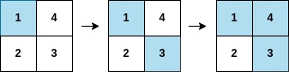

```C++
输入：arr = [1,3,4,2], mat = [[1,4],[2,3]]
输出：2
解释：遍历如上图所示，arr[2] 在矩阵中的第一行或第二列上都被涂色。
```

示例 2：
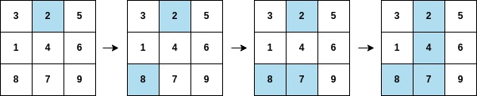

```C++
输入：arr = [2,8,7,4,1,3,5,6,9], mat = [[3,2,5],[1,4,6],[8,7,9]]
输出：3
解释：遍历如上图所示，arr[3] 在矩阵中的第二列上都被涂色。
```

提示：

```C++
m == mat.length
n = mat[i].length
arr.length == m * n
1 <= m, n <= 105
1 <= m * n <= 105
1 <= arr[i], mat[r][c] <= m * n
```

arr 中的所有整数 互不相同
mat 中的所有整数 互不相同

**思路**
利用 `mat` 的数值各不相同，先使用「哈希表」对 `mat` 进行转存，以 $mat[i][j]$ 为键，$(i, j)$ 为值，方便后续快速查询某个值所在位置。

创建数组 `c1` 和 `c2`，分别记录某行某列有多少单元格被涂色，如 $c1[x] = a$ 代表第 x 行被涂色单元格数量为 a 个，$c2[y] = b$ 代表第 y 列被涂色单元格数量为 b 个。

遍历所有的 $arr[i]$，查询到 $arr[i]$ 的所在位置 $(x, y)$ 后，更新 c1 和 c2，若某行或某列被完全涂色，返回当前下标。

```C++
class Solution {
public:
    int firstCompleteIndex(vector<int>& arr, vector<vector<int>>& mat) {
        int n = mat.size(), m = mat[0].size();
        unordered_map<int, pair<int, int>> map;
        for (int i = 0; i < n; i++) {
            for (int j = 0; j < m; j++) {
                map[mat[i][j]] = make_pair(i, j);
            }
        }
        vector<int> c1(n), c2(m);
        for (int i = 0; i < n * m; i++) {
            pair<int, int> info = map[arr[i]];
            int x = info.first, y = info.second;
            if (++c1[x] == m || ++c2[y] == n) return i;
        }
        return -1; // never
    }
};
```

### 12/2 [1094. 拼车](https://leetcode.cn/problems/car-pooling)

车上最初有 capacity 个空座位。车 只能 向一个方向行驶（也就是说，不允许掉头或改变方向）

给定整数 capacity 和一个数组 trips ,  trip[i] = [numPassengersi, fromi, toi] 表示第 i 次旅行有 numPassengersi 乘客，接他们和放他们的位置分别是 fromi 和 toi 。这些位置是从汽车的初始位置向东的公里数。

当且仅当你可以在所有给定的行程中接送所有乘客时，返回 true，否则请返回 false。

示例 1：

```C++
输入：trips = [[2,1,5],[3,3,7]], capacity = 4
输出：false
```

示例 2：

```C++
输入：trips = [[2,1,5],[3,3,7]], capacity = 5
输出：true
```

提示：

```C++
1 <= trips.length <= 1000
trips[i].length == 3
1 <= numPassengersi <= 100
0 <= fromi < toi <= 1000
1 <= capacity <= 10^5
```

**思路**
对于本题，设 $a[i]$ 表示车行驶到位置 i 时车上的人数。我们需要判断是否所有 $a[i]$ 都不超过 $\textit{capacity}$。

$\textit{trips}[i]$ 相当于把 $a$ 中下标从 $\textit{from}_i$ 到 $\textit{to}_i-1$ 的数都增加 $\textit{numPassengers}_i$。这正好可以用上面讲的差分数组解决。

例如示例 1 对应的 ddd 数组，$d[1]=2,\ d[5]=-2,\ d[3]=3,\ d[7]=-3$，即
$d = [0, 2, 0, 3, 0, -2, 0, -3, \cdots]$
从左到右累加，得到
$a = [0, 2, 2, 5, 5, 3, 3, 0,\cdots]$
$\textit{capacity}=4$，由于 $\max(a)=5>4$，所以返回 false。

```C++
class Solution {
public:
    bool carPooling(vector<vector<int>> &trips, int capacity) {
        int d[1001]{};
        for (auto &t : trips) {
            int num = t[0], from = t[1], to = t[2];
            d[from] += num;
            d[to] -= num;
        }
        int s = 0;
        for (int v : d) {
            s += v;
            if (s > capacity) {
                return false;
            }
        }
        return true;
    }
};
```

### 12/3 [1423. 可获得的最大点数](https://leetcode.cn/problems/maximum-points-you-can-obtain-from-cards/description/)

几张卡牌 排成一行，每张卡牌都有一个对应的点数。点数由整数数组 cardPoints 给出。

每次行动，你可以从行的开头或者末尾拿一张卡牌，最终你必须正好拿 k 张卡牌。

你的点数就是你拿到手中的所有卡牌的点数之和。

给你一个整数数组 cardPoints 和整数 k，请你返回可以获得的最大点数。

示例 1：

输入：`cardPoints = [1,2,3,4,5,6,1], k = 3`
输出：12
解释：第一次行动，不管拿哪张牌，你的点数总是 1 。但是，先拿最右边的卡牌将会最大化你的可获得点数。最优策略是拿右边的三张牌，最终点数为 1 + 6 + 5 = 12 。
示例 2：

输入：`cardPoints = [2,2,2], k = 2`
输出：4
解释：无论你拿起哪两张卡牌，可获得的点数总是 4 。
示例 3：

输入：`cardPoints = [9,7,7,9,7,7,9], k = 7`
输出：55
解释：你必须拿起所有卡牌，可以获得的点数为所有卡牌的点数之和。
示例 4：

输入：`cardPoints = [1,1000,1], k = 1`
输出：1
解释：你无法拿到中间那张卡牌，所以可以获得的最大点数为 1 。
示例 5：

输入：`cardPoints = [1,79,80,1,1,1,200,1], k = 3`
输出：202

提示：

```C++
1 <= cardPoints.length <= 10^5
1 <= cardPoints[i] <= 10^4
1 <= k <= cardPoints.length
```

**思路**
记数组 $\textit{cardPoints}$ 的长度为 n，由于只能从开头和末尾拿 k 张卡牌，所以最后剩下的必然是连续的 n-k 张卡牌。我们可以通过求出剩余卡牌点数之和的最小值，来求出拿走卡牌点数之和的最大值。
由于剩余卡牌是连续的，使用一个固定长度为 n−k 的滑动窗口对数组 $\textit{cardPoints}$ 进行遍历，求出滑动窗口最小值，然后用所有卡牌的点数之和减去该最小值，即得到了拿走卡牌点数之和的最大

```C++
class Solution {
public:
    int maxScore(vector<int>& cardPoints, int k) {
        int n = cardPoints.size();
        // 滑动窗口大小为 n-k
        int windowSize = n - k;
        // 选前 n-k 个作为初始值
        int sum = accumulate(cardPoints.begin(), cardPoints.begin() + windowSize, 0);
        int minSum = sum;
        for (int i = windowSize; i < n; ++i) {
            // 滑动窗口每向右移动一格，增加从右侧进入窗口的元素值，并减少从左侧离开窗口的元素值
            sum += cardPoints[i] - cardPoints[i - windowSize];
            minSum = min(minSum, sum);
        }
        return accumulate(cardPoints.begin(), cardPoints.end(), 0) - minSum;
    }
};
```

### 12/4 [1038. 从二叉搜索树到更大和树](https://leetcode.cn/problems/binary-search-tree-to-greater-sum-tree/description/)

给定一个二叉搜索树 root (BST)，请将它的每个节点的值替换成树中大于或者等于该节点值的所有节点值之和。

提醒一下， 二叉搜索树 满足下列约束条件：

节点的左子树仅包含键 小于 节点键的节点。
节点的右子树仅包含键 大于 节点键的节点。
左右子树也必须是二叉搜索树。

示例 1：

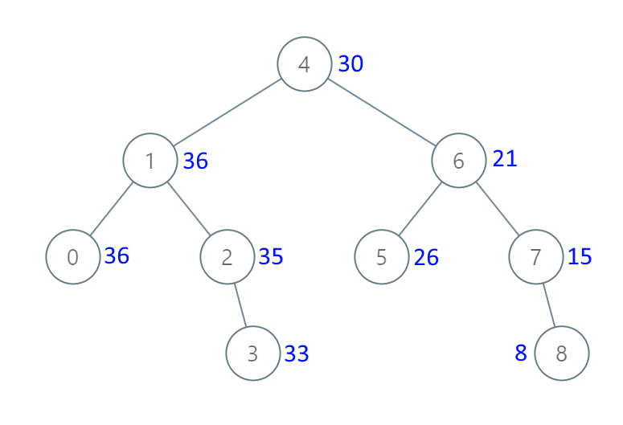

```C++
输入：[4,1,6,0,2,5,7,null,null,null,3,null,null,null,8]
输出：[30,36,21,36,35,26,15,null,null,null,33,null,null,null,8]
```

示例 2：

```C++
输入：root = [0,null,1]
输出：[1,null,1]
```

提示：

树中的节点数在 [1, 100] 范围内。
0 <= Node.val <= 100
树中的所有值均 不重复 。

注意：该题目与 [538](https://leetcode-cn.com/problems/convert-bst-to-greater-tree/) 相同

**思路**
为了算出节点值之和，必须先访问所有节点值大于当前节点值的节点
比如示例 1，为了算出根节点修改后的值，应当先把右子树的所有点遍历一遍（因为二叉搜索树右子树的节点值都大于根节点的值），得到右子树所有点的节点值之和，再加上根节点的值，即
$$8+7+6+5+4 = 30$$
这便是根节点修改后的值，即上图中根节点旁的蓝色数字。
这样就确定了递归的顺序：右子树-根-左子树。

初始化 $s=0$。
从根节点开始递归，先递归右子树。
右子树递归结束后，把当前节点的值加到 s 中，然后用 s 替换当前节点的值。
然后递归左子树。
递归边界：递归到空节点时返回。

```C++
/**
 * Definition for a binary tree node.
 * struct TreeNode {
 *     int val;
 *     TreeNode *left;
 *     TreeNode *right;
 *     TreeNode() : val(0), left(nullptr), right(nullptr) {}
 *     TreeNode(int x) : val(x), left(nullptr), right(nullptr) {}
 *     TreeNode(int x, TreeNode *left, TreeNode *right) : val(x), left(left), right(right) {}
 * };
 */
class Solution {
private:
    int s = 0;

    void dfs(TreeNode *node) {
        if (node == nullptr) {
            return;
        }
        dfs(node->right); // 递归右子树
        s += node->val;
        node->val = s; // 此时 s 就是 >= node->val 的所有数之和
        dfs(node->left); // 递归左子树
    }

public:
    TreeNode *bstToGst(TreeNode *root) {
        dfs(root);
        return root;
    }
};
```

### 12/5 [2477. 到达首都的最少油耗](https://leetcode.cn/problems/minimum-fuel-cost-to-report-to-the-capital/description/)

给你一棵 n 个节点的树（一个无向、连通、无环图），每个节点表示一个城市，编号从 0 到 n - 1 ，且恰好有 n - 1 条路。0 是首都。给你一个二维整数数组 roads ，其中 `roads[i] = [ai, bi]` ，表示城市 ai 和 bi 之间有一条 双向路 。
每个城市里有一个代表，他们都要去首都参加一个会议。
每座城市里有一辆车。给你一个整数 seats 表示每辆车里面座位的数目。
城市里的代表可以选择乘坐所在城市的车，或者乘坐其他城市的车。相邻城市之间一辆车的油耗是一升汽油。
请你返回到达首都最少需要多少升汽油。

示例 1：

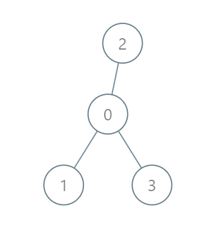

输入：roads = [[0,1],[0,2],[0,3]], seats = 5
输出：3
解释：

- 代表 1 直接到达首都，消耗 1 升汽油。
- 代表 2 直接到达首都，消耗 1 升汽油。
- 代表 3 直接到达首都，消耗 1 升汽油。
最少消耗 3 升汽油。
示例 2：

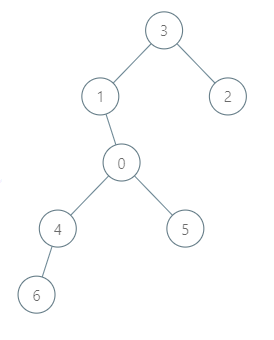

输入：roads = [[3,1],[3,2],[1,0],[0,4],[0,5],[4,6]], seats = 2
输出：7
解释：

- 代表 2 到达城市 3 ，消耗 1 升汽油。
- 代表 2 和代表 3 一起到达城市 1 ，消耗 1 升汽油。
- 代表 2 和代表 3 一起到达首都，消耗 1 升汽油。
- 代表 1 直接到达首都，消耗 1 升汽油。
- 代表 5 直接到达首都，消耗 1 升汽油。
- 代表 6 到达城市 4 ，消耗 1 升汽油。
- 代表 4 和代表 6 一起到达首都，消耗 1 升汽油。
最少消耗 7 升汽油。

示例 3：


输入：roads = [], seats = 1
输出：0
解释：没有代表需要从别的城市到达首都。

提示：

```C++
1 <= n <= 105
roads.length == n - 1
roads[i].length == 2
0 <= ai, bi < n
ai != bi
roads 表示一棵合法的树。
1 <= seats <= 105
```

**思路**
将双向图看作是以节点 0 为根的有向树，从每个节点出发往 0 前行，可看作是自底向上的移动过程。
当 seats = 1 时，每个节点前往 0 的过程相互独立，总油耗为每节点到 0 的最短距离之和。
当 seats 不为 1 时，考虑组成顺风车，此时总的油耗不该超过 seats = 1 的情况。
不难发现，只有「深度大的节点，在前往 0 过程中，搭乘深度小顺风车」可减少油耗（例如在上图节点 3 在经过节点 1 时搭乘顺风车，可与节点 1 合计使用一份油耗前往到 0），否则如果是深度小的节点先往深度大的节点走，再一同前往 0，会额外多经过某些边，产生不必要的油耗。
考虑组成顺风车时，总油耗该如何计算。
基于上述分析，无论 seats 是否为 1（是否组成顺风车），每个节点前往 0 的路径总是不变，即经过的边固定不变，必然是自底向上。
因此我们可统计每条边会被多少个节点经过，通过 DFS 统计「以每个节点为根时，子树的节点数量」即是经过该节点往上的边。

```C++
class Solution {
public:
    int N = 100010, M = 2 * N, idx = 0;
    int he[100010], e[200020], ne[200020];
    long long ans = 0;
    void add(int a, int b) {
        e[idx] = b;
        ne[idx] = he[a];
        he[a] = idx++;
    }
    long long minimumFuelCost(vector<vector<int>>& roads, int seats) {
        int n = roads.size() + 1;
        memset(he, -1, sizeof(he));
        for (auto& r : roads) {
            int a = r[0], b = r[1];
            add(a, b); add(b, a);
        }
        dfs(0, -1, seats);
        return ans;
    }
    int dfs(int u, int fa, int t) {
        int cnt = 1;
        for (int i = he[u]; i != -1; i = ne[i]) {
            int j = e[i];
            if (j == fa) continue;
            cnt += dfs(j, u, t);
        }
        if (u != 0) ans += ceil(cnt * 1.0 / t);
        return cnt;
    }
};
```

### 12/6 [2646. 最小化旅行的价格总和](https://leetcode.cn/problems/minimize-the-total-price-of-the-trips/description/)

现有一棵无向、无根的树，树中有 n 个节点，按从 0 到 n - 1 编号。给你一个整数 n 和一个长度为 n - 1 的二维整数数组 edges ，其中 $edges[i] = [a_i, b_i]$ 表示树中节点 $a_i$ 和 $b_i$ 之间存在一条边。
每个节点都关联一个价格。给你一个整数数组 price ，其中 price[i] 是第 i 个节点的价格。
给定路径的 价格总和 是该路径上所有节点的价格之和。
另给你一个二维整数数组 trips ，其中 $trips[i] = [start_i, end_i]$ 表示您从节点 $start_i$ 开始第 i 次旅行，并通过任何你喜欢的路径前往节点 $end_i$ 。
在执行第一次旅行之前，你可以选择一些 非相邻节点 并将价格减半。
返回执行所有旅行的最小价格总和。

示例 1：

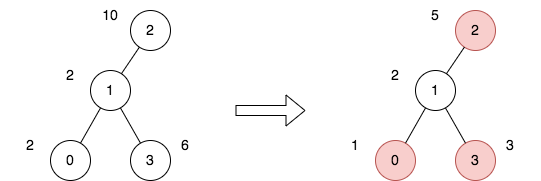

```C++
输入：n = 4, edges = [[0,1],[1,2],[1,3]], price = [2,2,10,6], trips = [[0,3],[2,1],[2,3]]
```

输出：23
解释：
上图表示将节点 2 视为根之后的树结构。第一个图表示初始树，第二个图表示选择节点 0 、2 和 3 并使其价格减半后的树。
第 1 次旅行，选择路径 [0,1,3] 。路径的价格总和为 1 + 2 + 3 = 6 。
第 2 次旅行，选择路径 [2,1] 。路径的价格总和为 2 + 5 = 7 。
第 3 次旅行，选择路径 [2,1,3] 。路径的价格总和为 5 + 2 + 3 = 10 。
所有旅行的价格总和为 6 + 7 + 10 = 23 。可以证明，23 是可以实现的最小答案。

示例 2：

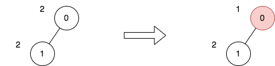

```C++
输入：n = 2, edges = [[0,1]], price = [2,2], trips = [[0,0]]
```

输出：1
解释：
上图表示将节点 0 视为根之后的树结构。第一个图表示初始树，第二个图表示选择节点 0 并使其价格减半后的树。
第 1 次旅行，选择路径 [0] 。路径的价格总和为 1 。
所有旅行的价格总和为 1 。可以证明，1 是可以实现的最小答案。

提示：

```C++
1 <= n <= 50
edges.length == n - 1
0 <= ai, bi <= n - 1
edges 表示一棵有效的树
price.length == n
price[i] 是一个偶数
1 <= price[i] <= 1000
1 <= trips.length <= 100
0 <= start_i, end_i <= n - 1
```

**思路1**
对每个 $\textit{trips}[i]$ 都 DFS 一次这棵树，在 DFS 的过程中，把从 $\textit{start}$ 到 $\textit{end}￥ 的路径上的每个点 x 的经过次数 $\textit{cnt}[x]$ 都加一。

既然知道了每个点会被经过多少次，把 $\textit{price}[i]$ 更新成 $\textit{price}[i]\cdot \textit{cnt}[i]$，问题就转换成计算减半后的 $\textit{price}[i]$ 之和的最小值。注意 $\textit{cnt}[i]=0$ 时 $\textit{price}[i]$ 会被更新成 0，我们无需考虑没有经过的节点。

我们随便选一个节点出发 DFS（比如节点 0）。在 DFS 的过程中，对于节点 x 及其儿子 y，分类讨论：

如果 $\textit{price}[x]$ 不变，那么 $\textit{price}[y]$ 可以减半，也可以不变，取这两种情况的最小值；
如果 $\textit{price}[x]$ 减半，那么 $\textit{price}[y]$ 只能不变。
因此子树 x 需要返回两个值：

$\textit{price}[x]$ 不变时的子树 x 的最小价值总和；
$\textit{price}[x]$ 减半时的子树 x 的最小价值总和。
答案就是根节点不变/减半的最小值。

问：代码实现时，如何找到从 $\textit{start}$ 到 $\textit{end}$ 的路径？

答：以 $\textit{start}$ 为树根 DFS，找到 $\textit{end}$ 时，$\textit{end}$ 及其祖先节点就恰好组成了从 $\textit{start}$ 到 $\textit{end}$ 的路径。据此可以在递归的「归」当中去更新 $\textit{cnt}$。

```C++
class Solution {
public:
    int minimumTotalPrice(int n, vector<vector<int>> &edges, vector<int> &price, vector<vector<int>> &trips) {
        vector<vector<int>> next(n);
        for (auto &edge : edges) {
            next[edge[0]].push_back(edge[1]);
            next[edge[1]].push_back(edge[0]);
        }

        vector<int> count(n);
        function<bool(int, int, int)> dfs = [&](int node, int parent, int end) -> bool {
            if (node == end) {
                count[node]++;
                return true;
            }
            for (int child : next[node]) {
                if (child == parent) {
                    continue;
                }
                if (dfs(child, node, end)) {
                    count[node]++;
                    return true;
                }
            }
            return false;
        };
        for (auto &trip: trips) {
            dfs(trip[0], -1, trip[1]);
        }
        function<pair<int, int>(int, int)> dp = [&](int node, int parent) -> pair<int, int> {
            pair<int, int> res = {
                price[node] * count[node], price[node] * count[node] / 2
            };
            for (int child : next[node]) {
                if (child == parent) {
                    continue;
                }
                auto [x, y] = dp(child, node);
                res.first += min(x, y); // node 没有减半，因此可以取子树的两种情况的最小值
                res.second += x; // node 减半，只能取子树没有减半的情况
            }
            return res;
        };
        auto [x, y] = dp(0, -1);
        return min(x, y);
    }
};
```

**思路2**
数组上的区间加一操作，我们可以用 差分数组 解决（请至少完成一道差分数组题目再往下读）。这一思想同样可以用到树上，把树上的一条路径上的节点值加一，也可以用差分数组解决。

从 $x=\textit{start}$ 到 $y=\textit{end}$ 的路径可以视作从 x 向上到某个点「拐弯」，再向下到达 y。

这个拐弯的点是 x 和 y 的 $\textit{lca}$（最近公共祖先）。注意拐弯的点也可能就是 x 或 y。

设路径为 $x-z-\textit{lca}-y$，其中 z 是 $\textit{lca}$ 往 x 方向的儿子。由于更新的是点，拆分成 $x-z$ 和 $y-\textit{lca}$ 这两段路径。

把路径上的点的 $\textit{cnt}$ 加一，转换成对差分数组 $\textit{diff}$ 的两个数的更新。规定把下面的点加一，把上面的点减一：

对于 $x-z$，把 $\textit{diff}[x]$ 加一，$\textit{diff}[\textit{lca}]$ 减一。注意，如果 x 就是 $\textit{lca}$，那么 z 是不存在的，而差分操作刚好对 $\textit{diff}[x]$ 加一再减一，没有变化。所以我们无需特判 x 就是 $\textit{lca}$ 的情况。
对于 $y-\textit{lca}$，把 $\textit{diff}[y]$ 加一，$\textit{diff}[\textit{father}[\textit{lca}]]$ 减一，其中 $\textit{father}[\textit{lca}]$ 表示 $\textit{lca}$ 的父节点。
最近公共祖先 $\textit{lca}$ 可以用 Tarjan 离线算法计算，见代码注释。

更新完 $\textit{diff}$ 后，DFS 这棵树，在递归的「归」的过程中自底向上累加 $\textit{diff}$，计算出 $\textit{cnt}$ 值。这个过程可以和计算答案的过程合在一起。

```C++
class Solution {
public:
    int minimumTotalPrice(int n, vector<vector<int>> &edges, vector<int> &price, vector<vector<int>> &trips) {
        vector<vector<int>> g(n);
        for (auto &e: edges) {
            int x = e[0], y = e[1];
            g[x].push_back(y);
            g[y].push_back(x); // 建树
        }

        vector<vector<int>> qs(n);
        for (auto &t: trips) {
            int x = t[0], y = t[1];
            qs[x].push_back(y); // 路径端点分组
            if (x != y) {
                qs[y].push_back(x);
            }
        }

        // 并查集模板
        vector<int> root(n);
        iota(root.begin(), root.end(), 0);
        function<int(int)> find = [&](int x) -> int { return root[x] == x ? x : root[x] = find(root[x]); };

        vector<int> diff(n), father(n), color(n);
        function<void(int, int)> tarjan = [&](int x, int fa) {
            father[x] = fa;
            color[x] = 1; // 递归中
            for (int y: g[x]) {
                if (color[y] == 0) { // 未递归
                    tarjan(y, x);
                    root[y] = x; // 相当于把 y 的子树节点全部 merge 到 x
                }
            }
            for (int y: qs[x]) {
                // color[y] == 2 意味着 y 所在子树已经遍历完
                // 也就意味着 y 已经 merge 到它和 x 的 lca 上了
                // 此时 find(y) 就是 x 和 y 的 lca
                if (y == x || color[y] == 2) {
                    diff[x]++;
                    diff[y]++;
                    int lca = find(y);
                    diff[lca]--;
                    int f = father[lca];
                    if (f >= 0) {
                        diff[f]--;
                    }
                }
            }
            color[x] = 2; // 递归结束
        };
        tarjan(0, -1);
        function<tuple<int, int, int>(int, int)> dfs = [&](int x, int fa) -> tuple<int, int, int> {
            int not_halve = 0, halve = 0, cnt = diff[x];
            for (int y: g[x]) {
                if (y != fa) {
                    auto [nh, h, c] = dfs(y, x); // 计算 y 不变/减半的最小价值总和
                    not_halve += min(nh, h); // x 不变，那么 y 可以不变，可以减半，取这两种情况的最小值
                    halve += nh; // x 减半，那么 y 只能不变
                    cnt += c; // 自底向上累加差分值
                }
            }
            not_halve += price[x] * cnt; // x 不变
            halve += price[x] * cnt / 2; // x 减半
            return {not_halve, halve, cnt};
        };
        auto [nh, h, _] = dfs(0, -1);
        return min(nh, h);
    }
};
```

### 12/7 [1466. 重新规划路线](https://leetcode.cn/problems/reorder-routes-to-make-all-paths-lead-to-the-city-zero/description/)

n 座城市，从 0 到 n-1 编号，其间共有 n-1 条路线。因此，要想在两座不同城市之间旅行只有唯一一条路线可供选择（路线网形成一颗树）。去年，交通运输部决定重新规划路线，以改变交通拥堵的状况。
路线用 connections 表示，其中 `connections[i] = [a, b]` 表示从城市 a 到 b 的一条有向路线。
今年，城市 0 将会举办一场大型比赛，很多游客都想前往城市 0 。
请你帮助重新规划路线方向，使每个城市都可以访问城市 0 。返回需要变更方向的最小路线数。
题目数据保证每个城市在重新规划路线方向后都能到达城市 0 。

示例 1：

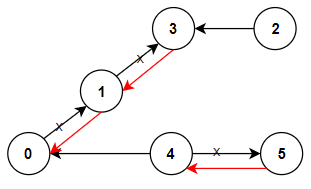

```C++
输入：n = 6, connections = [[0,1],[1,3],[2,3],[4,0],[4,5]]
输出：3
解释：更改以红色显示的路线的方向，使每个城市都可以到达城市 0 。
```

示例 2：

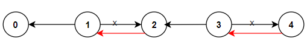

```C++
输入：n = 5, connections = [[1,0],[1,2],[3,2],[3,4]]
输出：2
解释：更改以红色显示的路线的方向，使每个城市都可以到达城市 0 。
```

示例 3：

```C++
输入：n = 3, connections = [[1,0],[2,0]]
输出：0
```

提示：

```C++
2 <= n <= 5 * 10^4
connections.length == n-1
connections[i].length == 2
0 <= connections[i][0], connections[i][1] <= n-1
connections[i][0] != connections[i][1]
```

**思路**
题目给定的路线图中有 n 个节点和 n−1 条边，如果我们忽略边的方向，那么这 n 个节点构成了一棵树。而题目需要我们改变某些边的方向，使得每个节点都能到达节点 0。

我们不妨考虑从节点 0 出发，到达其他所有节点。方向与题目描述相反，意味着我们在构建图的时候，对于有向边 `[a,b]`，我们应该视为有向边 `[b, a]`。也即是说，如果要从 a 到 b，我们需要变更一次方向；如果要从 b 到 a，则不需要变更方向。
接下来，我们只需要从节点 0 出发，搜索其他所有节点，过程中，如果遇到需要变更方向的边，则累加一次变更方向的次数。

```C++
class Solution {
public:
    int minReorder(int n, vector<vector<int>>& connections) {
        vector<pair<int, int>> g[n];
        for (auto& e : connections) {
            int a = e[0], b = e[1];
            g[a].emplace_back(b, 1);
            g[b].emplace_back(a, 0);
        }
        function<int(int, int)> dfs = [&](int a, int fa) {
            int ans = 0;
            for (auto& [b, c] : g[a]) {
                if (b != fa) {
                    ans += c + dfs(b, a);
                }
            }
            return ans;
        };
        return dfs(0, -1);
    }
};
```

### 12/8 [2008. 出租车的最大盈利](https://leetcode.cn/problems/maximum-earnings-from-taxi/description/)

你驾驶出租车行驶在一条有 n 个地点的路上。这 n 个地点从近到远编号为 1 到 n ，你想要从 1 开到 n ，通过接乘客订单盈利。你只能沿着编号递增的方向前进，不能改变方向。

乘客信息用一个下标从 0 开始的二维数组 rides 表示，其中 `rides[i] = [starti, endi, tipi]` 表示第 i 位乘客需要从地点 starti 前往 endi ，愿意支付 tipi 元的小费。

每一位 你选择接单的乘客 i ，你可以 盈利 endi - starti + tipi 元。你同时 最多 只能接一个订单。

给你 n 和 rides ，请你返回在最优接单方案下，你能盈利 最多 多少元。

注意：你可以在一个地点放下一位乘客，并在同一个地点接上另一位乘客。

示例 1：

```C++
输入：n = 5, rides = [[2,5,4],[1,5,1]]
输出：7
解释：我们可以接乘客 0 的订单，获得 5 - 2 + 4 = 7 元。
```

示例 2：

```C++
输入：n = 20, rides = [[1,6,1],[3,10,2],[10,12,3],[11,12,2],[12,15,2],[13,18,1]]
输出：20
```

解释：我们可以接以下乘客的订单：

- 将乘客 1 从地点 3 送往地点 10 ，获得 10 - 3 + 2 = 9 元。
- 将乘客 2 从地点 10 送往地点 12 ，获得 12 - 10 + 3 = 5 元。
- 将乘客 5 从地点 13 送往地点 18 ，获得 18 - 13 + 1 = 6 元。
我们总共获得 9 + 5 + 6 = 20 元。

提示：

```C++
1 <= n <= 105
1 <= rides.length <= 3 * 10^4
rides[i].length == 3
1 <= starti < endi <= n
1 <= tip[i] <= 10^5
```

**思路**
使用哈希表 $\textit{rideMap}[\textit{end}]$ 记录终点为 $\textit{end}$ 的所有乘客信息。我们使用 $\textit{dp}_{i}$表示到达第 i 个地点时，能获取的最大盈利，显然有 $\textit{dp}_0 = 0$
而对于 $i \in [1, n]$，有两种情况：

选择一个终点为第 i 个地点的乘客 j，那么最大盈利为 $\textit{dp}_i = \textit{dp}_{start_j} + \textit{end}_j - \textit{start}_j + \textit{tip}_j$

没有乘客在第 i 个地点下车，那么 $\textit{dp}_i = \textit{dp}_{i - 1}$。

根据以上情况，对于 $i \in [1, n]$，有转移方程为：

$\textit{dp}_i = \max(\textit{dp}_{i - 1}, \max_{j \in T_i}(\textit{dp}_{start_j} + \textit{end}_j - \textit{start}_j + \textit{tip}_j))$ $T_i$ 表示终点为第 i 个地点的所有乘客，此时 $\textit{dp}[n]$ 即为结果。

```C++
class Solution {
public:
    long long maxTaxiEarnings(int n, vector<vector<int>> &rides) {
        vector<vector<pair<int, int>>> groups(n + 1);
        for (auto &r : rides) {
            int start = r[0], end = r[1], tip = r[2];
            groups[end].push_back(make_pair(start, end - start + tip));
        }
        vector<long long> f(n + 1);
        for (int i = 2; i <= n; i++) {
            f[i] = f[i - 1];
            for (auto &[s, t] : groups[i]) {
                f[i] = max(f[i], f[s] + t);
            }
        }
        return f[n];
    }
};
```

### 12/9 [2048. 下一个更大的数值平衡数](https://leetcode.cn/problems/next-greater-numerically-balanced-number/description/)

如果整数  x 满足：对于每个数位 d ，这个数位 恰好 在 x 中出现 d 次。那么整数 x 就是一个 数值平衡数 。

给你一个整数 n ，请你返回 严格大于 n 的 最小数值平衡数 。

示例 1：

输入：n = 1
输出：22
解释：
22 是一个数值平衡数，因为：

- 数字 2 出现 2 次
这也是严格大于 1 的最小数值平衡数。

示例 2：

输入：n = 1000
输出：1333
解释：
1333 是一个数值平衡数，因为：

- 数字 1 出现 1 次。
- 数字 3 出现 3 次。

这也是严格大于 1000 的最小数值平衡数。
注意，1022 不能作为本输入的答案，因为数字 0 的出现次数超过了 0 。
示例 3：

输入：n = 3000
输出：3133
解释：
3133 是一个数值平衡数，因为：

- 数字 1 出现 1 次。
- 数字 3 出现 3 次。

这也是严格大于 3000 的最小数值平衡数。

提示：

```C++
0 <= n <= 10^6
```

**思路**
题目给一个整数 n ，要求返回严格大于 n 的最小数值平衡数，我们直接按照题目的要求进行模拟即可。

观察到 $0 <= n <= 10^6$ , 我们可能返回的数值平衡数最大是 $1224444$，这个范围可以在时间要求内找到答案。

我们依次枚举大于 n 的整数，统计所有数字的出现频数，判断是否是数值平衡数即可。

```C++
class Solution {
public:
    bool isBalance(int x) {
        vector<int> count(10);
        while (x > 0) {
            count[x % 10]++;
            x /= 10;
        }
        for (int d = 0; d < 10; ++d) {
            if (count[d] > 0 && count[d] != d) {
                return false;
            }
        }
        return true;
    }

    int nextBeautifulNumber(int n) {
        for (int i = n + 1; i <= 1224444; ++i) {
            if (isBalance(i)) {
                return i;
            }
        }
        return -1;
    }
};
```

```C++
class Solution {
public:
    const vector<int> balance {
        1, 22, 122, 212, 221, 333, 1333, 3133, 3313, 3331, 4444,
        14444, 22333, 23233, 23323, 23332, 32233, 32323, 32332,
        33223, 33232, 33322, 41444, 44144, 44414, 44441, 55555,
        122333, 123233, 123323, 123332, 132233, 132323, 132332,
        133223, 133232, 133322, 155555, 212333, 213233, 213323,
        213332, 221333, 223133, 223313, 223331, 224444, 231233,
        231323, 231332, 232133, 232313, 232331, 233123, 233132,
        233213, 233231, 233312, 233321, 242444, 244244, 244424,
        244442, 312233, 312323, 312332, 313223, 313232, 313322,
        321233, 321323, 321332, 322133, 322313, 322331, 323123,
        323132, 323213, 323231, 323312, 323321, 331223, 331232,
        331322, 332123, 332132, 332213, 332231, 332312, 332321,
        333122, 333212, 333221, 422444, 424244, 424424, 424442,
        442244, 442424, 442442, 444224, 444242, 444422, 515555,
        551555, 555155, 555515, 555551, 666666, 1224444
    };

    int nextBeautifulNumber(int n) {
        return *upper_bound(balance.begin(), balance.end(), n);
    }
};
```

### 12/10 [70. 爬楼梯](https://leetcode.cn/problems/climbing-stairs/description/)

假设你正在爬楼梯。需要 n 阶你才能到达楼顶。

每次你可以爬 1 或 2 个台阶。你有多少种不同的方法可以爬到楼顶呢？

示例 1：

输入：n = 2
输出：2
解释：有两种方法可以爬到楼顶。

1. 1 阶 + 1 阶
2. 2 阶

示例 2：

输入：n = 3
输出：3
解释：有三种方法可以爬到楼顶。

1. 1 阶 + 1 阶 + 1 阶
2. 1 阶 + 2 阶
3. 2 阶 + 1 阶

提示：

1 <= n <= 45

**思路**
动态规划，斐波那契数列

```C++
class Solution {
public:
    int climbStairs(int n) {
        vector<int> f(n + 1);
        f[0] = f[1] = 1;
        for (int i = 2; i <= n; i++) {
            f[i] = f[i - 1] + f[i - 2];
        }
        return f[n];
    }
};
```

### 12/11 [1631. 最小体力消耗路径](https://leetcode.cn/problems/climbing-stairs/description/)

你准备参加一场远足活动。给你一个二维 rows x columns 的地图 heights ，其中 `heights[row][col]` 表示格子 (row, col) 的高度。一开始你在最左上角的格子 (0, 0) ，且你希望去最右下角的格子 (rows-1, columns-1) （注意下标从 0 开始编号）。你每次可以往 上，下，左，右 四个方向之一移动，你想要找到耗费 体力 最小的一条路径。

一条路径耗费的 体力值 是路径上相邻格子之间 高度差绝对值 的 最大值 决定的。

请你返回从左上角走到右下角的最小 体力消耗值 。

示例 1：

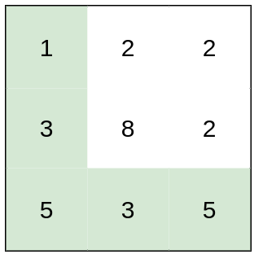

输入：`heights = [[1,2,2],[3,8,2],[5,3,5]]`
输出：2
解释：路径 `[1,3,5,3,5]` 连续格子的差值绝对值最大为 2 。
这条路径比路径 `[1,2,2,2,5]` 更优，因为另一条路径差值最大值为 3 。

示例 2：

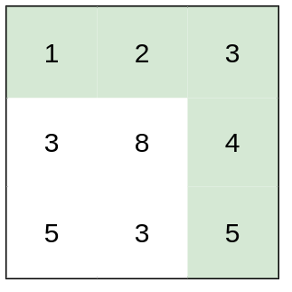

输入：`heights = [[1,2,3],[3,8,4],[5,3,5]]`
输出：1
解释：路径 [1,2,3,4,5] 的相邻格子差值绝对值最大为 1 ，比路径 `[1,3,5,3,5]` 更优。

示例 3：

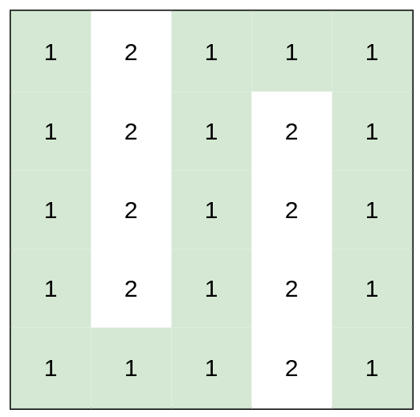

输入：`heights = [[1,2,1,1,1],[1,2,1,2,1],[1,2,1,2,1],[1,2,1,2,1],[1,1,1,2,1]]`
输出：0
解释：上图所示路径不需要消耗任何体力。

提示：

```C++
rows == heights.length
columns == heights[i].length
1 <= rows, columns <= 100
1 <= heights[i][j] <= 10^6
```

**思路**
「最短路径」使得我们很容易想到求解最短路径的 $\texttt{Dijkstra}$ 算法，然而本题中对于「最短路径」的定义不是其经过的所有边权的和，而是其经过的所有边权的最大值，那么我们还可以用 $\texttt{Dijkstra}$ 算法进行求解吗？

答案是可以的。$\texttt{Dijkstra}$ 算法本质上是一种启发式搜索算法，它是 $\texttt{A*}$ 算法在启发函数 $h \equiv 0$ 时的特殊情况。读者可以参考 A* search algorithm，Consistent heuristic，Admissible heuristic 深入了解 $\texttt{Dijkstra}$ 算法的本质。

下面给出 $\texttt{Dijkstra}$ 算法的可行性证明，需要读者对 $\texttt{A*}$ 算法以及其可行性条件有一定的掌握。

证明

定义加法运算$a \oplus b = \max (a,b)$，显然 $\oplus$ 满足交换律和结合律。那么如果一条路径上的边权分别为 $e_0, e_1, \cdots, e_k$ ，那么 $e_0 \oplus e_1 \oplus \cdots \oplus e_k$ 即为这条路径的长度。

在 $\texttt{Dijkstra}$ 算法中 $h \equiv 0$，对于图中任意的无向边 $x \leftrightarrow y$，由于 $e_{x, y} \geq 0$，那么 $h(x)=0\leq e_{x,y} \oplus h(y)$ 恒成立，其中 $e_{x, y}$ 表示边权。因此启发函数 h 和加法运算 $\oplus$ 满足三角不等式，是 consistent heuristic 的，可以使用 $\texttt{Dijkstra}$ 算法求出最短路径。

```C++
class Solution {
private:
    static constexpr int dirs[4][2] = {{-1, 0}, {1, 0}, {0, -1}, {0, 1}};
    
public:
    int minimumEffortPath(vector<vector<int>>& heights) {
        int m = heights.size();
        int n = heights[0].size();
        
        auto tupleCmp = [](const auto& e1, const auto& e2) {
            auto&& [x1, y1, d1] = e1;
            auto&& [x2, y2, d2] = e2;
            return d1 > d2;
        };
        priority_queue<tuple<int, int, int>, vector<tuple<int, int, int>>, decltype(tupleCmp)> q(tupleCmp);
        q.emplace(0, 0, 0);

        vector<int> dist(m * n, INT_MAX);
        dist[0] = 0;
        vector<int> seen(m * n);

        while (!q.empty()) {
            auto [x, y, d] = q.top();
            q.pop();
            int id = x * n + y;
            if (seen[id]) {
                continue;
            }
            if (x == m - 1 && y == n - 1) {
                break;
            }
            seen[id] = 1;
            for (int i = 0; i < 4; ++i) {
                int nx = x + dirs[i][0];
                int ny = y + dirs[i][1];
                if (nx >= 0 && nx < m && ny >= 0 && ny < n && max(d, abs(heights[x][y] - heights[nx][ny])) < dist[nx * n + ny]) {
                    dist[nx * n + ny] = max(d, abs(heights[x][y] - heights[nx][ny]));
                    q.emplace(nx, ny, dist[nx * n + ny]);
                }
            }
        }
        
        return dist[m * n - 1];
    }
};
```

### 12/12 [2454. 下一个更大元素 IV](https://leetcode.cn/problems/next-greater-element-iv/description/)

给你一个下标从 0 开始的非负整数数组 nums 。对于 nums 中每一个整数，你必须找到对应元素的 第二大 整数。
如果 nums[j] 满足以下条件，那么我们称它为 nums[i] 的 第二大 整数：

- `j > i`
- `nums[j] > nums[i]`
恰好存在 一个 k 满足 `i < k < j` 且 `nums[k] > nums[i]` 。
如果不存在 nums[j] ，那么第二大整数为 -1 。
比方说，数组 [1, 2, 4, 3] 中，1 的第二大整数是 4 ，2 的第二大整数是 3 ，3 和 4 的第二大整数是 -1 。
请你返回一个整数数组 answer ，其中 answer[i]是 nums[i] 的第二大整数。

示例 1：

```C++
输入：nums = [2,4,0,9,6]
输出：[9,6,6,-1,-1]
```

解释：
下标为 0 处：2 的右边，4 是大于 2 的第一个整数，9 是第二个大于 2 的整数。
下标为 1 处：4 的右边，9 是大于 4 的第一个整数，6 是第二个大于 4 的整数。
下标为 2 处：0 的右边，9 是大于 0 的第一个整数，6 是第二个大于 0 的整数。
下标为 3 处：右边不存在大于 9 的整数，所以第二大整数为 -1 。
下标为 4 处：右边不存在大于 6 的整数，所以第二大整数为 -1 。
所以我们返回 `[9,6,6,-1,-1]` 。

示例 2：

```C++
输入：nums = [3,3]
输出：[-1,-1]
```

解释：
由于每个数右边都没有更大的数，所以我们返回 [-1,-1] 。

提示：

```C++
1 <= nums.length <= 10e5
0 <= nums[i] <= 10e9
```

**思路**
我们观察到在执行操作 1 后，如果最小堆非空，则堆顶元素一定大于等于当前遍历元素。同时，在操作 2 中，从单调栈中弹出的元素一定满足小于当前遍历元素的条件。因此，从单调栈中弹出的元素一定小于堆顶元素（如果堆非空）。基于这一观察，我们可以进一步优化「方法一」的时间复杂度，用另一个「单调递减栈」 $\textit{st}_2$ 代替「最小堆」。

我们定义一个新的单调递减栈 $\textit{st}_2$ 来保存原堆中的元素，并将「方法一」中的「单调栈」称为 $\textit{st}_1$。按照初始在栈 $\textit{st}_1$中的顺序，将原操作 222 中弹出的元素加入 $\textit{st}_2$中。在上述分析的基础上，我们可以得知这样的操作后仍然能够保持 $\textit{st}_2$的单调递减性质。因此，在遍历数组的过程中，对于每个元素，执行以下操作：
若该 $\textit{st}_2$非空且栈顶元素小于当前遍历的元素时，说明当前元素为栈顶元素的「第二大」的整数，将栈顶元素出栈，并更新结果数组。重复该操作直至 $\textit{st}_2$为空或者栈顶元素大于等于当前遍历元素。
若 $\textit{st}_1$非空且栈顶元素对应的值小于当前遍历元素，则说明找到了栈顶元素的下一个更大的数字，将栈顶元素出栈。重复执行该操作直至 $\textit{st}_1$为空或者栈顶元素大于等于当前遍历元素。然后我们将出栈的元素按照在栈 $\textit{st}_1$中的顺序加入栈 $\textit{st}_2$中。将当前元素的下标压入栈 $\textit{st}_1$中。
这样，最终结果数组中存储的就是每个数字的「第二大」数字（如果存在的话），如果没有「第二大」数字，则对应位置的值为 −1。在实现操作 2 的代码时，为了方便，我们使用「数组」来模拟「单调栈」。

```C++
class Solution {
public:
    vector<int> secondGreaterElement(vector<int> &nums) {
        int n = nums.size();
        vector<int> res(n, -1);
        vector<int> st1;
        vector<int> st2;
        for (int i = 0; i < n; ++i) {
            int v = nums[i];
            while (!st2.empty() && nums[st2.back()] < v) {
                res[st2.back()] = v;
                st2.pop_back();
            }
            int pos = st1.size() - 1;
            while (pos >= 0 && nums[st1[pos]] < v) {
                --pos;
            }
            st2.insert(st2.end(), st1.begin() + (pos + 1), st1.end());
            st1.resize(pos + 1);
            st1.push_back(i);
        }
        return res;
    }
};
```

### 12/13 [2697. 字典序最小回文串](https://leetcode.cn/problems/lexicographically-smallest-palindrome/description/)

给你一个由 小写英文字母 组成的字符串 s ，你可以对其执行一些操作。在一步操作中，你可以用其他小写英文字母 替换  s 中的一个字符。
请你执行 尽可能少的操作 ，使 s 变成一个 回文串 。如果执行 最少 操作次数的方案不止一种，则只需选取 字典序最小 的方案。
对于两个长度相同的字符串 a 和 b ，在 a 和 b 出现不同的第一个位置，如果该位置上 a 中对应字母比 b 中对应字母在字母表中出现顺序更早，则认为 a 的字典序比 b 的字典序要小。
返回最终的回文字符串。

示例 1：

输入：s = "egcfe"
输出："efcfe"
解释：将 "egcfe" 变成回文字符串的最小操作次数为 1 ，修改 1 次得到的字典序最小回文字符串是 "efcfe"，只需将 'g' 改为 'f' 。

示例 2：

输入：s = "abcd"
输出："abba"
解释：将 "abcd" 变成回文字符串的最小操作次数为 2 ，修改 2 次得到的字典序最小回文字符串是 "abba" 。

示例 3：

输入：s = "seven"
输出："neven"
解释：将 "seven" 变成回文字符串的最小操作次数为 1 ，修改 1 次得到的字典序最小回文字符串是 "neven" 。

提示：

1 <= s.length <= 1000
s 仅由小写英文字母组成

**思路**
我们可以使用双指针对给定的字符串 s 进行遍历。初始时，两个指针 left 和 right 分别指向 s 的首尾。在遍历的过程中，left 每次向右移动一个位置，right 每次向左移动一个位置，这样一来，它们总是指向在最终回文字符串中必须相同的两个字母，会有以下两种情况：

如果它们指向的字母相同，我们无需进行任何操作。当两个指针指向同一个位置时，也属于这一种情况；
如果它们指向的字母不同，由于需要尽可能少的操作，我们会把其中一个字母修改成与另一个字母相同。对于这一次操作，我们需要让最终字符串的字典序最小，因此我们应当贪心地将字典序较大的字母改成与字典序较小的字母相同。
我们根据上述操作对字符串 s 进行遍历后，即可得到最终的回文字符串。

```C++
class Solution {
public:
    string makeSmallestPalindrome(string s) {
        int left = 0, right = s.size() - 1;
        while (left < right) {
            if (s[left] != s[right]) {
                s[left] = s[right] = min(s[left], s[right]);
            }
            ++left;
            --right;
        }
        return s;
    }
};
```

### 12/14 [2697. 字典序最小回文串](https://leetcode.cn/problems/stamping-the-grid/description/)

给你邮票的尺寸为 stampHeight x stampWidth 。我们想将邮票贴进二进制矩阵中，且满足以下 限制 和 要求 ：
覆盖所有 空 格子。
不覆盖任何 被占据 的格子。
我们可以放入任意数目的邮票。
邮票可以相互有 重叠 部分。
邮票不允许 旋转 。
邮票必须完全在矩阵 内 。
如果在满足上述要求的前提下，可以放入邮票，请返回 true ，否则返回 false 。

示例 1：

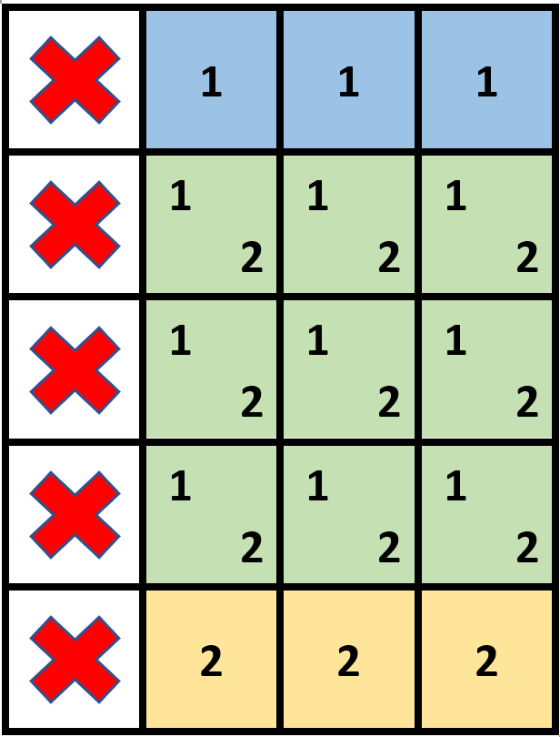

```C++
输入：grid = [[1,0,0,0],[1,0,0,0],[1,0,0,0],[1,0,0,0],[1,0,0,0]], stampHeight = 4, stampWidth = 3
输出：true
解释：我们放入两个有重叠部分的邮票（图中标号为 1 和 2），它们能覆盖所有与空格子。
```

示例 2：

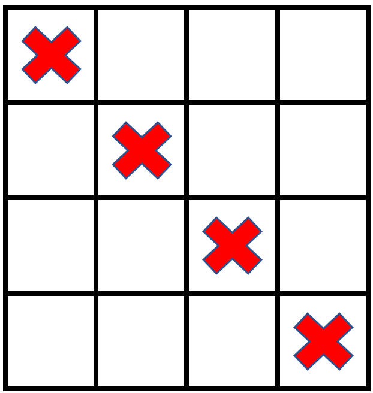

```C++
输入：grid = [[1,0,0,0],[0,1,0,0],[0,0,1,0],[0,0,0,1]], stampHeight = 2, stampWidth = 2 
输出：false 
解释：没办法放入邮票覆盖所有的空格子，且邮票不超出网格图以外。
```

提示：

```C++
m == grid.length
n == grid[r].length
1 <= m, n <= 105
1 <= m * n <= 2 * 105
grid[r][c] 要么是 0 ，要么是 1 。
1 <= stampHeight, stampWidth <= 10^5
```

**思路**
由于邮票可以互相重叠，贪心地想，能放邮票就放邮票。
遍历所有能放邮票的位置去放邮票。注意邮票不能覆盖被占据的格子，也不能出界。
放邮票的同时，记录每个空格子被多少张邮票覆盖。如果存在一个空格子没被邮票覆盖，则返回 false，否则返回 true。

怎么快速判断一个矩形区域可以放邮票？求出 grid 的二维前缀和，从而 O(1) 地求出任意矩形区域的元素和。如果一个矩形区域的元素和等于 0，就表示该矩形区域的所有格子都是 0。
假设用一个二维计数矩阵 cnt 记录每个空格子被多少张邮票覆盖，那么放邮票时，就需要把 cnt 的一个矩形区域都加一。怎么快速实现？可以用二维差分矩阵 d 来代替 cnt 。矩形区域都加一的操作，转变成 O(1) 地对 d 中四个位置的更新操作。
最后从二维差分矩阵 d 还原出二维计数矩阵 cnt 。类似对一维差分数组求前缀和得到原数组，我们需要对二维差分矩阵求二维前缀和。遍历 cnt ，如果存在一个空格子的计数值为 0，就表明该空格子没有被邮票覆盖，返回 false，否则返回 true\texttt{true}true。代码实现时，可以直接在 d 数组上原地计算出 cnt 。

```C++
class Solution {
public:
    bool possibleToStamp(vector<vector<int>> &grid, int stampHeight, int stampWidth) {
        int m = grid.size(), n = grid[0].size();

        // 1. 计算 grid 的二维前缀和
        vector<vector<int>> s(m + 1, vector<int>(n + 1));
        for (int i = 0; i < m; i++) {
            for (int j = 0; j < n; j++) {
                s[i + 1][j + 1] = s[i + 1][j] + s[i][j + 1] - s[i][j] + grid[i][j];
            }
        }

        // 2. 计算二维差分
        // 为方便第 3 步的计算，在 d 数组的最上面和最左边各加了一行（列），所以下标要 +1
        vector<vector<int>> d(m + 2, vector<int>(n + 2));
        for (int i2 = stampHeight; i2 <= m; i2++) {
            for (int j2 = stampWidth; j2 <= n; j2++) {
                int i1 = i2 - stampHeight + 1;
                int j1 = j2 - stampWidth + 1;
                if (s[i2][j2] - s[i2][j1 - 1] - s[i1 - 1][j2] + s[i1 - 1][j1 - 1] == 0) {
                    d[i1][j1]++;
                    d[i1][j2 + 1]--;
                    d[i2 + 1][j1]--;
                    d[i2 + 1][j2 + 1]++;
                }
            }
        }

        // 3. 还原二维差分矩阵对应的计数矩阵（原地计算）
        for (int i = 0; i < m; i++) {
            for (int j = 0; j < n; j++) {
                d[i + 1][j + 1] += d[i + 1][j] + d[i][j + 1] - d[i][j];
                if (grid[i][j] == 0 && d[i + 1][j + 1] == 0) {
                    return false;
                }
            }
        }
        return true;
    }
};

```

### 12/15 [2415. 反转二叉树的奇数层](https://leetcode.cn/problems/reverse-odd-levels-of-binary-tree/description/)

给你一棵 完美 二叉树的根节点 root ，请你反转这棵树中每个 奇数 层的节点值。
例如，假设第 3 层的节点值是 `[2,1,3,4,7,11,29,18]`，那么反转后它应该变成 `[18,29,11,7,4,3,1,2]` 。
反转后，返回树的根节点。
完美二叉树需满足：二叉树的所有父节点都有两个子节点，且所有叶子节点都在同一层。
节点的层数等于该节点到根节点之间的边数。

示例 1：

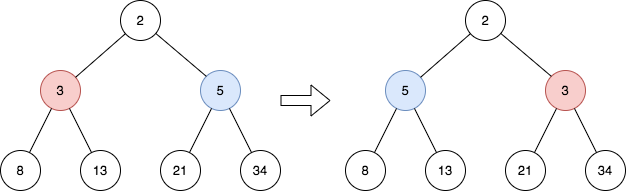

```C++
输入：root = [2,3,5,8,13,21,34]
输出：[2,5,3,8,13,21,34]
解释：
这棵树只有一个奇数层。
在第 1 层的节点分别是 3、5 ，反转后为 5、3 。
```

示例 2：

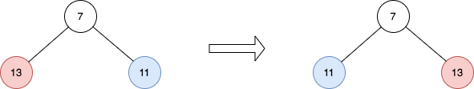

```C++
输入：root = [7,13,11]
输出：[7,11,13]
解释： 
在第 1 层的节点分别是 13、11 ，反转后为 11、13 。 
```

示例 3：

```C++
输入：root = [0,1,2,0,0,0,0,1,1,1,1,2,2,2,2]
输出：[0,2,1,0,0,0,0,2,2,2,2,1,1,1,1]
解释：奇数层由非零值组成。
在第 1 层的节点分别是 1、2 ，反转后为 2、1 。
在第 3 层的节点分别是 1、1、1、1、2、2、2、2 ，反转后为 2、2、2、2、1、1、1、1 。
```

提示：

```C++
树中的节点数目在范围 [1, 214] 内
0 <= Node.val <= 10^5
root 是一棵 完美 二叉树
```

**思路**
同样的方法我们还可以使用深度优先搜索来遍历该二叉树，对奇数层进行反转。遍历过程如下：

由于该二叉树是完美二叉树，因此我们可以知道对于根节点来说，它的孩子节点为第一层节点，此时左孩子需要与右孩子需要进行反转；
当遍历每一层时，由于 root1,root2 分别指向该层两个可能需要进行值交换的节点。根据完美二叉树的层次反转规则，即左边排第一的元素与倒数第一元素进行交换，第二个元素与倒数二个元素交换，此时 root1 的左孩子与 root2 的右孩子可能需要进行交换，root1 的右孩子与 root2 的左孩子可能需要进行交换。在遍历的同时按照上述规则，将配对的节点进行递归传递到下一层；
我们用 isOdd 来标记当前层次是否为奇数层，由于偶数层不需要进行交换，当 isOdd 为 true 时，表明当前需要交换，我们直接交换两个节点 root1,root2 的值；
由于完美二叉树来说，第 i 的节点数目要么为 2^i 个，要么为 0 个，因此如果最左边的节点 root1 为空时，则可以直接返回。

```C++
/**
 * Definition for a binary tree node.
 * struct TreeNode {
 *     int val;
 *     TreeNode *left;
 *     TreeNode *right;
 *     TreeNode() : val(0), left(nullptr), right(nullptr) {}
 *     TreeNode(int x) : val(x), left(nullptr), right(nullptr) {}
 *     TreeNode(int x, TreeNode *left, TreeNode *right) : val(x), left(left), right(right) {}
 * };
 */
class Solution {
public:
    TreeNode* reverseOddLevels(TreeNode* root) {
        dfs(root->left, root->right, true);
        return root;
    }

    void dfs(TreeNode *root1, TreeNode *root2, bool isOdd) {
        if (root1 == nullptr) {
            return;
        }
        if (isOdd) {
            swap(root1->val, root2->val);
        }
        dfs(root1->left, root2->right, !isOdd);
        dfs(root1->right, root2->left, !isOdd);
    }
};
```

### 12/16 [2276. 统计区间中的整数数目](https://leetcode.cn/problems/count-integers-in-intervals/description/)

给你区间的空集，请你设计并实现满足要求的数据结构：

新增：添加一个区间到这个区间集合中。
统计：计算出现在 至少一个 区间中的整数个数。
实现 CountIntervals 类：

CountIntervals() 使用区间的空集初始化对象
void add(int left, int right) 添加区间 [left, right] 到区间集合之中。
int count() 返回出现在 至少一个 区间中的整数个数。
注意：区间 [left, right] 表示满足 left <= x <= right 的所有整数 x 。

示例 1：

```C++
输入
["CountIntervals", "add", "add", "count", "add", "count"]
[[], [2, 3], [7, 10], [], [5, 8], []]
输出
[null, null, null, 6, null, 8]

解释
CountIntervals countIntervals = new CountIntervals(); // 用一个区间空集初始化对象
countIntervals.add(2, 3);  // 将 [2, 3] 添加到区间集合中
countIntervals.add(7, 10); // 将 [7, 10] 添加到区间集合中
countIntervals.count();    // 返回 6
                           // 整数 2 和 3 出现在区间 [2, 3] 中
                           // 整数 7、8、9、10 出现在区间 [7, 10] 中
countIntervals.add(5, 8);  // 将 [5, 8] 添加到区间集合中
countIntervals.count();    // 返回 8
                           // 整数 2 和 3 出现在区间 [2, 3] 中
                           // 整数 5 和 6 出现在区间 [5, 8] 中
                           // 整数 7 和 8 出现在区间 [5, 8] 和区间 [7, 10] 中
                           // 整数 9 和 10 出现在区间 [7, 10] 中
```

提示：

```C++
1 <= left <= right <= 109
最多调用  add 和 count 方法 总计 10^5 次
调用 count 方法至少一次
```

**思路**
用一棵平衡二叉搜索树维护插入的区间，树中的区间两两不相交。当插入一个新的区间时，需要找出所有与待插入区间有重合整数的区间，将这些区间合并成一个新的区间后插入平衡树里。间隔包含两个属性，左端点 l 和右端点 r，其中左端点在树中参与排序。当插入一个新的间隔 add(left,right) 时，需要找到树中的最大的间隔 interval 满足：interval.l≤right，这个是可能与待插入的间隔相交的最大的间隔，如果相交，则将它们合并，并且继续寻找下一个这样的间隔，直到不存在这样的间隔或者找到的间隔与待插入的间隔不相交。同时用一个整数 cnt 维护树中的间隔覆盖的整数，当调用 count 时，直接返回即可。

```C++
class CountIntervals {
public:
    CountIntervals() {

    }
    
    void add(int left, int right) {
        auto interval = mp.upper_bound(right);
        if (interval != mp.begin()) {
            interval--;
        }
        while (interval != mp.end() && interval->first <= right && interval->second >= left) {
            int l = interval->first, r = interval->second;
            left = min(left, l);
            right = max(right, r);
            cnt -= r - l + 1;
            mp.erase(interval);
            interval = mp.upper_bound(right);
            if (interval != mp.begin()) {
                interval--;
            }
        }
        cnt += (right - left + 1);
        mp[left] = right;
    }
    
    int count() {
        return cnt;
    }
private:
    int cnt = 0;
    map<int, int> mp;
};

/**
 * Your CountIntervals object will be instantiated and called as such:
 * CountIntervals* obj = new CountIntervals();
 * obj->add(left,right);
 * int param_2 = obj->count();
 */
```

### 12/17 [746. 使用最小花费爬楼梯](https://leetcode.cn/problems/min-cost-climbing-stairs/description/)

给你一个整数数组 cost ，其中 cost[i] 是从楼梯第 i 个台阶向上爬需要支付的费用。一旦你支付此费用，即可选择向上爬一个或者两个台阶。

你可以选择从下标为 0 或下标为 1 的台阶开始爬楼梯。

请你计算并返回达到楼梯顶部的最低花费。

示例 1：

输入：cost = [10,15,20]
输出：15
解释：你将从下标为 1 的台阶开始。

- 支付 15 ，向上爬两个台阶，到达楼梯顶部。
总花费为 15 。

示例 2：

输入：cost = [1,100,1,1,1,100,1,1,100,1]
输出：6
解释：你将从下标为 0 的台阶开始。

- 支付 1 ，向上爬两个台阶，到达下标为 2 的台阶。
- 支付 1 ，向上爬两个台阶，到达下标为 4 的台阶。
- 支付 1 ，向上爬两个台阶，到达下标为 6 的台阶。
- 支付 1 ，向上爬一个台阶，到达下标为 7 的台阶。
- 支付 1 ，向上爬两个台阶，到达下标为 9 的台阶。
- 支付 1 ，向上爬一个台阶，到达楼梯顶部。
总花费为 6 。

提示：

2 <= cost.length <= 1000
0 <= cost[i] <= 999

**思路**
假设数组 cost 的长度为 n，则 n 个阶梯分别对应下标 0 到 n−1，楼层顶部对应下标 n，问题等价于计算达到下标 n 的最小花费。可以通过动态规划求解。

创建长度为 n+1 的数组 dp，其中 dp[i] 表示达到下标 i 的最小花费。

由于可以选择下标 0 或 1 作为初始阶梯，因此有 dp[0]=dp[1]=0

当 2≤i≤n2 时，可以从下标 i−1 使用 cost[i−1] 的花费达到下标 i，或者从下标 i−2 使用 cost[i−2] 的花费达到下标 i。为了使总花费最小，dp[i] 应取上述两项的最小值，因此状态转移方程如下：
$$\textit{dp}[i]=\min(\textit{dp}[i-1]+\textit{cost}[i-1],\textit{dp}[i-2]+\textit{cost}[i-2])$$
依次计算 dp 中的每一项的值，最终得到的 dp[n]即为达到楼层顶部的最小花费。

```C++
class Solution {
public:
    int minCostClimbingStairs(vector<int>& cost) {
        int n = cost.size();
        int prev = 0, curr = 0;
        for (int i = 2; i <= n; i++) {
            int next = min(curr + cost[i - 1], prev + cost[i - 2]);
            prev = curr;
            curr = next;
        }
        return curr;
    }
};
```

### 12/18 [162. 寻找峰值](https://leetcode.cn/problems/find-peak-element/description/)

峰值元素是指其值严格大于左右相邻值的元素。

给你一个整数数组 nums，找到峰值元素并返回其索引。数组可能包含多个峰值，在这种情况下，返回 任何一个峰值 所在位置即可。

你可以假设 `nums[-1] = nums[n] = -∞` 。

你必须实现时间复杂度为 O(log n) 的算法来解决此问题。

示例 1：

输入：`nums = [1,2,3,1]`
输出：2
解释：3 是峰值元素，你的函数应该返回其索引 2。
示例 2：

输入：`nums = [1,2,1,3,5,6,4]`
输出：1 或 5
解释：你的函数可以返回索引 1，其峰值元素为 2；
     或者返回索引 5， 其峰值元素为 6。

提示：

```C++
1 <= nums.length <= 1000
-2^31 <= nums[i] <= 2^31 - 1
对于所有有效的 i 都有 nums[i] != nums[i + 1]
```

**思路**
我们可以发现，如果 `nums[i]<nums[i+1]`，并且我们从位置 i 向右走到了位置 `i+1`，那么位置 i 左侧的所有位置是不可能在后续的迭代中走到的。

这是因为我们每次向左或向右移动一个位置，要想「折返」到位置 i 以及其左侧的位置，我们首先需要在位置 i+1 向左走到位置 i，但这是不可能的。

并且根据方法二，我们知道位置 i+1 以及其右侧的位置中一定有一个峰值，因此我们可以设计出如下的一个算法：

对于当前可行的下标范围 [l,r]，我们随机一个下标 i；

如果下标 i 是峰值，我们返回 i 作为答案；

如果 `nums[i]<nums[i+1]` ，那么我们抛弃 [l,i] 的范围，在剩余 [i+1,r] 的范围内继续随机选取下标；

如果 `nums[i]>nums[i+1]`，那么我们抛弃 [i,r] 的范围，在剩余 [l,i−1] 的范围内继续随机选取下标。

在上述算法中，如果我们固定选取 i 为 [l,r] 的中点，那么每次可行的下标范围会减少一半，成为一个类似二分查找的方法，时间复杂度为 O(log⁡n)。

```C++
class Solution {
public:
    int findPeakElement(vector<int>& nums) {
        int n = nums.size();

        // 辅助函数，输入下标 i，返回一个二元组 (0/1, nums[i])
        // 方便处理 nums[-1] 以及 nums[n] 的边界情况
        auto get = [&](int i) -> pair<int, int> {
            if (i == -1 || i == n) {
                return {0, 0};
            }
            return {1, nums[i]};
        };

        int left = 0, right = n - 1, ans = -1;
        while (left <= right) {
            int mid = (left + right) / 2;
            if (get(mid - 1) < get(mid) && get(mid) > get(mid + 1)) {
                ans = mid;
                break;
            }
            if (get(mid) < get(mid + 1)) {
                left = mid + 1;
            }
            else {
                right = mid - 1;
            }
        }
        return ans;
    }
};
```

### 12/19 [1901. 寻找峰值 II](https://leetcode.cn/problems/find-a-peak-element-ii/description/)

一个 2D 网格中的 峰值 是指那些 严格大于 其相邻格子(上、下、左、右)的元素。

给你一个 从 0 开始编号 的 m x n 矩阵 mat ，其中任意两个相邻格子的值都 不相同 。找出 任意一个 峰值 `mat[i][j]` 并 返回其位置 [i,j] 。

你可以假设整个矩阵周边环绕着一圈值为 -1 的格子。

要求必须写出时间复杂度为 `O(m log(n))` 或 `O(n log(m))` 的算法

示例 1:

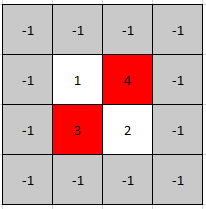

输入: `mat = [[1,4],[3,2]]`
输出: [0,1]
解释: 3 和 4 都是峰值，所以[1,0]和[0,1]都是可接受的答案。

示例 2:

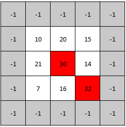

输入: `mat = [[10,20,15],[21,30,14],[7,16,32]]`
输出: [1,1]
解释: 30 和 32 都是峰值，所以[1,1]和[2,2]都是可接受的答案。

提示：

```C++
m == mat.length
n == mat[i].length
1 <= m, n <= 500
1 <= mat[i][j] <= 10^5
任意两个相邻元素均不相等.
```

**思路**
令 m 和 n 分别为 mat 的行数和列数。首先对于一维数组，因为任意两个相邻的格子的值都不相同，所以它的最大值必定是该一维数组的峰值。基于这一点，我们可以只考虑每一行的最大值，记第 i 行的最大值为第 $j_i$ 列元素，如果 $\textit{mat}[i][j_i] \gt \textit{mat}[i - 1][j_i]$ 且 $\textit{mat}[i][j_i] \gt \textit{mat}[i + 1][j_i]$（对于数组越界的情况，取 −1 值），那么 $(i, j_i)$ 即为结果。

对于题目给定的条件，是否一定存在峰值呢？答案是肯定的。证明可以采用反证法：

如果不存在峰值，根据题目给定的条件，我们知道第 0 行的最大值比它上面的格子（值为 −1-1−1）大，那么初始时有 i = 0 行的最大值满足比上面格子大的条件。如果第 i 行的最大值满足比它上面的格子大这一条件，那么根据不存在峰值的前提，我们有 $\textit{mat}[i][j_i] \lt \textit{mat}[i + 1][j_i]$，而 $\textit{mat}[i + 1][j_{i + 1}] \ge \textit{mat}[i + 1][j_i] \gt \textit{mat}[i][j_i] \ge \textit{mat}[i][j_{i+1}]$，从而我们有 $\textit{mat}[i + 1][j_{i + 1}] \gt \textit{mat}[i][j_{i+1}]$，即 i + 1 也满足条件。基于以上推导，使用数学归纳法，当 i = m - 1 时，有 $\textit{mat}[m - 1][j_{m - 1}] \gt \textit{mat}[m - 2][j_{m - 1}]$，而下面的格子值为 −1，显然 $(m - 1, j_{m - 1})$ 为峰值，与不存在峰值矛盾。

根据以上证明，我们也可以得出这样一个结论，即如果 $i_1$ 行的最大值比它上面的格子大，$i_2$ 行比它下面的格子大，且 $i_1 \le i_2$，那么 $[i_1, i_2]$ 之间一定存在峰值。基于这个结论，我们可以使用二分法来求解问题，初始时 $\textit{low} = 0$，$\textit{high} = m - 1$:

令 $i = \lfloor \frac{\textit{low} + \textit{high}}{2} \rfloor$，第 i 行的最大值为第 j 列。

如果 $\textit{mat}[i][j] \lt \textit{mat}[i - 1][j]$，那么令 $textit{high} = i - 1$，继续步骤 1。

如果 $\textit{mat}[i][j] \lt \textit{mat}[i + 1][j]$，那么令 $\textit{low} = i + 1$，继续步骤 1。

返回 `(i, j)` 为结果。

类似地，我们也可以只考虑每一列的最大值，读者可以思考一下类似的求解过程，时间复杂度为 `O(mlogn)`。

```C++
class Solution {
public:
    vector<int> findPeakGrid(vector<vector<int>>& mat) {
        int m = mat.size();
        int low = 0, high = m - 1;
        while (low <= high) {
            int i = (low + high) / 2;
            int j = max_element(mat[i].begin(), mat[i].end()) - mat[i].begin();
            if (i - 1 >= 0 && mat[i][j] < mat[i - 1][j]) {
                high = i - 1;
                continue;
            }
            if (i + 1 < m && mat[i][j] < mat[i + 1][j]) {
                low = i + 1;
                continue;
            }
            return {i, j};
        }
        return {}; // impossible
    }
};
```

### 12/20 [2828. 判别首字母缩略词](https://leetcode.cn/problems/check-if-a-string-is-an-acronym-of-words/description/)

给你一个字符串数组 words 和一个字符串 s ，请你判断 s 是不是 words 的 首字母缩略词 。

如果可以按顺序串联 words 中每个字符串的第一个字符形成字符串 s ，则认为 s 是 words 的首字母缩略词。例如，"ab" 可以由 ["apple", "banana"] 形成，但是无法从 ["bear", "aardvark"] 形成。

如果 s 是 words 的首字母缩略词，返回 true ；否则，返回 false 。

示例 1：

输入：words = ["alice","bob","charlie"], s = "abc"
输出：true
解释：words 中 "alice"、"bob" 和 "charlie" 的第一个字符分别是 'a'、'b' 和 'c'。因此，s = "abc" 是首字母缩略词。

示例 2：

输入：words = ["an","apple"], s = "a"
输出：false
解释：words 中 "an" 和 "apple" 的第一个字符分别是 'a' 和 'a'。
串联这些字符形成的首字母缩略词是 "aa" 。
因此，s = "a" 不是首字母缩略词。
示例 3：

输入：words = ["never","gonna","give","up","on","you"], s = "ngguoy"
输出：true
解释：串联数组 words 中每个字符串的第一个字符，得到字符串 "ngguoy" 。
因此，s = "ngguoy" 是首字母缩略词。

提示：

1 <= words.length <= 100
1 <= words[i].length <= 10
1 <= s.length <= 100
words[i] 和 s 由小写英文字母组成

**思路**
遍历

```C++
class Solution {
public:
    bool isAcronym(vector<string>& words, string s) {
        if (s.size() != words.size()) {
            return false;
        }
        for (int i = 0; i < s.size(); i++) {
            if (words[i][0] != s[i]) {
                return false;
            }
        }
        return true;
    }
};
```

### 12/21 [2866. 美丽塔 II](https://leetcode.cn/problems/beautiful-towers-ii/description/)

给你一个长度为 n 下标从 0 开始的整数数组 maxHeights 。

你的任务是在坐标轴上建 n 座塔。第 i 座塔的下标为 i ，高度为 heights[i] 。

如果以下条件满足，我们称这些塔是 美丽 的：

1 <= heights[i] <= maxHeights[i]
heights 是一个 山脉 数组。
如果存在下标 i 满足以下条件，那么我们称数组 heights 是一个 山脉 数组：

对于所有 0 < j <= i ，都有 heights[j - 1] <= heights[j]
对于所有 i <= k < n - 1 ，都有 heights[k + 1] <= heights[k]
请你返回满足 美丽塔 要求的方案中，高度和的最大值 。

示例 1：

输入：maxHeights = [5,3,4,1,1]
输出：13
解释：和最大的美丽塔方案为 heights = [5,3,3,1,1] ，这是一个美丽塔方案，因为：

- 1 <= heights[i] <= maxHeights[i]
- heights 是个山脉数组，峰值在 i = 0 处。
13 是所有美丽塔方案中的最大高度和。

示例 2：

输入：maxHeights = [6,5,3,9,2,7]
输出：22
解释： 和最大的美丽塔方案为 heights = [3,3,3,9,2,2] ，这是一个美丽塔方案，因为：

- 1 <= heights[i] <= maxHeights[i]
- heights 是个山脉数组，峰值在 i = 3 处。
22 是所有美丽塔方案中的最大高度和。

示例 3：

输入：maxHeights = [3,2,5,5,2,3]
输出：18
解释：和最大的美丽塔方案为 heights = [2,2,5,5,2,2] ，这是一个美丽塔方案，因为：

- 1 <= heights[i] <= maxHeights[i]
- heights 是个山脉数组，最大值在 i = 2 处。
注意，在这个方案中，i = 3 也是一个峰值。
18 是所有美丽塔方案中的最大高度和。

提示：

1 <= n == maxHeights <= 10^5
1 <= maxHeights[i] <= 10^9

**思路**
下面把 maxHeights 简记为 a。

计算从 a[0] 到 a[i] 形成山状数组的左侧递增段，元素和最大是多少，记到数组 pre[i] 中。
计算从 a[i] 到 a[n−1] 形成山状数组的右侧递减段，元素和最大是多少，记到数组 suf[i] 中。
那么答案就是 pre[i]+suf[i+1] 的最大值。

如何计算 pre 和 suf 呢？

用单调栈，元素值从栈底到栈顶严格递增。

以 suf 为例，我们从右往左遍历 a，设当前得到的元素和为 sum。

如果 a[i] 大于栈顶的元素值，那么直接把 a[i] 加到 sum 中，同时把 i 入栈（栈中只需要保存下标）。
否则，只要 a[i] 小于等于栈顶元素值，就不断循环，把之前加到 sum 的撤销掉。循环结束后，从 a[i] 到 a[j−1]（假设现在栈顶下标是 j）都必须是 a[i]，把 a[i]⋅(j−i) 加到 sum 中。

```C++
class Solution {
public:
    long long maximumSumOfHeights(vector<int> &a) {
        int n = a.size();
        vector<long long> suf(n + 1);
        stack<int> st;
        st.push(n); // 哨兵
        long long sum = 0;
        for (int i = n - 1; i >= 0; i--) {
            int x = a[i];
            while (st.size() > 1 && x <= a[st.top()]) {
                int j = st.top();
                st.pop();
                sum -= (long long) a[j] * (st.top() - j); // 撤销之前加到 sum 中的
            }
            sum += (long long) x * (st.top() - i); // 从 i 到 st.top()-1 都是 x
            suf[i] = sum;
            st.push(i);
        }

        long long ans = sum;
        st = stack<int>();
        st.push(-1); // 哨兵
        long long pre = 0;
        for (int i = 0; i < n; i++) {
            int x = a[i];
            while (st.size() > 1 && x <= a[st.top()]) {
                int j = st.top();
                st.pop();
                pre -= (long long) a[j] * (j - st.top()); // 撤销之前加到 pre 中的
            }
            pre += (long long) x * (i - st.top()); // 从 st.top()+1 到 i 都是 x
            ans = max(ans, pre + suf[i + 1]);
            st.push(i);
        }
        return ans;
    }
};
```

### 12/22 [1671. 得到山形数组的最少删除次数](https://leetcode.cn/problems/minimum-number-of-removals-to-make-mountain-array/description/)

我们定义 arr 是 山形数组 当且仅当它满足：

arr.length >= 3
存在某个下标 i （从 0 开始） 满足 0 < i < arr.length - 1 且：
arr[0] < arr[1] < ... < arr[i - 1] < arr[i]
arr[i] > arr[i + 1] > ... > arr[arr.length - 1]
给你整数数组 nums​ ，请你返回将 nums 变成 山形状数组 的​ 最少 删除次数。

示例 1：

输入：nums = [1,3,1]
输出：0
解释：数组本身就是山形数组，所以我们不需要删除任何元素。

示例 2：

输入：nums = [2,1,1,5,6,2,3,1]
输出：3
解释：一种方法是将下标为 0，1 和 5 的元素删除，剩余元素为 [1,5,6,3,1] ，是山形数组。

提示：
3 <= nums.length <= 1000
1 <= nums[i] <= 109
题目保证 nums 删除一些元素后一定能得到山形数组。

**思路**
要使删除次数最少，山形子序列的长度越长越好。最长是多少呢？不妨枚举 nums[i]，把它当作峰顶，计算此时山形子序列的最长长度。

山形子序列可以看成一个严格递增子序列，拼接一个严格递减子序列：

定义 pre[i] 表示子序列最后一个数是 nums[i] 的最长严格递增子序列的长度。
定义 suf[i] 表示子序列第一个数是 nums[i] 的最长严格递减子序列的长度。
注意本题要求峰顶左右两侧必须有数字，所以在 pre[i]≥2 且 suf[i]≥2 的情况下，可以把这两部分拼起来，再去掉中间重复的一个 nums[i]，得到以 nums[i] 为峰顶的最长山形子序列的长度：pre[i]+suf[i]−1
枚举 i，取上式取最大值，即为答案。
如何计算 pre 和 suf 呢？以 suf 为例，从右往左遍历 nums，就相当于是在求最长严格递增子序列，可以使用 O(nlog⁡n) 的做法解决。当我们遍历到 nums[i] 时，二分下标加一就是此时 suf[i] 的值。

代码实现时，计算 pre 的过程可以和计算答案最大值的过程合并，这样只需要用一个变量表示 pre。

最后用数组长度减去山形子序列的最长长度，即为答案。

```C++
class Solution {
public:
    int minimumMountainRemovals(vector<int> &nums) {
        int n = nums.size();
        vector<int> suf(n), g;
        for (int i = n - 1; i; i--) {
            int x = nums[i];
            auto it = lower_bound(g.begin(), g.end(), x);
            suf[i] = it - g.begin() + 1; // 从 nums[i] 开始的最长严格递减子序列的长度
            if (it == g.end()) {
                g.push_back(x);
            } else {
                *it = x;
            }
        }

        int mx = 0;
        g.clear();
        for (int i = 0; i < n - 1; i++) {
            int x = nums[i];
            auto it = lower_bound(g.begin(), g.end(), x);
            int pre = it - g.begin() + 1; // 在 nums[i] 结束的最长严格递增子序列的长度
            if (it == g.end()) {
                g.push_back(x);
            } else {
                *it = x;
            }
            if (pre >= 2 && suf[i] >= 2) {
                mx = max(mx, pre + suf[i] - 1); // 减去重复的 nums[i]
            }
        }
        return n - mx;
    }
};
```

### 12/23 [1962. 移除石子使总数最小](https://leetcode.cn/problems/remove-stones-to-minimize-the-total/description/)

给你一个整数数组 piles ，数组 下标从 0 开始 ，其中 piles[i] 表示第 i 堆石子中的石子数量。另给你一个整数 k ，请你执行下述操作 恰好 k 次：

选出任一石子堆 piles[i] ，并从中 移除 floor(piles[i] / 2) 颗石子。
注意：你可以对 同一堆 石子多次执行此操作。

返回执行 k 次操作后，剩下石子的 最小 总数。

floor(x) 为 小于 或 等于 x 的 最大 整数。（即，对 x 向下取整）。

示例 1：

输入：piles = [5,4,9], k = 2
输出：12
解释：可能的执行情景如下：

- 对第 2 堆石子执行移除操作，石子分布情况变成 [5,4,5] 。
- 对第 0 堆石子执行移除操作，石子分布情况变成 [3,4,5] 。
剩下石子的总数为 12 。

示例 2：

输入：piles = [4,3,6,7], k = 3
输出：12
解释：可能的执行情景如下：

- 对第 2 堆石子执行移除操作，石子分布情况变成 [4,3,3,7] 。
- 对第 3 堆石子执行移除操作，石子分布情况变成 [4,3,3,4] 。
- 对第 0 堆石子执行移除操作，石子分布情况变成 [2,3,3,4] 。
剩下石子的总数为 12 。

提示：
1 <= piles.length <= 10^5
1 <= piles[i] <= 10^4
1 <= k <= 10^5

**思路**
每次操作，应当选数组中最大的数，移除它的一半（下取整）。

动态维护数组的最大值，可以最大堆模拟。

循环 k 次。每次循环，弹出堆顶 x，然后把 $x-\left\lfloor\dfrac{x}{2}\right\rfloor = \left\lceil\dfrac{x}{2}\right\rceil$ 入堆。

循环结束后，堆中所有元素之和就是答案。

优化
如果堆顶等于 0，说明堆中所有元素都为 0，后续操作无法修改任何元素，可以直接退出循环。
原地堆化（heapify）可以做到 O(1) 的空间复杂度。部分语言用的标准库自带的堆化函数。关于堆化是如何实现的，可以看下面的 Java 代码。

```C++
class Solution {
public:
    int minStoneSum(vector<int> &piles, int k) {
        make_heap(piles.begin(), piles.end()); // 原地堆化（最大堆）
        while (k-- && piles[0]) {
            pop_heap(piles.begin(), piles.end()); // 弹出堆顶并移到末尾
            piles.back() -= piles.back() / 2;
            push_heap(piles.begin(), piles.end()); // 把末尾元素入堆
        }
        return accumulate(piles.begin(), piles.end(), 0);
    }
};
```

```Java
class Solution {
    public long minStoneSum(int[] piles, int k) {
        heapify(piles); // 原地堆化（最大堆）
        while (k-- > 0 && piles[0] > 0) {
            piles[0] -= piles[0] / 2; // 直接修改堆顶
            sink(piles, 0); // 堆化（只需要把 piles[0] 下沉）
        }

        int ans = 0;
        for (int x : piles) {
            ans += x;
        }
        return ans;
    }

    // 原地堆化（最大堆）
    // 堆化可以保证 h[0] 是堆顶元素，且 h[i] >= max(h[2*i+1], h[2*i+2])
    private void heapify(int[] h) {
        // 倒着遍历，从而保证 i 的左右子树一定是堆，那么 sink(h, i) 就可以把左右子树合并成一个堆
        // 下标 >= h.length / 2 的元素是二叉树的叶子，无需下沉
        for (int i = h.length / 2 - 1; i >= 0; i--) {
            sink(h, i);
        }
    }

    // 把 h[i] 不断下沉，每次找左右儿子中最大的交换，直到 i 的左右儿子都 <= h[i] 时停止
    private void sink(int[] h, int i) {
        int n = h.length;
        while (2 * i + 1 < n) {
            int j = 2 * i + 1; // i 的左儿子
            if (j + 1 < n && h[j + 1] > h[j]) { // i 的右儿子比 i 的左儿子大
                j++;
            }
            if (h[j] <= h[i]) { // 说明 i 的左右儿子都 <= h[i]，停止下沉
                break;
            }
            swap(h, i, j); // 下沉
            i = j;
        }
    }

    // 交换 h[i] 和 h[j]
    private void swap(int[] h, int i, int j) {
        int tmp = h[i];
        h[i] = h[j];
        h[j] = tmp;
    }
}
```

### 12/24 [1954. 收集足够苹果的最小花园周长](https://leetcode.cn/problems/minimum-garden-perimeter-to-collect-enough-apples/description/)

给你一个用无限二维网格表示的花园，每一个 整数坐标处都有一棵苹果树。整数坐标 (i, j) 处的苹果树有 |i| + |j| 个苹果。

你将会买下正中心坐标是 (0, 0) 的一块 正方形土地 ，且每条边都与两条坐标轴之一平行。

给你一个整数 neededApples ，请你返回土地的 最小周长 ，使得 至少 有 neededApples 个苹果在土地 里面或者边缘上。

|x| 的值定义为：

如果 x >= 0 ，那么值为 x
如果 x < 0 ，那么值为 -x

示例 1：

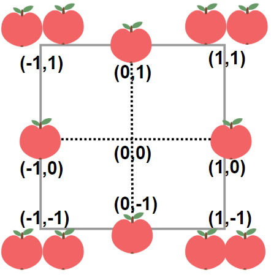

输入：neededApples = 1
输出：8
解释：边长长度为 1 的正方形不包含任何苹果。
但是边长为 2 的正方形包含 12 个苹果（如上图所示）。
周长为 2 * 4 = 8 。
示例 2：

输入：neededApples = 13
输出：16
示例 3：

输入：neededApples = 1000000000
输出：5040

提示：

1 <= neededApples <= 10^15

**思路**
如果正方形土地的右上角坐标为 (n,n)，即边长为 2n，周长为 8n，那么其中包含的苹果总数为：
$$S_n = 2n(n+1)(2n+1)$$
对于坐标为 (x, y) 的树，它有 |x| + |y| 个苹果。因此，一块右上角坐标为 (n,n)的正方形土地包含的苹果总数为：
$$S_n = \sum_{x=-n}^n \sum_{y=-n}^n |x| + |y|$$
由于 x 和 y 是对称的，因此：

$$\begin{aligned} S_n &= 2 \sum_{x=-n}^n \sum_{y=-n}^n |x| \\ &= 2 \sum_{x=-n}^n (2n+1) |x| \\ &= 2(2n+1) \sum_{x=-n}^n |x| \\ &= 2n(n+1)(2n+1) \end{aligned}$$

思路与算法

我们从小到大枚举 nnn，直到 2n(n+1)(2n+1)≥neededApples 为止。

```C++
class Solution {
public:
    int minStoneSum(vector<int> &piles, int k) {
        make_heap(piles.begin(), piles.end()); // 原地堆化（最大堆）
        while (k-- && piles[0]) {
            pop_heap(piles.begin(), piles.end()); // 弹出堆顶并移到末尾
            piles.back() -= piles.back() / 2;
            push_heap(piles.begin(), piles.end()); // 把末尾元素入堆
        }
        return accumulate(piles.begin(), piles.end(), 0);
    }
};
```

### 12/25 [1276. 不浪费原料的汉堡制作方案](https://leetcode.cn/problems/number-of-burgers-with-no-waste-of-ingredients/description/?envType=daily-question&envId=2023-12-25)

圣诞活动预热开始啦，汉堡店推出了全新的汉堡套餐。为了避免浪费原料，请你帮他们制定合适的制作计划。

给你两个整数 tomatoSlices 和 cheeseSlices，分别表示番茄片和奶酪片的数目。不同汉堡的原料搭配如下：

巨无霸汉堡：4 片番茄和 1 片奶酪
小皇堡：2 片番茄和 1 片奶酪
请你以 [total_jumbo, total_small]（[巨无霸汉堡总数，小皇堡总数]）的格式返回恰当的制作方案，使得剩下的番茄片 tomatoSlices 和奶酪片 cheeseSlices 的数量都是 0。

如果无法使剩下的番茄片 tomatoSlices 和奶酪片 cheeseSlices 的数量为 0，就请返回 []。

示例 1：

输入：tomatoSlices = 16, cheeseSlices = 7
输出：[1,6]
解释：制作 1 个巨无霸汉堡和 6 个小皇堡需要 `4*1 + 2*6 = 16` 片番茄和 1 + 6 = 7 片奶酪。不会剩下原料。
示例 2：

输入：tomatoSlices = 17, cheeseSlices = 4
输出：[]
解释：只制作小皇堡和巨无霸汉堡无法用光全部原料。
示例 3：

输入：tomatoSlices = 4, cheeseSlices = 17
输出：[]
解释：制作 1 个巨无霸汉堡会剩下 16 片奶酪，制作 2 个小皇堡会剩下 15 片奶酪。
示例 4：

输入：tomatoSlices = 0, cheeseSlices = 0
输出：[0,0]
示例 5：

输入：tomatoSlices = 2, cheeseSlices = 1
输出：[0,1]

提示：

0 <= tomatoSlices <= 10^7
0 <= cheeseSlices <= 10^7

**思路**
设巨无霸汉堡有 x 个，皇堡有 y 个，由于所有的材料都需要用完，因此我们可以得到二元一次方程组：
$$\begin{cases} 4x + 2y = \textit{tomatoSlices} \\ x + y = \textit{cheeseSlices} \end{cases}$$
解得：
$$\begin{cases} x = \dfrac{1}{2} \times \textit{tomatoSlices} - \textit{cheeseSlices} \\ y = 2 \times \textit{cheeseSlices} - \dfrac{1}{2} \times \textit{tomatoSlices} \end{cases}$$
根据题意，x,y≥0 且 x,y∈N，因此需要满足：

$$\begin{cases} \textit{tomatoSlices} = 2k, \quad k \in \mathbb{N} \\ \textit{tomatoSlices} \geq 2 \times \textit{cheeseSlices} \\ 4 \times \textit{cheeseSlices} \geq \textit{tomatoSlices} \end{cases}$$
若不满足，则无解。

```C++
class Solution {
public:
    vector<int> numOfBurgers(int tomatoSlices, int cheeseSlices) {
        if (tomatoSlices % 2 != 0 || tomatoSlices < cheeseSlices * 2 || cheeseSlices * 4 < tomatoSlices) {
            return {};
        }
        return {tomatoSlices / 2 - cheeseSlices, cheeseSlices * 2 - tomatoSlices / 2};
    }
};
```

### 12/26 [1349. 参加考试的最大学生数](https://leetcode.cn/problems/maximum-students-taking-exam/description/?envType=daily-question&envId=2023-12-26)

给你一个 m * n 的矩阵 seats 表示教室中的座位分布。如果座位是坏的（不可用），就用 '#' 表示；否则，用 '.' 表示。

学生可以看到左侧、右侧、左上、右上这四个方向上紧邻他的学生的答卷，但是看不到直接坐在他前面或者后面的学生的答卷。请你计算并返回该考场可以容纳的同时参加考试且无法作弊的 最大 学生人数。

学生必须坐在状况良好的座位上。

示例 1：

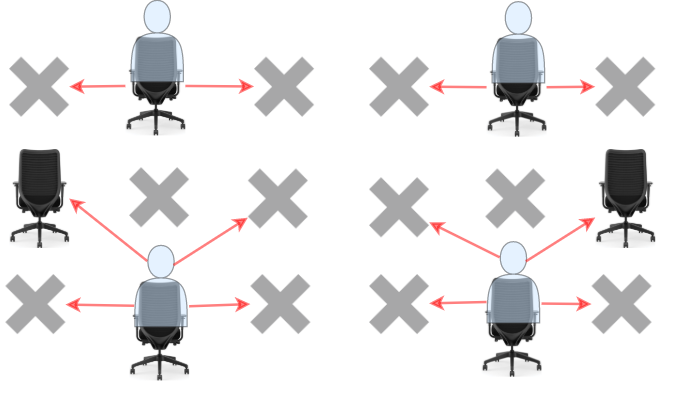

```C++
输入：seats = [["#",".","#","#",".","#"],
              [".","#","#","#","#","."],
              ["#",".","#","#",".","#"]]
输出：4
解释：教师可以让 4 个学生坐在可用的座位上，这样他们就无法在考试中作弊。 

示例 2：
输入：seats = [[".","#"],
              ["#","#"],
              ["#","."],
              ["#","#"],
              [".","#"]]
输出：3
解释：让所有学生坐在可用的座位上。

示例 3：
输入：seats = [["#",".",".",".","#"],
              [".","#",".","#","."],
              [".",".","#",".","."],
              [".","#",".","#","."],
              ["#",".",".",".","#"]]
输出：10
解释：让学生坐在第 1、3 和 5 列的可用座位上。

提示：
seats 只包含字符 '.' 和'#'
m == seats.length
n == seats[i].length
1 <= m <= 8
1 <= n <= 8
```

**思路**
学生在选择座位时，必须满足四个指定的位置都没有人坐，而这四个位置，要不位于当前排，要不位于前一排。因此，某一排的座位上，学生可以选择的座位取决于上一排的落座情况。这提醒我们可以以排为单位来进行动态规划。同时，每一个座位，学生可以选择坐或者不坐，我们可以用一个长为 n 的二进制数字来表示某一排的落座情况，从低到高的第 j 位，如果为 1 则表示这一排的第 j 个位置有人落座，为 0 则表示无人落座。

构造函数 dp(row,status)，用来表示当第 row\textit{row}row 排学生落座情况为 status 时，第 row 排及其之前所有座位能够容纳最多的学生数。首先判断第 row 排的落座情况是否可能为 status 时，我们可以构造一个函数 isSingleRowCompliant 来辅助判断，主要是判断是否有学生坐了坏的位置和是否有两个学生挨着坐。如果第 row 排的落座情况不可能为 status，返回一个极小的负值。接下来需要对前一排的落座情况进行遍历，即求出所有的 dp(row−1,upperRowStatus)，并且在这相邻两排的落座情况不会产生作弊的情况下，求出最大的学生数后进行返回。

最后我们调用 dp，求出最后一排所有状态下的最大学生数量。因为求解过程中会多次求解同一个状态，所以对动态规划进行记忆化的处理来降低时间复杂度。

```C++
class Solution {
public:
    int maxStudents(vector<vector<char>>& seats) {
        int m = seats.size(), n = seats[0].size();
        unordered_map<int, int> memo;

        auto isSingleRowCompliant = [&](int status, int row) -> bool {
            for (int j = 0; j < n; j++) {
                if ((status >> j) & 1) {
                    if (seats[row][j] == '#') {
                        return false;
                    }
                    if (j > 0 && ((status >> (j - 1)) & 1)) {
                        return false;
                    }
                }
            }
            return true;
        };
        
        auto isCrossRowsCompliant = [&](int status, int upperRowStatus) -> bool {
            for (int j = 0; j < n; j++) {
                if ((status >> j) & 1) {
                    if (j > 0 && ((upperRowStatus >> (j - 1)) & 1)) {
                        return false;
                    }
                    if (j < n - 1 && ((upperRowStatus >> (j + 1)) & 1)) {
                        return false;
                    }
                }
            }
            return true;
        };

        function<int(int, int)> dp = [&](int row, int status) -> int {
            int key = (row << n) + status;
            if (!memo.count(key)) {
                if (!isSingleRowCompliant(status, row)) {
                    memo[key] = INT_MIN;
                    return INT_MIN;
                }
                int students = __builtin_popcount(status);
                if (row == 0) {
                    memo[key] = students;
                    return students;
                }
                int mx = 0;
                for (int upperRowStatus = 0; upperRowStatus < 1 << n; upperRowStatus++) {
                    if (isCrossRowsCompliant(status, upperRowStatus)) {
                        mx = max(mx, dp(row - 1, upperRowStatus));
                    }
                }
                memo[key] = students + mx;
            }
            return memo[key];
        };
        
        int mx = 0;
        for (int i = 0; i < (1 << n); i++) {
            mx = max(mx, dp(m - 1, i));
        }
        return mx;
    }
};
```

### 12/27 [2660. 保龄球游戏的获胜者](https://leetcode.cn/problems/determine-the-winner-of-a-bowling-game/description/?envType=daily-question&envId=2023-12-27)

给你两个下标从 0 开始的整数数组 player1 和 player2 ，分别表示玩家 1 和玩家 2 击中的瓶数。

保龄球比赛由 n 轮组成，每轮的瓶数恰好为 10 。

假设玩家在第 i 轮中击中 xi 个瓶子。玩家第 i 轮的价值为：

如果玩家在该轮的前两轮的任何一轮中击中了 10 个瓶子，则为 2xi 。
否则，为 xi 。
玩家的得分是其 n 轮价值的总和。

返回

如果玩家 1 的得分高于玩家 2 的得分，则为 1 ；
如果玩家 2 的得分高于玩家 1 的得分，则为 2 ；
如果平局，则为 0 。

示例 1：

```C++
输入：player1 = [4,10,7,9], player2 = [6,5,2,3]
输出：1
解释：player1 的得分是 4 + 10 + 2*7 + 2*9 = 46。
player2 的得分是 6 + 5 + 2 + 3 = 16 。
player1 的得分高于 player2 的得分，所以 play1 在比赛中获胜，答案为 1 。
示例 2：

输入：player1 = [3,5,7,6], player2 = [8,10,10,2]
输出：2
解释：player1 的得分是 3 + 5 + 7 + 6 = 21 。
player2 的得分是 8 + 10 + 2*10 + 2*2 = 42。
player2 的得分高于 player1 的得分，所以 play2 在比赛中获胜，答案为 2 。
示例 3：

输入：player1 = [2,3], player2 = [4,1]
输出：0
解释：player1 的得分是 2 + 3 = 5 。
player2 的得分是 4 + 1 = 5 。
player1 的得分等于 player2 的得分，所以这一场比赛平局，答案为 0 。
```

提示：

n == player1.length == player2.length
1 <= n <= 1000
0 <= player1[i], player2[i] <= 10

**思路**
根据题意可以知道，第 i 轮中如果前两轮中存在任意一轮击中 10 个瓶子，则得分为 2xi，否则得分为 xi。我们直接模拟即可，假设当前遍历到 第 i 轮，检测 i 的前两轮是否击中 10 个瓶子，主要检测数组的第 i−1,i−2 个元素中是否存在等于 10 的元素，如果存在则当前得分翻倍，否则不进行翻倍，累加每轮得分得到总得分别为 s1,s2，比较二者的大小，根据题意返回即可。

如果 s1=s2，直接返回 0
如果 s1>s2，直接返回 1
如果 s1<s2，直接返回 2

```C++
class Solution {
public:
    int score(const vector<int> &player) {
        int res = 0;
        for (int i = 0; i < player.size(); i++) {
            if ((i > 0 && player[i - 1] == 10) || (i > 1 && player[i - 2] >= 10)) {
                res += 2 * player[i];
            } else {
                res += player[i];
            }
        }
        return res;
    }

    int isWinner(vector<int>& player1, vector<int>& player2) {
        int s1 = score(player1);
        int s2 = score(player2);
        return s1 == s2 ? 0 : s1 > s2 ? 1 : 2;
    }
};
```

### 12/28 [2735. 收集巧克力](https://leetcode.cn/problems/collecting-chocolates/description/)

给你一个长度为 n 、下标从 0 开始的整数数组 nums ，表示收集不同巧克力的成本。每个巧克力都对应一个不同的类型，最初，位于下标 i 的巧克力就对应第 i 个类型。

在一步操作中，你可以用成本 x 执行下述行为：

同时修改所有巧克力的类型，将巧克力的类型 ith 修改为类型 ((i + 1) mod n)th。
假设你可以执行任意次操作，请返回收集所有类型巧克力所需的最小成本。

示例 1：

输入：nums = [20,1,15], x = 5
输出：13
解释：最开始，巧克力的类型分别是 [0,1,2] 。我们可以用成本 1 购买第 1 个类型的巧克力。
接着，我们用成本 5 执行一次操作，巧克力的类型变更为 [1,2,0] 。我们可以用成本 1 购买第 2 个类型的巧克力。
然后，我们用成本 5 执行一次操作，巧克力的类型变更为 [2,0,1] 。我们可以用成本 1 购买第 0 个类型的巧克力。
因此，收集所有类型的巧克力需要的总成本是 (1 + 5 + 1 + 5 + 1) = 13 。可以证明这是一种最优方案。

示例 2：

输入：nums = [1,2,3], x = 4
输出：6
解释：我们将会按最初的成本收集全部三个类型的巧克力，而不需执行任何操作。因此，收集所有类型的巧克力需要的总成本是 1 + 2 + 3 = 6 。

提示：

1 <= nums.length <= 1000
1 <= nums[i] <= 10^9
1 <= x <= 10^9

**思路**
提示 1
枚举操作次数，从操作 0 次到操作 n−1 次。

提示 2
如果不操作，第 i 个巧克力必须花费 nums[i] 收集，总花费为所有 nums[i] 之和。例如示例 2 不操作是最优的。

如果只操作一次，第 i 个巧克力可以在操作前购买，也可以在操作后购买，取最小值，即 min⁡(nums[i],nums[(i+1) mod n])。

如果操作两次，购买第 i 个巧克力的花费为 min⁡(nums[i],nums[(i+1) mod n],nums[(i+2) mod n])。例如示例 1，我们可以操作两次，这样每块巧克力都只需要 1 的花费，总成本为 2x+1+1+1=13。

依此类推。

提示 3
如果暴力枚举操作次数，再枚举每个巧克力，再计算购买这个巧克力的最小花费，总的时间复杂度是 O(n3)。

一个初步的优化是，用 O(n2) 的时间预处理所有子数组的最小值，保存到一个二维数组中。这样做需要 O(n2)的时间和空间。

但其实不需要预处理，还有更简单的做法：

用一个长为 n 的数组 s 统计不同操作次数下的总成本。
写一个二重循环，枚举子数组的左端点 i 和右端点 j。
在枚举右端点的同时，维护从 nums[i] 到 nums[j] 的最小值 mn。
把 mn 加到 s[j−i] 中，这是因为长为 j−i+1 的子数组恰好对应着操作 j−i 次时要计算的子数组。
最后输出 min⁡(s)。

```C++
class Solution {
public:
    long long minCost(vector<int> &nums, int x) {
        int n = nums.size();
        vector<long long> s(n); // s[k] 统计操作 k 次的总成本
        for (int i = 0; i < n; i++) {
            s[i] = (long long) i * x;
        }
        for (int i = 0; i < n; i++) { // 子数组左端点
            int mn = nums[i];
            for (int j = i; j < n + i; j++) { // 子数组右端点（把数组视作环形的）
                mn = min(mn, nums[j % n]); // 维护从 nums[i] 到 nums[j] 的最小值
                s[j - i] += mn; // 累加操作 j-i 次的花费
            }
        }
        return *min_element(s.begin(), s.end());
    }
};
```

### 12/29 [2706. 购买两块巧克力](https://leetcode.cn/problems/buy-two-chocolates/description/?envType=daily-question&envId=2023-12-29)

给你一个整数数组 prices ，它表示一个商店里若干巧克力的价格。同时给你一个整数 money ，表示你一开始拥有的钱数。

你必须购买 恰好 两块巧克力，而且剩余的钱数必须是 非负数 。同时你想最小化购买两块巧克力的总花费。

请你返回在购买两块巧克力后，最多能剩下多少钱。如果购买任意两块巧克力都超过了你拥有的钱，请你返回 money 。注意剩余钱数必须是非负数。

示例 1：

输入：prices = [1,2,2], money = 3
输出：0
解释：分别购买价格为 1 和 2 的巧克力。你剩下 3 - 3 = 0 块钱。所以我们返回 0 。
示例 2：

输入：prices = [3,2,3], money = 3
输出：3
解释：购买任意 2 块巧克力都会超过你拥有的钱数，所以我们返回 3 。

提示：

2 <= prices.length <= 50
1 <= prices[i] <= 100
1 <= money <= 100

**思路**
我们可以在一次遍历中找到最小的两个价格，然后计算花费。

```C++
class Solution {
public:
    int buyChoco(vector<int>& prices, int money) {
        int a = 1000, b = 1000;
        for (int x : prices) {
            if (x < a) {
                b = a;
                a = x;
            } else if (x < b) {
                b = x;
            }
        }
        int cost = a + b;
        return money < cost ? money : money - cost;
    }
};
```

### 12/30 [1185. 一周中的第几天](https://leetcode.cn/problems/day-of-the-week/description/?envType=daily-question&envId=2023-12-30)

给你一个日期，请你设计一个算法来判断它是对应一周中的哪一天。

输入为三个整数：day、month 和 year，分别表示日、月、年。

您返回的结果必须是这几个值中的一个 {"Sunday", "Monday", "Tuesday", "Wednesday", "Thursday", "Friday", "Saturday"}。

示例 1：

输入：day = 31, month = 8, year = 2019
输出："Saturday"
示例 2：

输入：day = 18, month = 7, year = 1999
输出："Sunday"
示例 3：

输入：day = 15, month = 8, year = 1993
输出："Sunday"

提示：

给出的日期一定是在 1971 到 2100 年之间的有效日期。

**思路**
题目规定输入的日期一定是在 1971 到 2100 年之间的有效日期，即在 1971 年 1 月 1 日，到 2100 年 12 月 31 日之间。通过查询日历可知，1970 年 12 月 31 日是星期四，我们只需要算出输入的日期距离 1970 年 12 月 31 日有几天，再加上 3 后对 7 求余，即可得到输入日期是一周中的第几天。

求输入的日期距离 1970 年 12 月 31 日的天数，可以分为三部分分别计算后求和：

（1）输入年份之前的年份的天数贡献；
（2）输入年份中，输入月份之前的月份的天数贡献；
（3）输入月份中的天数贡献。

例如，如果输入是 2100 年 12 月 31 日，即可分为三部分分别计算后求和：

（1）1971 年 1 月 1 到 2099 年 12 月 31 日之间所有的天数；
（2）2100 年 1 月 1 日到 2100 年 11 月 31 日之间所有的天数；
（3）2100 年 12 月 1 日到 2100 年 12 月 31 日之间所有的天数。

其中（1）和（2）部分的计算需要考虑到闰年的影响。当年份是 400 的倍数或者是 4 的倍数且不是 100 的倍数时，该年会在二月份多出一天。

```C++
class Solution {
public:
    string dayOfTheWeek(int day, int month, int year) {
        vector<string> week = {"Monday", "Tuesday", "Wednesday", "Thursday", "Friday", "Saturday", "Sunday"};
        vector<int> monthDays = {31, 28, 31, 30, 31, 30, 31, 31, 30, 31, 30};
        /* 输入年份之前的年份的天数贡献 */
        int days = 365 * (year - 1971) + (year - 1969) / 4;
        /* 输入年份中，输入月份之前的月份的天数贡献 */
        for (int i = 0; i < month - 1; ++i) {
            days += monthDays[i];
        }
        if ((year % 400 == 0 || (year % 4 == 0 && year % 100 != 0)) && month >= 3) {
            days += 1;
        }
        /* 输入月份中的天数贡献 */
        days += day;
        return week[(days + 3) % 7];
    }
};
```

### 12/31 [1185. 一周中的第几天](https://leetcode.cn/problems/day-of-the-week/description/?envType=daily-question&envId=2023-12-30)

给你一个字符串 date ，按 YYYY-MM-DD 格式表示一个 现行公元纪年法 日期。返回该日期是当年的第几天。

示例 1：

输入：date = "2019-01-09"
输出：9
解释：给定日期是2019年的第九天。

示例 2：

输入：date = "2019-02-10"
输出：41

提示：

date.length == 10
date[4] == date[7] == '-'，其他的 date[i] 都是数字
date 表示的范围从 1900 年 1 月 1 日至 2019 年 12 月 31 日

**思路**
我们首先从给定的字符串 date 中提取出年 year，月 month 以及日 day。

这样一来，我们就可以首先统计到 month 的前一个月为止的天数。这一部分只需要使用一个长度为 12 的数组，预先记录每一个月的天数，再进行累加即可。随后我们将答案再加上 day，就可以得到 date 是一年中的第几天。

需要注意的是，如果 year 是闰年，那么二月份会多出一天。闰年的判定方法为：year 是 400 的倍数，或者 year 是 4 的倍数且不是 100 的倍数。

```C++
class Solution {
public:
    int dayOfYear(string date) {
        int year = stoi(date.substr(0, 4));
        int month = stoi(date.substr(5, 2));
        int day = stoi(date.substr(8, 2));

        int amount[] = {31, 28, 31, 30, 31, 30, 31, 31, 30, 31, 30, 31};
        if (year % 400 == 0 || (year % 4 == 0 && year % 100 != 0)) {
            ++amount[1];
        }

        int ans = 0;
        for (int i = 0; i < month - 1; ++i) {
            ans += amount[i];
        }
        return ans + day;
    }
};
```
