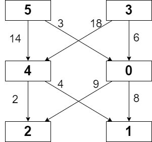
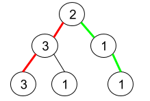
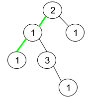

# 11月每日一题

## 11/18-11/30

### 11/18 [2342. 数位和相等数对的最大和](https://leetcode.cn/problems/max-sum-of-a-pair-with-equal-sum-of-digits)

给你一个下标从 0 开始的数组 nums ，数组中的元素都是 正 整数。请你选出两个下标 i 和 j（i != j），且 nums[i] 的数位和 与  nums[j] 的数位和相等。

请你找出所有满足条件的下标 i 和 j ，找出并返回 nums[i] + nums[j] 可以得到的 最大值 。

示例 1：

输入：nums = [18,43,36,13,7]
输出：54
解释：满足条件的数对 (i, j) 为：

- (0, 2) ，两个数字的数位和都是 9 ，相加得到 18 + 36 = 54 。
- (1, 4) ，两个数字的数位和都是 7 ，相加得到 43 + 7 = 50 。
所以可以获得的最大和是 54 。
示例 2：

输入：nums = [10,12,19,14]
输出：-1
解释：不存在满足条件的数对，返回 -1 。

提示：

1 <= nums.length <= 105
1 <= nums[i] <= 109

**思路**
既然每个`nums[i]`都对应一个具体的数位和，统计每个数位和的最大值和次大值，然后在所有数位和的最大值和次大值求和中取 max 即是答案。
利用`1 <= nums[i] <= 10^9`，我们知道数位和不会超过`9×9=81`，可直接起一个大小为 `100×2`的二维数组进行统计，`val[x][0]` 代表数位和为 `x` 的次大值，`val[x][1]` 代表数位和为 `x` 的最大值。
更进一步，我们不需要记录次大值，仅记录某个“数对和”当前的最大值即可。
每次计算出当前 `nums[i]` 对应的数对 `cur` 后，检查 `cur` 是否已出现过，若出现过用两者之和更新答案，并用 `nums[i]` 来更新 `cur` 下的最大值。
该做法本质是用「遍历过程」代替「次大维护」。

```C++
class Solution {
public:
    int maximumSum(vector<int>& nums) {
        vector<vector<int>> val (100,vector<int>(2,0));
        for(int i : nums){
            int j = i, cur = 0;
            while (j !=0){
                cur += j % 10;
                j /= 10;
            }
            if (i >= val [cur][1]){
                val[cur][0] = val[cur][1];
                val[cur][1] = i;
            }else if (i > val [cur][0]){
                val[cur][0] = i;
            }
        }
        int ans = -1;
        for (int i = 0; i < 100; ++i ){
            if (val[i][0]!=0 && val[i][1] !=0){
            ans = max(ans, val[i][0]+val[i][1]);
            }
        }
    return ans;
    }
};
```

```C++
class Solution {
public:
    int maximumSum(vector<int>& nums) {
        vector<int> val (100,0);
        int ans =-1;
        for(int i : nums){
            int j = i, cur = 0;
            while (j !=0){
                cur += j % 10;
                j /= 10;
            }
            if (val [cur]!=0){
                ans = max(ans,val[cur]+i);
            }
            val[cur] = max(val[cur],i);
            }
    return ans;
    }
};
```

### 11/19 [689. 三个无重叠子数组的最大和](https://leetcode.cn/problems/maximum-sum-of-3-non-overlapping-subarrays)

给你一个整数数组 `nums` 和一个整数 `k` ，找出三个长度为 `k` 、互不重叠、且全部数字和（`3 * k` 项）最大的子数组，并返回这三个子数组。

以下标的数组形式返回结果，数组中的每一项分别指示每个子数组的起始位置（下标从 0 开始）。如果有多个结果，返回字典序最小的一个。

示例 1：

输入：nums = [1,2,1,2,6,7,5,1], k = 2
输出：[0,3,5]
解释：子数组 [1, 2], [2, 6], [7, 5] 对应的起始下标为 [0, 3, 5]。
也可以取 [2, 1], 但是结果 [1, 3, 5] 在字典序上更大。
示例 2：

输入：nums = [1,2,1,2,1,2,1,2,1], k = 2
输出：[0,2,4]

提示：

1 <= nums.length <= 2 * 104
1 <= nums[i] < 216
1 <= k <= floor(nums.length / 3)

**思路**
预处理前后缀 + 枚举中间子数组
我们可以预处理得到数组 `nums` 的前缀和数组 s，其中 $$s[i] = \sum_{j=0}^{i-1} nums[j]$$，那么对于任意的 `i`，`j`，`s[j]−s[i]` 就是子数组 `[i,j)` 的和。

接下来，我们使用动态规划的方法，维护两个长度为 `n` 的数组 `pre` 和 `suf`，其中 `pre[i]` 表示 `[0,i]` 范围内长度为 `k` 的子数组的最大和及其起始位置，`suf[i]` 表示 `[i,n)` 范围内长度为 `k` 的子数组的最大和及其起始位置。

然后，我们枚举中间子数组的起始位置 `i`，那么三个子数组的和就是 `pre[i−1][0]+suf[i+k][0]+(s[i+k]−s[i])`，其中 `pre[i−1][0]`表示 `[0,i−1]` 范围内长度为 `k` 的子数组的最大和，`suf[i+k][0]`表示 `[i+k,n)` 范围内长度为 `k` 的子数组的最大和，`(s[i+k]−s[i])` 表示 `[i,i+k)` 范围内长度为 `k` 的子数组的和。我们找出和的最大值对应的三个子数组的起始位置即可。

```C++
class Solution {
public:
    vector<int> maxSumOfThreeSubarrays(vector<int>& nums, int k) {
        int n = nums.size();
        vector<int> s(n + 1, 0);
        for (int i = 0; i < n; ++i) {
            s[i + 1] = s[i] + nums[i];
        }

        vector<vector<int>> pre(n, vector<int>(2, 0));
        vector<vector<int>> suf(n, vector<int>(2, 0));

        for (int i = 0, t = 0, idx = 0; i < n - k + 1; ++i) {
            int cur = s[i + k] - s[i];
            if (cur > t) {
                pre[i + k - 1] = {cur, i};
                t = cur;
                idx = i;
            } else {
                pre[i + k - 1] = {t, idx};
            }
        }

        for (int i = n - k, t = 0, idx = 0; i >= 0; --i) {
            int cur = s[i + k] - s[i];
            if (cur >= t) {
                suf[i] = {cur, i};
                t = cur;
                idx = i;
            } else {
                suf[i] = {t, idx};
            }
        }

        vector<int> ans;
        for (int i = k, t = 0; i < n - 2 * k + 1; ++i) {
            int cur = s[i + k] - s[i] + pre[i - 1][0] + suf[i + k][0];
            if (cur > t) {
                ans = {pre[i - 1][1], i, suf[i + k][1]};
                t = cur;
            }
        }
        return ans;
    }
};
```

```C++
class Solution {
public:
    vector<int> maxSumOfThreeSubarrays(vector<int> &nums, int k) {
        vector<int> ans;
        int sum1 = 0, maxSum1 = 0, maxSum1Idx = 0;
        int sum2 = 0, maxSum12 = 0, maxSum12Idx1 = 0, maxSum12Idx2 = 0;
        int sum3 = 0, maxTotal = 0;
        for (int i = k * 2; i < nums.size(); ++i) {
            sum1 += nums[i - k * 2];
            sum2 += nums[i - k];
            sum3 += nums[i];
            if (i >= k * 3 - 1) {
                if (sum1 > maxSum1) {
                    maxSum1 = sum1;
                    maxSum1Idx = i - k * 3 + 1;
                }
                if (maxSum1 + sum2 > maxSum12) {
                    maxSum12 = maxSum1 + sum2;
                    maxSum12Idx1 = maxSum1Idx;
                    maxSum12Idx2 = i - k * 2 + 1;
                }
                if (maxSum12 + sum3 > maxTotal) {
                    maxTotal = maxSum12 + sum3;
                    ans = {maxSum12Idx1, maxSum12Idx2, i - k + 1};
                }
                sum1 -= nums[i - k * 3 + 1];
                sum2 -= nums[i - k * 2 + 1];
                sum3 -= nums[i - k + 1];
            }
        }
        return ans;
    }
};
```

### 11/20 [53. 最大子数组和](https://leetcode.cn/problems/maximum-subarray)

给你一个整数数组 nums ，请你找出一个具有最大和的连续子数组（子数组最少包含一个元素），返回其最大和。

子数组 是数组中的一个连续部分。

示例 1：
输入：nums = [-2,1,-3,4,-1,2,1,-5,4]
输出：6
解释：连续子数组 [4,-1,2,1] 的和最大，为 6 。

示例 2：
输入：nums = [1]
输出：1

示例 3：
输入：nums = [5,4,-1,7,8]
输出：23

提示：
1 <= nums.length <= 105
-104 <= nums[i] <= 104

进阶：如果你已经实现复杂度为 O(n) 的解法，尝试使用更为精妙的 分治法 求解。

**思路**
假设 `nums` 数组的长度是 `n`，下标从 `0` 到 `n−1`。

我们用 `f(i)` 代表以第 `i` 个数结尾的「连续子数组的最大和」，那么很显然我们要求的答案就是：

$$\max_{0 \leq i \leq n-1} \{ f(i) \}$$

因此我们只需要求出每个位置的 `f(i)`，然后返回 `f` 数组中的最大值即可。那么我们如何求 `f(i)` 呢？我们可以考虑 `nums[i]` 单独成为一段还是加入 `f(i−1)` 对应的那一段，这取决于 `nums[i]` 和 `f(i−1)+nums[i]` 的大小，我们希望获得一个比较大的，于是可以写出这样的动态规划转移方程：

$$f(i) = \max \{ f(i-1) + \textit{nums}[i], \textit{nums}[i] \}$$

不难给出一个时间复杂度 `O(n)`、空间复杂度 `O(n)` 的实现，即用一个 `f` 数组来保存 `f(i)` 的值，用一个循环求出所有 `f(i)`。考虑到 `f(i)` 只和 `f(i−1)` 相关，于是我们可以只用一个变量 `pre` 来维护对于当前 `f(i)` 的 `f(i−1)` 的值是多少，从而让空间复杂度降低到 `O(1)`，这有点类似「滚动数组」的思想。

```C++
// 动态规划
class Solution {
public:
    int maxSubArray(vector<int>& nums) {
        int i=0;
        int ans = nums [0];
        for (int &n : nums){
            i = max(i+n,n);
            ans = max(ans,i);
        }
        return ans;
    }
};
```

```C++
// 分治，线段树方法
class Solution {
public:
    struct Status {
        int lSum, rSum, mSum, iSum;
    };

    Status pushUp(Status l, Status r) {
        int iSum = l.iSum + r.iSum;
        int lSum = max(l.lSum, l.iSum + r.lSum);
        int rSum = max(r.rSum, r.iSum + l.rSum);
        int mSum = max(max(l.mSum, r.mSum), l.rSum + r.lSum);
        return (Status) {lSum, rSum, mSum, iSum};
    };

    Status get(vector<int> &a, int l, int r) {
        if (l == r) {
            return (Status) {a[l], a[l], a[l], a[l]};
        }
        int m = (l + r) >> 1;
        Status lSub = get(a, l, m);
        Status rSub = get(a, m + 1, r);
        return pushUp(lSub, rSub);
    }

    int maxSubArray(vector<int>& nums) {
        return get(nums, 0, nums.size() - 1).mSum;
    }
};
```

### 11/21 [2216. 美化数组的最少删除数](https://leetcode.cn/problems/minimum-deletions-to-make-array-beautiful)

给你一个下标从 0 开始的整数数组 nums ，如果满足下述条件，则认为数组 nums 是一个 美丽数组 ：
nums.length 为偶数
对所有满足 i % 2 == 0 的下标 i ，nums[i] != nums[i + 1] 均成立
注意，空数组同样认为是美丽数组。
你可以从 nums 中删除任意数量的元素。当你删除一个元素时，被删除元素右侧的所有元素将会向左移动一个单位以填补空缺，而左侧的元素将会保持 不变 。
返回使 nums 变为美丽数组所需删除的 最少 元素数目。

示例 1：

输入：nums = [1,1,2,3,5]
输出：1
解释：可以删除 nums[0] 或 nums[1] ，这样得到的 nums = [1,2,3,5] 是一个美丽数组。可以证明，要想使 nums 变为美丽数组，至少需要删除 1 个元素。
示例 2：

输入：nums = [1,1,2,2,3,3]
输出：2
解释：可以删除 nums[0] 和 nums[5] ，这样得到的 nums = [1,2,2,3] 是一个美丽数组。可以证明，要想使 nums 变为美丽数组，至少需要删除 2 个元素。

提示：
1 <= nums.length <= 105
0 <= nums[i] <= 105

**思路**
根据题目描述，我们知道，一个美丽数组有偶数个元素，且如果我们把这个数组中每相邻两个元素划分为一组，那么每一组中的两个元素都不相等。这意味着，组内的元素不能重复，但组与组之间的元素可以重复。

因此，我们考虑从左到右遍历数组，只要遇到相邻两个元素相等，我们就将其中的一个元素删除，即删除数加一；否则，我们可以保留这两个元素。

最后，我们判断删除后的数组长度是否为偶数，如果不是，则说明我们需要再删除一个元素，使得最终的数组长度为偶数。

```C++
class Solution {
public:
    int minDeletion(vector<int>& nums) {
        int ans=0;
        int n = nums.size();
        if (n== 0) return 0;
        //每次走两步
        for (int i = 0;i< n; i+=2){
            //下标i在最后一个，代表(处理后)的数组长度为奇数，需要把最后一个元素删除
            if (i== n-1){
                ans++;
                return ans;
            }
            /*如果当前下标元素和下一个相等，就“删掉”一个，但不是真正的删掉，只是将游标后移一位，
            以便下次循环从i+1的位置开始判断，这样就相当于“孤立”了i号元素”*/
            if (nums[i]==nums[i+1]){
                ans++;
                i--;
            }
        }
        return ans;
    }
};
```

### 11/22 [2304. 网格中的最小路径代价](https://leetcode.cn/problems/minimum-path-cost-in-a-grid)

给你一个下标从 0 开始的整数矩阵 grid ，矩阵大小为 `m x n` ，由从 0 到 `m * n - 1` 的不同整数组成。你可以在此矩阵中，从一个单元格移动到 下一行 的任何其他单元格。如果你位于单元格 `(x, y)` ，且满足 `x < m - 1` ，你可以移动到 `(x + 1, 0)`, `(x + 1, 1)`, ..., `(x + 1, n - 1)` 中的任何一个单元格。注意： 在最后一行中的单元格不能触发移动。

每次可能的移动都需要付出对应的代价，代价用一个下标从 0 开始的二维数组 moveCost 表示，该数组大小为 `(m * n) x n` ，其中 `moveCost[i][j]` 是从值为 i 的单元格移动到下一行第 j 列单元格的代价。从 grid 最后一行的单元格移动的代价可以忽略。

grid 一条路径的代价是：所有路径经过的单元格的 值之和 加上 所有移动的 代价之和 。从 第一行 任意单元格出发，返回到达 最后一行 任意单元格的最小路径代价。

示例 1：

输入：`grid = [[5,3],[4,0],[2,1]], moveCost = [[9,8],[1,5],[10,12],[18,6],[2,4],[14,3]]`
输出：17
解释：
最小代价的路径是 5 -> 0 -> 1 。

- 路径途经单元格值之和 5 + 0 + 1 = 6 。
- 从 5 移动到 0 的代价为 3 。
- 从 0 移动到 1 的代价为 8 。
路径总代价为 6 + 3 + 8 = 17 。

示例 2：
输入：`grid = [[5,1,2],[4,0,3]], moveCost = [[12,10,15],[20,23,8],[21,7,1],[8,1,13],[9,10,25],[5,3,2]]`
输出：6
解释：
最小代价的路径是 2 -> 3 。

- 路径途经单元格值之和 2 + 3 = 5 。
- 从 2 移动到 3 的代价为 1 。
路径总代价为 5 + 1 = 6 。

提示：

```C++
m == grid.length
n == grid[i].length
2 <= m, n <= 50
grid 由从 0 到 m * n - 1 的不同整数组成
moveCost.length == m * n
moveCost[i].length == n
1 <= moveCost[i][j] <= 100
```

**思路**
可以发现，每一层的值可以来自上一层的值，并且走到当前位置的花费越小越好，所以可以考虑动态规划，`dp[i][j]`表示走到i行j列的最小开销，转移的时候，把上一层的所有点都探测一遍，找到最小的值

```C++
class Solution {
public:
    int minPathCost(vector<vector<int>>& grid, vector<vector<int>>& moveCost) {
        int n = grid.size(),m= grid[0].size();
        vector<vector<int>> dp(n,vector<int>(m,1e9));
        dp[0] = grid[0];
        for(int i = 1 ;i<n;i++)
            for(int j =0;j<m;j++)
                for(int k =0;k<m;k++)
                    dp[i][j] = min(dp[i][j],dp[i-1][k]+moveCost[grid[i-1][k]][j]+grid[i][j]);
        return *min_element(dp.back().begin(),dp.back().end());
    }
};
```

### 11/23 [1410. HTML 实体解析器](https://leetcode.cn/problems/html-entity-parser)

HTML 实体解析器 是一种特殊的解析器，它将 HTML 代码作为输入，并用字符本身替换掉所有这些特殊的字符实体。

HTML 里这些特殊字符和它们对应的字符实体包括：

双引号：字符实体为 &quot; ，对应的字符是 " 。
单引号：字符实体为 &apos; ，对应的字符是 ' 。
与符号：字符实体为 &amp; ，对应对的字符是 & 。
大于号：字符实体为 &gt; ，对应的字符是 > 。
小于号：字符实体为 &lt; ，对应的字符是 < 。
斜线号：字符实体为 &frasl; ，对应的字符是 / 。
给你输入字符串 text ，请你实现一个 HTML 实体解析器，返回解析器解析后的结果。

示例 1：

输入：text = "&amp; is an HTML entity but &ambassador; is not."
输出："& is an HTML entity but &ambassador; is not."
解释：解析器把字符实体 &amp; 用 & 替换
示例 2：

输入：text = "and I quote: &quot;...&quot;"
输出："and I quote: \"...\""
示例 3：

输入：text = "Stay home! Practice on Leetcode :)"
输出："Stay home! Practice on Leetcode :)"
示例 4：

输入：text = "x &gt; y &amp;&amp; x &lt; y is always false"
输出："x > y && x < y is always false"
示例 5：

输入：text = "leetcode.com&frasl;problemset&frasl;all"
输出："leetcode.com/problemset/all"

提示：

1 <= text.length <= 10^5
字符串可能包含 256 个ASCII 字符中的任意字符。

**思路**
每个特殊字符均以 & 开头，最长一个特殊字符为 &frasl;。

从前往后处理 text，若遇到 & 则往后读取最多 666 个字符（中途遇到结束字符 ; 则终止），若读取子串为特殊字符，将使用替换字符进行拼接，否则使用原字符进行拼接。

时间复杂度：`O(n×K)`，其中 `K=6` 为最大特殊字符长度
空间复杂度：`O(C)`，一个固定大小的哈希表

```C++
class Solution {
public:
    string entityParser(string text) {
        unordered_map<string, string> entityMap = {
            {"&quot;", "\""},
            {"&apos;", "'"},
            {"&amp;", "&"},
            {"&gt;", ">"},
            {"&lt;", "<"},
            {"&frasl;", "/"}
        };
        int n = text.length();
        string ans = "";
        for (int i = 0; i < n; ) {
            if (text[i] == '&') {
                int j = i + 1;
                while (j < n && j - i < 6 && text[j] != ';') j++;
                string sub = text.substr(i, min(j + 1, n) - i);
                if (entityMap.find(sub) != entityMap.end()) {
                    ans += entityMap[sub];
                    i = j + 1;
                    continue;
                }
            }
            ans += text[i++];
        }
        return ans;
    }
};
```

### 11/24 [2824. 统计和小于目标的下标对数目](https://leetcode.cn/problems/count-pairs-whose-sum-is-less-than-target)

给你一个下标从 0 开始长度为 n 的整数数组 nums 和一个整数 target ，请你返回满足 0 <= i < j < n 且 nums[i] + nums[j] < target 的下标对 (i, j) 的数目。

示例 1：
输入：nums = [-1,1,2,3,1], target = 2
输出：3
解释：总共有 3 个下标对满足题目描述：

- (0, 1) ，0 < 1 且 nums[0] + nums[1] = 0 < target
- (0, 2) ，0 < 2 且 nums[0] + nums[2] = 1 < target
- (0, 4) ，0 < 4 且 nums[0] + nums[4] = 0 < target
注意 (0, 3) 不计入答案因为 nums[0] + nums[3] 不是严格小于 target 。
示例 2：

输入：nums = [-6,2,5,-2,-7,-1,3], target = -2
输出：10
解释：总共有 10 个下标对满足题目描述：

- (0, 1) ，0 < 1 且 nums[0] + nums[1] = -4 < target
- (0, 3) ，0 < 3 且 nums[0] + nums[3] = -8 < target
- (0, 4) ，0 < 4 且 nums[0] + nums[4] = -13 < target
- (0, 5) ，0 < 5 且 nums[0] + nums[5] = -7 < target
- (0, 6) ，0 < 6 且 nums[0] + nums[6] = -3 < target
- (1, 4) ，1 < 4 且 nums[1] + nums[4] = -5 < target
- (3, 4) ，3 < 4 且 nums[3] + nums[4] = -9 < target
- (3, 5) ，3 < 5 且 nums[3] + nums[5] = -3 < target
- (4, 5) ，4 < 5 且 nums[4] + nums[5] = -8 < target
- (4, 6) ，4 < 6 且 nums[4] + nums[6] = -4 < target

提示：

1 <= nums.length == n <= 50
-50 <= nums[i], target <= 50

**思路**
为了方便，先对 nums 进行排序。

当 nums 有了有序特性后，剩下的便是「遍历右端点，在右端点左侧找最大合法左端点」或「遍历左端点，在左端点右侧找最大合法右端点」过程。

方法一:二分查找

遍历右端点 `i`，然后在 `[0,i−1]` 范围内进行二分，找到最大的满足 `nums[j]+nums[i]<target` 的位置 `j`。

若存在这样左端点 `j`，说明以 `nums[i]` 为右端点时，共有 `j+1` 个（范围为 `[0,j]` ）个合法左端点，需要被统计。

方法二:双指针

使用 l 和 r 分别指向排序好的 nums 的首尾。

若当前 `nums[l]+nums[r]≥target`，说明此时对于 `l` 来说，`r` 并不合法，对 `r` 自减（左移）。

直到满足 `nums[l]+nums[r]<target`，此时对于 `l` 来说，找到了最右侧的合法右端点 `r`，在 `[l+1,r]` 期间的数必然仍满足 `nums[l]+nums[r]<target`，共有 `r−l` 个（范围为 `[l+1,r]` ）个合法右端点，需要被统计。

```C++
//二分查找
class Solution {
public:
    int countPairs(vector<int>& nums, int target) {
        sort(nums.begin(), nums.end());
        int n = nums.size(), ans = 0;
        for (int i = 1; i < n; i++) {
            int l = 0, r = i - 1;
            while (l < r) {
                int mid = l + r + 1 >> 1;
                if (nums[mid] + nums[i] < target) l = mid;
                else r = mid - 1;
            }
            if (nums[r] + nums[i] < target) ans += r + 1;
        }
        return ans;
    }
};
```

```C++
//双指针
class Solution {
public:
    int countPairs(vector<int>& nums, int target) {
        sort(nums.begin(), nums.end());
        int n = nums.size(), ans = 0;
        for (int l = 0, r = n - 1; l < r; l++) {
            while (r >= 0 && nums[l] + nums[r] >= target) r--;
            if (l < r) ans += r - l;
        }
        return ans;
    }
};
```

### 11/25 [1457. 二叉树中的伪回文路径](https://leetcode.cn/problems/pseudo-palindromic-paths-in-a-binary-tree)

给你一棵二叉树，每个节点的值为 1 到 9 。我们称二叉树中的一条路径是 「伪回文」的，当它满足：路径经过的所有节点值的排列中，存在一个回文序列。

请你返回从根到叶子节点的所有路径中 伪回文 路径的数目。

示例 1：



输入：root = [2,3,1,3,1,null,1]
输出：2
解释：上图为给定的二叉树。总共有 3 条从根到叶子的路径：红色路径 [2,3,3] ，绿色路径 [2,1,1] 和路径 [2,3,1] 。
     在这些路径中，只有红色和绿色的路径是伪回文路径，因为红色路径 [2,3,3] 存在回文排列 [3,2,3] ，绿色路径 [2,1,1] 存在回文排列 [1,2,1] 。
示例 2：



输入：root = [2,1,1,1,3,null,null,null,null,null,1]
输出：1
解释：上图为给定二叉树。总共有 3 条从根到叶子的路径：绿色路径 [2,1,1] ，路径 [2,1,3,1] 和路径 [2,1] 。
     这些路径中只有绿色路径是伪回文路径，因为 [2,1,1] 存在回文排列 [1,2,1] 。
示例 3：

输入：root = [9]
输出：1

提示：

给定二叉树的节点数目在范围 [1, 105] 内
1 <= Node.val <= 9

**思路**
“伪回文”是指能够通过重新排列变成“真回文”，真正的回文串只有两种情况：

长度为偶数，即出现次数为奇数的字符个数为 0 个
长度为奇数，即出现次数为奇数的字符个数为 1 个（位于中间）
因此，我们只关心路径中各个字符（数字 0-9）出现次数的奇偶性，若路径中所有字符出现次数均为偶数，或仅有一个字符出现次数为奇数，那么该路径满足要求。

节点值范围为 [1,9]，除了使用固定大小的数组进行词频统计以外，还可以使用一个 int 类型的变量 cnt 来统计各数值的出现次数奇偶性：若 cnt 的第 k 位为 1，说明数值 k 的出现次数为奇数，否则说明数值 k 出现次数为偶数或没出现过，两者是等价的。

例如 $cnt = (0001010)_2$ 代表数值 1 和数值 3 出现次数为奇数次，其余数值没出现过或出现次数为偶数次。

翻转一个二进制数字中的某一位可使用「异或」操作，具体操作位 `cnt ^= 1 << k`。

判断是否最多只有一个字符出现奇数次的操作，也就是判断一个二进制数字是为全为 0 或仅有一位 1，可配合 lowbit 来做，若 `cnt` 与 `lowbit(cnt) = cnt & -cnt` 相等，说明满足要求。

考虑到对 `lowbit(x) = x & -x` 不熟悉的同学，这里再做简单介绍：`lowbit(x)` 表示 x 的二进制表示中最低位的 1 所在的位置对应的值，即仅保留从最低位起的第一个 1，其余位均以 0 填充：
x = 6，其二进制表示为 $(110)_2$，那么 $lowbit(6) = (010)_2 = 2$
x = 12，其二进制表示为 $(1100)_2$，那么 $lowbit(12) = (100)_2 = 4$

```C++
/**
 * Definition for a binary tree node.
 * struct TreeNode {
 *     int val;
 *     TreeNode *left;
 *     TreeNode *right;
 *     TreeNode() : val(0), left(nullptr), right(nullptr) {}
 *     TreeNode(int x) : val(x), left(nullptr), right(nullptr) {}
 *     TreeNode(int x, TreeNode *left, TreeNode *right) : val(x), left(left), right(right) {}
 * };
 */
 //数组维护
class Solution {
    int dfs(TreeNode *node, array<int, 10> &p) {
        if (node == nullptr) {
            return 0;
        }
        p[node->val] ^= 1; // 修改 node->val 出现次数的奇偶性
        int res;
        if (node->left == node->right) { // node 是叶子节点
            res = accumulate(p.begin(), p.end(), 0) <= 1;
        } else {
            res = dfs(node->left, p) + dfs(node->right, p);
        }
        // 恢复到递归 node 之前的状态（不做这一步就把 node->val 算到其它路径中了）
        p[node->val] ^= 1;
        return res;
    }
public:
    int pseudoPalindromicPaths(TreeNode *root) {
        array<int, 10> p{};
        return dfs(root, p);
    }
};
```

```C++
//位运算
class Solution {
public:
    int ans;
    int pseudoPalindromicPaths(TreeNode* root) {
        dfs(root, 0);
        return ans;
    }
    void dfs(TreeNode* root, int cnt) {
        if (!root->left && !root->right) {
            cnt ^= 1 << root->val;
            if (cnt == (cnt & -cnt)) ans++;
            return;
        }
        if (root->left) dfs(root->left, cnt ^ (1 << root->val));
        if (root->right) dfs(root->right, cnt ^ (1 << root->val));
    }
};
```

### 11/26 [828. 统计子串中的唯一字符](https://leetcode.cn/problems/count-unique-characters-of-all-substrings-of-a-given-string)

我们定义了一个函数 `countUniqueChars(s)` 来统计字符串 s 中的唯一字符，并返回唯一字符的个数。

例如：s = "LEETCODE" ，则其中 "L", "T","C","O","D" 都是唯一字符，因为它们只出现一次，所以 countUniqueChars(s) = 5 。

本题将会给你一个字符串 s ，我们需要返回 countUniqueChars(t) 的总和，其中 t 是 s 的子字符串。输入用例保证返回值为 32 位整数。

注意，某些子字符串可能是重复的，但你统计时也必须算上这些重复的子字符串（也就是说，你必须统计 s 的所有子字符串中的唯一字符）。

示例 1：

输入: s = "ABC"
输出: 10
解释: 所有可能的子串为："A","B","C","AB","BC" 和 "ABC"。
     其中，每一个子串都由独特字符构成。
     所以其长度总和为：1 + 1 + 1 + 2 + 2 + 3 = 10
示例 2：

输入: s = "ABA"
输出: 8
解释: 除了 countUniqueChars("ABA") = 1 之外，其余与示例 1 相同。
示例 3：

输入：s = "LEETCODE"
输出：92

提示：

1 <= s.length <= 105
s 只包含大写英文字符

**思路**
对于下标为  i 的字符 $c_i$，当它在某个子字符串中仅出现一次时，它会对这个子字符串统计唯一字符时有贡献。只需对每个字符，计算有多少子字符串仅包含该字符一次即可。对于 $c_i$， 记同字符上一次出现的位置为 $c_j$，下一次出现的位置为 $c_k$，那么这样的子字符串就一共有 $(c_i - c_j) \times (c_k - c_i)$ 种，即子字符串的起始位置有 $c_j$（不含）到 $c_i$（含）之间这 $(c_i - c_j)$ 种可能，到结束位置有 $(c_k - c_i)$ 种可能。可以预处理 sss，将相同字符的下标放入数组中，方便计算。最后对所有字符进行这种计算即可。

```C++
class Solution {
public:
    int uniqueLetterString(string s) {
        int ans = 0, total = 0, last0[26], last1[26];
        memset(last0, -1, sizeof(last0));
        memset(last1, -1, sizeof(last1));
        for (int i = 0; i < s.length(); ++i) {
            char c = s[i] - 'A';
            total += i - 2 * last0[c] + last1[c];
            ans += total;
            last1[c] = last0[c];
            last0[c] = i;
        }
        return ans;
    }
};
```

```C++
class Solution {
public:
    int uniqueLetterString(string s) {
        unordered_map<char, vector<int>> index;
        for (int i = 0; i < s.size(); i++) {
            index[s[i]].emplace_back(i);
        }
        int res = 0;
        for (auto &&[_, arr]: index) {
            arr.insert(arr.begin(), -1);
            arr.emplace_back(s.size());
            for (int i = 1; i < arr.size() - 1; i++) {
                res += (arr[i] - arr[i - 1]) * (arr[i + 1] - arr[i]);
            }
        }
        return res;
    }
};
```

### 11/27 [907. 子数组的最小值之和](https://leetcode.cn/problems/sum-of-subarray-minimums)

给定一个整数数组 arr，找到 min(b) 的总和，其中 b 的范围为 arr 的每个（连续）子数组。

由于答案可能很大，因此 返回答案模 10^9 + 7 。

示例 1：

输入：arr = [3,1,2,4]
输出：17

解释：
子数组为 [3]，[1]，[2]，[4]，[3,1]，[1,2]，[2,4]，[3,1,2]，[1,2,4]，[3,1,2,4]。
最小值为 3，1，2，4，1，1，2，1，1，1，和为 17。
示例 2：

输入：arr = [11,81,94,43,3]
输出：444

提示：

$1 <= arr.length <= 3 * 10^4$
$1 <= arr[i] <= 3 * 10^4$

**思路**
题目要求的是每个子数组的最小值之和，实际上相当于，对于每个元素 arr[i]，求以 arr[i] 为最小值的子数组的个数，然后乘以 arr[i]，最后求和。

因此，题目的重点转换为：求以 arr[i] 为最小值的子数组的个数。对于 arr[i]，我们找出其左边第一个小于 arr[i] 的位置 left[i]，右侧第一个小于等于 arr[i] 的位置 right[i]，则以 arr[i] 为最小值的子数组的个数为 $(i - left[i]) \times (right[i] - i)$。

注意，这里为什么要求右侧第一个小于等于 arr[i] 的位置 right[i]，而不是小于 arr[i] 的位置呢？这是因为，如果是右侧第一个小于 arr[i] 的位置 right[i]，则会导致重复计算。

```C++
class Solution {
public:
    int sumSubarrayMins(vector<int>& arr) {
        int n = arr.size();
        vector<int> left(n, -1);
        vector<int> right(n, n);
        stack<int> stk;
        for (int i = 0; i < n; ++i) {
            while (!stk.empty() && arr[stk.top()] >= arr[i]) {
                stk.pop();
            }
            if (!stk.empty()) {
                left[i] = stk.top();
            }
            stk.push(i);
        }
        stk = stack<int>();
        for (int i = n - 1; i >= 0; --i) {
            while (!stk.empty() && arr[stk.top()] > arr[i]) {
                stk.pop();
            }
            if (!stk.empty()) {
                right[i] = stk.top();
            }
            stk.push(i);
        }
        long long ans = 0;
        const int mod = 1e9 + 7;
        for (int i = 0; i < n; ++i) {
            ans += 1LL * (i - left[i]) * (right[i] - i) * arr[i] % mod;
            ans %= mod;
        }
        return ans;
    }
};
```

### 11/28 [1670. 设计前中后队列](https://leetcode.cn/problems/design-front-middle-back-queue/)

请你设计一个队列，支持在前，中，后三个位置的 push 和 pop 操作。

请你完成 `FrontMiddleBack` 类：

`FrontMiddleBack()` 初始化队列。
`void pushFront(int val)` 将 val 添加到队列的 最前面 。
`void pushMiddle(int val)` 将 val 添加到队列的 正中间 。
`void pushBack(int val)` 将 val 添加到队里的 最后面 。
`int popFront()` 将 最前面 的元素从队列中删除并返回值，如果删除之前队列为空，那么返回 -1 。
`int popMiddle()` 将 正中间 的元素从队列中删除并返回值，如果删除之前队列为空，那么返回 -1 。
`int popBack()` 将 最后面 的元素从队列中删除并返回值，如果删除之前队列为空，那么返回 -1 。
请注意当有 两个 中间位置的时候，选择靠前面的位置进行操作。比方说：

将 6 添加到 [1, 2, 3, 4, 5] 的中间位置，结果数组为 [1, 2, 6, 3, 4, 5] 。
从 [1, 2, 3, 4, 5, 6] 的中间位置弹出元素，返回 3 ，数组变为 [1, 2, 4, 5, 6] 。

示例 1：

输入：

```C++
["FrontMiddleBackQueue", "pushFront", "pushBack", "pushMiddle", "pushMiddle", "popFront", "popMiddle", "popMiddle", "popBack", "popFront"]
[[], [1], [2], [3], [4], [], [], [], [], []]
输出：
[null, null, null, null, null, 1, 3, 4, 2, -1]

解释：
FrontMiddleBackQueue q = new FrontMiddleBackQueue();
q.pushFront(1);   // [1]
q.pushBack(2);    // [1, 2]
q.pushMiddle(3);  // [1, 3, 2]
q.pushMiddle(4);  // [1, 4, 3, 2]
q.popFront();     // 返回 1 -> [4, 3, 2]
q.popMiddle();    // 返回 3 -> [4, 2]
q.popMiddle();    // 返回 4 -> [2]
q.popBack();      // 返回 2 -> []
q.popFront();     // 返回 -1 -> [] （队列为空）
```

提示：

1 <= val <= 109
最多调用 1000 次 pushFront， pushMiddle， pushBack， popFront， popMiddle 和 popBack 。

**思路**
在本题中，我们需要设计一种支持在头部、中部和尾部插入、删除元素的数据结构。可以自然而然的想到将该数据结构分为左右两个部分，它们的长度大致相同，并且左边尾部与右边头部相接。这样一来，我们对中部的操作可以转换为对左边尾部或者右边头部的操作。

由于左右两个部分都需要支持头部、尾部的插入和删除，因此使用双端队列这一基础数据结构。我们用 $\textit{left}$ 表示左边，用 $\textit{right}$ 表示右边。在整个过程中，保持 $\textit{left}$ 和 $\textit{right}$ 的长度相同，或者 $\textit{left}$ 的长度恰好比 $\textit{right}$ 大 1，即 $\textit{right.length} \le \textit{left.length} \le \textit{right.length} + 1$（当然也可以反过来，让 $\textit{left}$ 的长度与 $\textit{right}$ 的长度相等或者 $\textit{right}$ 的长度比 $\textit{left}$ 恰好大 1），这样做是为了能够方便的在中部进行插入和删除操作。

在以下六个基本操作中，你需要设置一些调整让两个双端队列满足长度约束：

头部插入 $\textit{pushFront}$，在 $\textit{left}$ 的头部插入，若插入后 $\textit{left}$ 的长度比 $\textit{right}$ 的长度大 222，需要将 $\textit{left}$ 的尾部元素移动到 $\textit{right}$ 的头部
中部插入 $\textit{pushMiddle}$，在 $\textit{left}$ 的尾部插入，若插入前 $\textit{left}$ 的长度比 $\textit{right}$ 的长度大 1，需要先把 $\textit{left}$ 的尾部元素移动到 $\textit{right}$ 的头部，然后再插入新元素
尾部插入 $\textit{pushBack}$，在 $\textit{right}$ 尾部插入，若插入后 $\textit{right}$ 的长度比 $\textit{left}$ 的长度大 1，需要将 $\textit{right}$ 的头部元素移动到 $\textit{left}$ 的尾部
头部删除 $\textit{popFront}$，若 $\textit{left}$ 为空则直接返回 −1（因为当队列中有元素时，$\textit{left}$ 总是不为空，以下同理），否则删除 $\textit{left}$ 的头部元素，若删除后 $\textit{left}$ 的长度比 $\textit{right}$ 的长度小 1，需要将 $\textit{right}$ 的头部元素移动到 $\textit{left}$ 的尾部
中部删除 $\textit{popMiddle}$，若 $\textit{left}$ 为空则直接返回 −1，否则删除 $\textit{left}$ 的尾部元素，若删除后 $\textit{left}$ 的长度比 $\textit{right}$ 的长度小 1，需要将 $\textit{right}$ 的头部元素移动到 $\textit{left}$ 的尾部
尾部删除 $\textit{popBack}$，若 $\textit{left}$ 为空则直接返回 −1，否则再看 $\textit{right}$ 的长度:
若 $\textit{right}$ 为空（此时队列中仅存在一个元素），删除 $\textit{left}$ 的尾部元素
若 $\textit{right}$ 不为空，删除 $\textit{right}$ 的尾部元素，若删除后 $\textit{left}$ 的长度比 $\textit{right}$ 的长度大 2，需要将 $\textit{left}$ 的尾部元素移动到 $\textit{right}$ 的头部。

```C++
class FrontMiddleBackQueue {
public:
    FrontMiddleBackQueue() {

    }

    void pushFront(int val) {
        left.push_front(val);
        if (left.size() == right.size() + 2) {
            right.push_front(left.back());
            left.pop_back();
        }
    }

    void pushMiddle(int val) {
        if (left.size() == right.size() + 1) {
            right.push_front(left.back());
            left.pop_back();
        }
        left.push_back(val);
    }

    void pushBack(int val) {
        right.push_back(val);
        if (left.size() + 1 == right.size()) {
            left.push_back(right.front());
            right.pop_front();
        }
    }

    int popFront() {
        if (left.empty()) {
            return -1;
        }
        int val = left.front();
        left.pop_front();
        if (left.size() + 1 == right.size()) {
            left.push_back(right.front());
            right.pop_front();
        }
        return val;
    }

    int popMiddle() {
        if (left.empty()) {
            return -1;
        }
        int val = left.back();
        left.pop_back();
        if (left.size() + 1 == right.size()) {
            left.push_back(right.front());
            right.pop_front();
        }
        return val;
    }

    int popBack() {
        if (left.empty()) {
            return -1;
        }
        int val = 0;
        if (right.empty()) {
            val = left.back();
            left.pop_back();
        } else {
            val = right.back();
            right.pop_back();
            if (left.size() == right.size() + 2) {
                right.push_front(left.back());
                left.pop_back();
            }
        }
        return val;
    }
private:
    deque<int> left;
    deque<int> right;
};

/**
 * Your FrontMiddleBackQueue object will be instantiated and called as such:
 * FrontMiddleBackQueue* obj = new FrontMiddleBackQueue();
 * obj->pushFront(val);
 * obj->pushMiddle(val);
 * obj->pushBack(val);
 * int param_4 = obj->popFront();
 * int param_5 = obj->popMiddle();
 * int param_6 = obj->popBack();
 */
```

### 11/29 [2336. 无限集中的最小数字](https://leetcode.cn/problems/smallest-number-in-infinite-set)

现有一个包含所有正整数的集合 [1, 2, 3, 4, 5, ...] 。

实现 SmallestInfiniteSet 类：

SmallestInfiniteSet() 初始化 SmallestInfiniteSet 对象以包含 所有 正整数。
int popSmallest() 移除 并返回该无限集中的最小整数。
void addBack(int num) 如果正整数 num 不 存在于无限集中，则将一个 num 添加 到该无限集最后。

示例：

输入

```C++
["SmallestInfiniteSet", "addBack", "popSmallest", "popSmallest", "popSmallest", "addBack", "popSmallest", "popSmallest", "popSmallest"]
[[], [2], [], [], [], [1], [], [], []]
```

输出

```C++
[null, null, 1, 2, 3, null, 1, 4, 5]
```

解释

```C++
SmallestInfiniteSet smallestInfiniteSet = new SmallestInfiniteSet();
smallestInfiniteSet.addBack(2);    // 2 已经在集合中，所以不做任何变更。
smallestInfiniteSet.popSmallest(); // 返回 1 ，因为 1 是最小的整数，并将其从集合中移除。
smallestInfiniteSet.popSmallest(); // 返回 2 ，并将其从集合中移除。
smallestInfiniteSet.popSmallest(); // 返回 3 ，并将其从集合中移除。
smallestInfiniteSet.addBack(1);    // 将 1 添加到该集合中。
smallestInfiniteSet.popSmallest(); // 返回 1 ，因为 1 在上一步中被添加到集合中，
                                   // 且 1 是最小的整数，并将其从集合中移除。
smallestInfiniteSet.popSmallest(); // 返回 4 ，并将其从集合中移除。
smallestInfiniteSet.popSmallest(); // 返回 5 ，并将其从集合中移除。
```

提示：

1 <= num <= 1000
最多调用 popSmallest 和 addBack 方法 共计 1000 次

**思路**
使用 `idx` 代表顺序弹出的集合左边界，$[idx, +\infty]$ 范围内的数均为待弹出，起始有 $idx = 1$。

考虑当调用 addBack 往集合添加数值 x 时，该如何处理：

$x \geq idx$：说明数值本身就存在于集合中，忽略该添加操作；
$x = idx - 1$：数值刚好位于边界左侧，更新 $idx = idx - 1$；
$x < idx - 1$：考虑将数值添加到某个容器中，该容器支持返回最小值，容易联想到“小根堆”；但小根堆并没有“去重”功能，为防止重复弹出，还需额外使用“哈希表”来记录哪些元素在堆中。
该做法本质上将集合分成两类，一类是从 `idx` 到正无穷的连续段，对此类操作的复杂度为 O(1)；一类是比 `idx` 要小的离散类数集，对该类操作复杂度为 $O(\log{n})$，其中 n 为调用 addBack 的最大次数。

```C++
class SmallestInfiniteSet {
public:
    vector<bool> vis;
    priority_queue<int, vector<int>, greater<int>> q;
    int idx;
    SmallestInfiniteSet() : idx(1) {
        vis.resize(1010, false);
    }
    int popSmallest() {
        int ans = -1;
        if (!q.empty()) {
            ans = q.top();
            q.pop();
            vis[ans] = false;
        } else {
            ans = idx++;
        }
        return ans;
    }
    void addBack(int x) {
        if (x >= idx || vis[x]) return;
        if (x == idx - 1) {
            idx--;
        } else {
            q.push(x);
            vis[x] = true;
        }
    }
};
/**
 * Your SmallestInfiniteSet object will be instantiated and called as such:
 * SmallestInfiniteSet* obj = new SmallestInfiniteSet();
 * int param_1 = obj->popSmallest();
 * obj->addBack(num);
 */
```

### 11/30 [1657. 确定两个字符串是否接近](https://leetcode.cn/problems/determine-if-two-strings-are-close)

如果可以使用以下操作从一个字符串得到另一个字符串，则认为两个字符串 接近 ：

操作 1：交换任意两个 现有 字符。
例如，abcde -> aecdb
操作 2：将一个 现有 字符的每次出现转换为另一个 现有 字符，并对另一个字符执行相同的操作。
例如，aacabb -> bbcbaa（所有 a 转化为 b ，而所有的 b 转换为 a ）
你可以根据需要对任意一个字符串多次使用这两种操作。

给你两个字符串，word1 和 word2 。如果 word1 和 word2 接近 ，就返回 true ；否则，返回 false 。

示例 1：

输入：word1 = "abc", word2 = "bca"
输出：true
解释：2 次操作从 word1 获得 word2 。
执行操作 1："abc" -> "acb"
执行操作 1："acb" -> "bca"
示例 2：

输入：word1 = "a", word2 = "aa"
输出：false
解释：不管执行多少次操作，都无法从 word1 得到 word2 ，反之亦然。
示例 3：

输入：word1 = "cabbba", word2 = "abbccc"
输出：true
解释：3 次操作从 word1 获得 word2 。
执行操作 1："cabbba" -> "caabbb"
执行操作 2："caabbb" -> "baaccc"
执行操作 2："baaccc" -> "abbccc"
示例 4：

输入：word1 = "cabbba", word2 = "aabbss"
输出：false
解释：不管执行多少次操作，都无法从 word1 得到 word2 ，反之亦然。

提示：

1 <= word1.length, word2.length <= 105
word1 和 word2 仅包含小写英文字母

**思路**
两个字符串接近的充分必要条件为：

两个字符串出现的字符集 $S_1$ 和 $S_2$ 相等，即 $S_1 = S_2$。

分别将两个字符串的字符出现次数数组 $f_1$ 和 $f_2$ 进行排序后，两个数组从小到大一一相等。

充分条件：

首先分别将两个字符串的字符按照字符出现次数从小到大进行排序（基于操作 1），然后将字符按照从小到大的顺序进行交换（基于操作 2，交换后字符串非递减）。由条件 1 和条件 2 可知两个字符串相等，将两个字符串都按照其中一个字符串 2 前面的操作逆序执行，那么就能从一个字符串 1 得到另一个字符串 2，即两个字符串接近。

必要条件：

如果条件 1 不成立，那么存在 $c \in S_1$ 且 $c \notin S_2$ 或者存在 $c \in S_2$ 且 $c \notin S_1$，因此两个字符串不可能接近。

如果条件 2 不成立，那么不管怎么进行操作 2 的交换字符出现次数，总会存在 $c \in S1 \cap S2$ 且 $f_1[c] \neq f_2[c]$，因此一个字符串不可能通过操作得到另一个字符串，即两个字符串不可能接近。

```C++
class Solution {
public:
    bool closeStrings(string word1, string word2) {
        vector<int> count1(26), count2(26);
        for (char c : word1) {
            count1[c - 'a']++;
        }
        for (char c : word2) {
            count2[c - 'a']++;
        }
        for (int i = 0; i < 26; i++) {
            if (count1[i] > 0 && count2[i] == 0 || count1[i] == 0 && count2[i] > 0) {
                return false;
            }
        }
        sort(count1.begin(), count1.end());
        sort(count2.begin(), count2.end());
        return count1 == count2;
    }
};
```
