# 1月每日一题

## 1/1-1/31

### 1/1 [1599. 经营摩天轮的最大利润](https://leetcode.cn/problems/maximum-profit-of-operating-a-centennial-wheel/description)

你正在经营一座摩天轮，该摩天轮共有 4 个座舱 ，每个座舱 最多可以容纳 4 位游客 。你可以 逆时针 轮转座舱，但每次轮转都需要支付一定的运行成本 runningCost 。摩天轮每次轮转都恰好转动 1 / 4 周。

给你一个长度为 n 的数组 customers ， customers[i] 是在第 i 次轮转（下标从 0 开始）之前到达的新游客的数量。这也意味着你必须在新游客到来前轮转 i 次。每位游客在登上离地面最近的座舱前都会支付登舱成本 boardingCost ，一旦该座舱再次抵达地面，他们就会离开座舱结束游玩。

你可以随时停下摩天轮，即便是 在服务所有游客之前 。如果你决定停止运营摩天轮，为了保证所有游客安全着陆，将免费进行所有后续轮转 。注意，如果有超过 4 位游客在等摩天轮，那么只有 4 位游客可以登上摩天轮，其余的需要等待 下一次轮转 。

返回最大化利润所需执行的 最小轮转次数 。 如果不存在利润为正的方案，则返回 -1 。

示例 1：

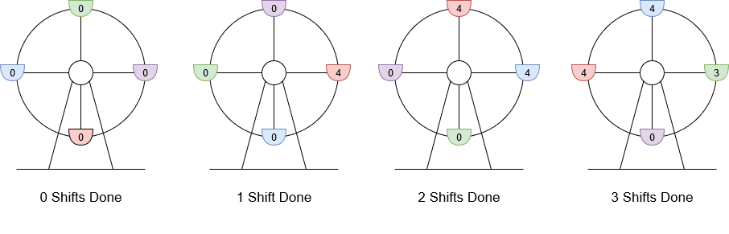

输入：customers = [8,3], boardingCost = 5, runningCost = 6
输出：3
解释：座舱上标注的数字是该座舱的当前游客数。

1. 8 位游客抵达，4 位登舱，4 位等待下一舱，摩天轮轮转。当前利润为 4 * $5 - 1 * $6 = $14 。
2. 3 位游客抵达，4 位在等待的游客登舱，其他 3 位等待，摩天轮轮转。当前利润为 8 * $5 - 2 * $6 = $28 。
3. 最后 3 位游客登舱，摩天轮轮转。当前利润为 11 * $5 - 3 * $6 = $37 。
轮转 3 次得到最大利润，最大利润为 $37 。
示例 2：

输入：customers = [10,9,6], boardingCost = 6, runningCost = 4
输出：7
解释：

1. 10 位游客抵达，4 位登舱，6 位等待下一舱，摩天轮轮转。当前利润为 4 * $6 - 1 * $4 = $20 。
2. 9 位游客抵达，4 位登舱，11 位等待（2 位是先前就在等待的，9 位新加入等待的），摩天轮轮转。当前利润为 8 * $6 - 2 * $4 = $40 。
3. 最后 6 位游客抵达，4 位登舱，13 位等待，摩天轮轮转。当前利润为 12 * $6 - 3 * $4 = $60 。
4. 4 位登舱，9 位等待，摩天轮轮转。当前利润为 * $6 - 4 * $4 = $80 。
5. 4 位登舱，5 位等待，摩天轮轮转。当前利润为 20 * $6 - 5 * $4 = $100 。
6. 4 位登舱，1 位等待，摩天轮轮转。当前利润为 24 * $6 - 6 * $4 = $120 。
7. 1 位登舱，摩天轮轮转。当前利润为 25 * $6 - 7 * $4 = $122 。
轮转 7 次得到最大利润，最大利润为$122 。
示例 3：

输入：customers = [3,4,0,5,1], boardingCost = 1, runningCost = 92
输出：-1
解释：

1. 3 位游客抵达，3 位登舱，0 位等待，摩天轮轮转。当前利润为 3 * $1 - 1 * $92 = -$89 。
2. 4 位游客抵达，4 位登舱，0 位等待，摩天轮轮转。当前利润为 7 * $1 - 2 * $92 = -$177 。
3. 0 位游客抵达，0 位登舱，0 位等待，摩天轮轮转。当前利润为 7 * $1 - 3 * $92 = -$269 。
4. 5 位游客抵达，4 位登舱，1 位等待，摩天轮轮转。当前利润为 11 * $1 - 4 * $92 = -$357 。
5. 1 位游客抵达，2 位登舱，0 位等待，摩天轮轮转。当前利润为 13 * $1 - 5 * $92 = -$447 。
利润永不为正，所以返回 -1 。

提示：

n == customers.length
1 <= n <= 105
0 <= customers[i] <= 50
1 <= boardingCost, runningCost <= 100

**思路**
我们直接模拟摩天轮的轮转过程，每次轮转时，累加等待的游客以及新到达的游客，然后最多 444 个人上船，更新等待的游客数和利润，记录最大利润与其对应的轮转次数。

```C++
class Solution {
public:
    int minOperationsMaxProfit(vector<int>& customers, int boardingCost, int runningCost) {
        int ans = -1;
        int mx = 0, t = 0;
        int wait = 0, i = 0;
        while (wait || i < customers.size()) {
            wait += i < customers.size() ? customers[i] : 0;
            int up = min(4, wait);
            wait -= up;
            ++i;
            t += up * boardingCost - runningCost;
            if (t > mx) {
                mx = t;
                ans = i;
            }
        }
        return ans;
    }
};
```

### 1/2 [466. 统计重复个数](https://leetcode.cn/problems/count-the-repetitions/description/)

定义 str = [s, n] 表示 str 由 n 个字符串 s 连接构成。

例如，str == ["abc", 3] =="abcabcabc" 。
如果可以从 s2 中删除某些字符使其变为 s1，则称字符串 s1 可以从字符串 s2 获得。

例如，根据定义，s1 = "abc" 可以从 s2 = "abdbec" 获得，仅需要删除加粗且用斜体标识的字符。
现在给你两个字符串 s1 和 s2 和两个整数 n1 和 n2 。由此构造得到两个字符串，其中 str1 = [s1, n1]、str2 = [s2, n2] 。

请你找出一个最大整数 m ，以满足 str = [str2, m] 可以从 str1 获得。

示例 1：

输入：s1 = "acb", n1 = 4, s2 = "ab", n2 = 2
输出：2

示例 2：

输入：s1 = "acb", n1 = 1, s2 = "acb", n2 = 1
输出：1

提示：

1 <= s1.length, s2.length <= 100
s1 和 s2 由小写英文字母组成
1 <= n1, n2 <= 10^6

**思路**
由于题目中的 n1 和 n2 都很大，因此我们无法真正把 S1 = [s1, n1] 和 S2 = [s2, n2] 都显式地表示出来。由于这两个字符串都是不断循环的，因此我们可以考虑找出 S2 在 S1 中出现的循环节，如果我们找到了循环节，那么我们就可以很快算出 S2 在 S1 中出现了多少次了。

有些读者可能对循环节这个概念会有些陌生，这个概念我们可以类比无限循环小数，如果从小数部分的某一位起向右进行到某一位止的一节数字「循环」出现，首尾衔接，称这种小数为「无限循环小数」，这一节数字称为「无限循环小数」。比如对于 3.56789789789... 这个无限循环小数，它的小数部分就是以 789 为一个「循环节」在无限循环，且开头可能会有部分不循环的部分，这个数字中即为 56。

那么回到这题，我们可以将不断循环的 s2 组成的字符串类比作上面小数部分，去找是否存在一个子串，即「循环节」，满足不断在 S2 中循环，且这个循环节能对应固定数量的 s1 。如下图所示，在第一次出现后，S2 的子串 bdadc 构成一个循环节：之后 bdadc 的每次出现都需要有相应的两段 s1。

当我们找出循环节后，我们即可知道一个循环节内包含 s1 的数量，以及在循环节出现前的 s1 的数量，这样就可以在 O(1) 的时间内，通过简单的运算求出 s2 在 S1 中出现的次数了。当然，由于 S1 中 s1 的数量 n1 是有限的，因此可能会存在循环节最后一个部分没有完全匹配，如上图最后会单独剩一个 s1 出来无法完全匹配完循环节，这部分我们需要单独拿出来遍历处理统计。

有些读者可能会怀疑循环节是否一定存在，这里我们给出的答案是肯定的，根据鸽笼原理，我们最多只要找过 |s2| + 1 个 s1，就一定会出现循环节。

我们设计一个哈希表 recall ：哈希表 recall 以 s2 字符串的下标 index 为索引，存储匹配至第 s1cnt 个 s1 的末尾，当前匹配到第 s2cnt 个 s2 中的第 index 个字符时， 已经匹配过的s1 的个数 s1cnt 和 s2 的个数 s2cnt 。

我们在每次遍历至 s1 的末尾时根据当前匹配到的 s2 中的位置 index 查看哈希表中的对应位置，如果哈希表中对应的位置 index 已经存储元素，则说明我们找到了循环节。循环节的长度可以用当前已经匹配的 s1 与 s2 的数量减去上次出现时经过的数量（即哈希表中存储的值）来得到。

然后我们就可以通过简单的运算求出所有构成循环节的 s2 的数量，对于不参与循环节部分的 s1，直接遍历计算即可，具体实现以及一些细节边界的处理请看下文的代码。

```C++
class Solution {
public:
    int getMaxRepetitions(string s1, int n1, string s2, int n2) {
        if (n1 == 0) {
            return 0;
        }
        int s1cnt = 0, index = 0, s2cnt = 0;
        // recall 是我们用来找循环节的变量，它是一个哈希映射
        // 我们如何找循环节？假设我们遍历了 s1cnt 个 s1，此时匹配到了第 s2cnt 个 s2 中的第 index 个字符
        // 如果我们之前遍历了 s1cnt' 个 s1 时，匹配到的是第 s2cnt' 个 s2 中同样的第 index 个字符，那么就有循环节了
        // 我们用 (s1cnt', s2cnt', index) 和 (s1cnt, s2cnt, index) 表示两次包含相同 index 的匹配结果
        // 那么哈希映射中的键就是 index，值就是 (s1cnt', s2cnt') 这个二元组
        // 循环节就是；
        //    - 前 s1cnt' 个 s1 包含了 s2cnt' 个 s2
        //    - 以后的每 (s1cnt - s1cnt') 个 s1 包含了 (s2cnt - s2cnt') 个 s2
        // 那么还会剩下 (n1 - s1cnt') % (s1cnt - s1cnt') 个 s1, 我们对这些与 s2 进行暴力匹配
        // 注意 s2 要从第 index 个字符开始匹配
        unordered_map<int, pair<int, int>> recall;
        pair<int, int> pre_loop, in_loop;
        while (true) {
            // 我们多遍历一个 s1，看看能不能找到循环节
            ++s1cnt;
            for (char ch: s1) {
                if (ch == s2[index]) {
                    index += 1;
                    if (index == s2.size()) {
                        ++s2cnt;
                        index = 0;
                    }
                }
            }
            // 还没有找到循环节，所有的 s1 就用完了
            if (s1cnt == n1) {
                return s2cnt / n2;
            }
            // 出现了之前的 index，表示找到了循环节
            if (recall.count(index)) {
                auto [s1cnt_prime, s2cnt_prime] = recall[index];
                // 前 s1cnt' 个 s1 包含了 s2cnt' 个 s2
                pre_loop = {s1cnt_prime, s2cnt_prime};
                // 以后的每 (s1cnt - s1cnt') 个 s1 包含了 (s2cnt - s2cnt') 个 s2
                in_loop = {s1cnt - s1cnt_prime, s2cnt - s2cnt_prime};
                break;
            } else {
                recall[index] = {s1cnt, s2cnt};
            }
        }
        // ans 存储的是 S1 包含的 s2 的数量，考虑的之前的 pre_loop 和 in_loop
        int ans = pre_loop.second + (n1 - pre_loop.first) / in_loop.first * in_loop.second;
        // S1 的末尾还剩下一些 s1，我们暴力进行匹配
        int rest = (n1 - pre_loop.first) % in_loop.first;
        for (int i = 0; i < rest; ++i) {
            for (char ch: s1) {
                if (ch == s2[index]) {
                    ++index;
                    if (index == s2.size()) {
                        ++ans;
                        index = 0;
                    }
                }
            }
        }
        // S1 包含 ans 个 s2，那么就包含 ans / n2 个 S2
        return ans / n2;
    }
};
```

### 1/3 [2487. 从链表中移除节点](https://leetcode.cn/problems/remove-nodes-from-linked-list/description/)

给你一个链表的头节点 head 。

移除每个右侧有一个更大数值的节点。

返回修改后链表的头节点 head 。

示例 1：


输入：head = [5,2,13,3,8]
输出：[13,8]
解释：需要移除的节点是 5 ，2 和 3 。

- 节点 13 在节点 5 右侧。
- 节点 13 在节点 2 右侧。
- 节点 8 在节点 3 右侧。
示例 2：

输入：head = [1,1,1,1]
输出：[1,1,1,1]
解释：每个节点的值都是 1 ，所以没有需要移除的节点。

提示：

给定列表中的节点数目在范围 [1, 105] 内
1 <= Node.val <= 10^5

**思路**
我们也可以不使用数组 nums，直接遍历链表，维护一个从栈底到栈顶单调递减的栈 stk，如果当前元素比栈顶元素大，则将栈顶元素出栈，直到当前元素小于等于栈顶元素。然后，如果栈不为空，则将栈顶元素的 next 指针指向当前元素，否则将答案链表的虚拟头节点的 next 指针指向当前元素。最后，将当前元素入栈，继续遍历链表。
遍历结束后，将虚拟头节点的 next 指针作为答案返回。

```C++
/**
 * Definition for singly-linked list.
 * struct ListNode {
 *     int val;
 *     ListNode *next;
 *     ListNode() : val(0), next(nullptr) {}
 *     ListNode(int x) : val(x), next(nullptr) {}
 *     ListNode(int x, ListNode *next) : val(x), next(next) {}
 * };
 */
class Solution {
public:
    ListNode* removeNodes(ListNode* head) {
        ListNode* dummy = new ListNode(0, head);
        ListNode* cur = head;
        vector<ListNode*> stk;
        for (ListNode* cur = head; cur; cur = cur->next) {
            while (stk.size() && stk.back()->val < cur->val) {
                stk.pop_back();
            }
            if (stk.size()) {
                stk.back()->next = cur;
            } else {
                dummy->next = cur;
            }
            stk.push_back(cur);
        }
        return dummy->next;
    }
};
```

### 1/4 [2397. 被列覆盖的最多行数](https://leetcode.cn/problems/maximum-rows-covered-by-columns/description/)

给你一个下标从 0 开始、大小为 m x n 的二进制矩阵 matrix ；另给你一个整数 numSelect，表示你必须从 matrix 中选择的 不同 列的数量。

如果一行中所有的 1 都被你选中的列所覆盖，则认为这一行被 覆盖 了。

形式上，假设 s = {c1, c2, ...., cnumSelect} 是你选择的列的集合。对于矩阵中的某一行 row ，如果满足下述条件，则认为这一行被集合 s 覆盖：

对于满足 `matrix[row][col] == 1` 的每个单元格 `matrix[row][col]`（0 <= col <= n - 1），col 均存在于 s 中，或者
row 中 不存在 值为 1 的单元格。
你需要从矩阵中选出 numSelect 个列，使集合覆盖的行数最大化。

返回一个整数，表示可以由 numSelect 列构成的集合 覆盖 的 最大行数 。

示例 1：

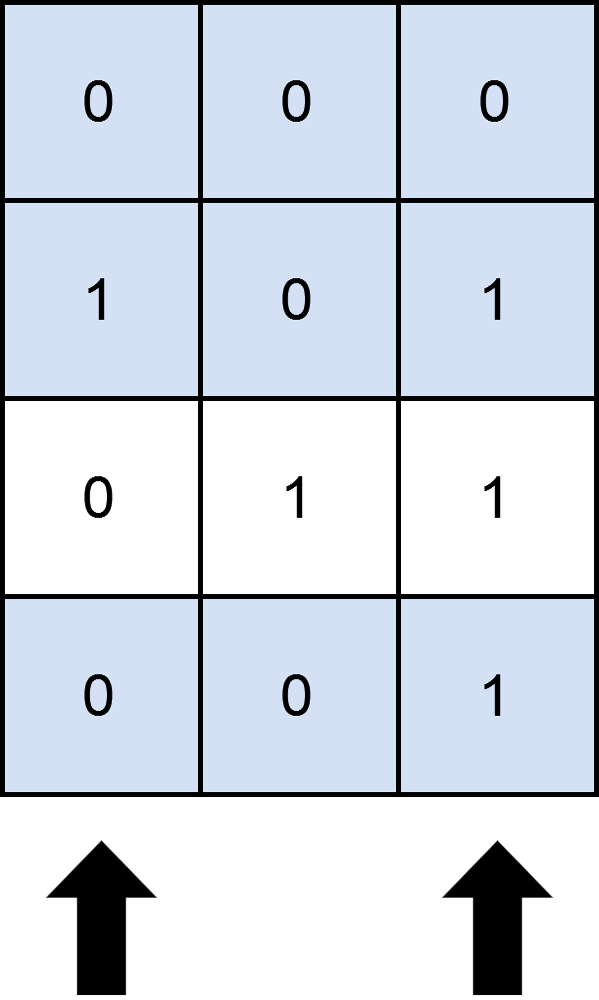

输入：`matrix = [[0,0,0],[1,0,1],[0,1,1],[0,0,1]]`, numSelect = 2
输出：3
解释：
图示中显示了一种覆盖 3 行的可行办法。
选择 s = {0, 2} 。

- 第 0 行被覆盖，因为其中没有出现 1 。
- 第 1 行被覆盖，因为值为 1 的两列（即 0 和 2）均存在于 s 中。
- 第 2 行未被覆盖，因为 `matrix[2][1] == 1` 但是 1 未存在于 s 中。
- 第 3 行被覆盖，因为 `matrix[2][2] == 1` 且 2 存在于 s 中。
因此，可以覆盖 3 行。
另外 s = {1, 2} 也可以覆盖 3 行，但可以证明无法覆盖更多行。

示例 2：


输入：`matrix = [[1],[0]]`, numSelect = 1
输出：2
解释：
选择唯一的一列，两行都被覆盖了，因为整个矩阵都被覆盖了。
所以我们返回 2 。

提示：

m == matrix.length
n == matrix[i].length
1 <= m, n <= 12
`matrix[i][j]` 要么是 0 要么是 1
1 <= numSelect <= n

**思路**
我们先将矩阵中的每一行转换成一个二进制数，记录在数组 rows 中，其中 rows[i] 表示第 i 行对应的二进制数，而 rows[i] 这个二进制数的第 j 位表示矩阵第 i 行第 j 列的值。

接下来，我们枚举所有的 2^n种列选择方案，其中 n 为矩阵的列数。对于每一种列选择方案，我们判断是否选中了 numSelect 列，如果不是，则跳过。否则，我们统计矩阵中有多少行中的所有 1 都被选中的列覆盖，即统计有多少行的二进制数 rows[i] 与列选择方案 mask 按位与的结果等于 rows[i]，并更新最大的行数。

```C++
class Solution {
public:
    int maximumRows(vector<vector<int>>& matrix, int numSelect) {
        int m = matrix.size(), n = matrix[0].size();
        int rows[m];
        memset(rows, 0, sizeof(rows));
        for (int i = 0; i < m; ++i) {
            for (int j = 0; j < n; ++j) {
                if (matrix[i][j]) {
                    rows[i] |= 1 << j;
                }
            }
        }
        int ans = 0;
        for (int mask = 1; mask < 1 << n; ++mask) {
            if (__builtin_popcount(mask) != numSelect) {
                continue;
            }
            int t = 0;
            for (int x : rows) {
                t += (x & mask) == x;
            }
            ans = max(ans, t);
        }
        return ans;
    }
};
```

### 1/5 [1944. 队列中可以看到的人数](https://leetcode.cn/problems/number-of-visible-people-in-a-queue/description/)

有 n 个人排成一个队列，从左到右 编号为 0 到 n - 1 。给你以一个整数数组 heights ，每个整数 互不相同，heights[i] 表示第 i 个人的高度。

一个人能 看到 他右边另一个人的条件是这两人之间的所有人都比他们两人 矮 。更正式的，第 i 个人能看到第 j 个人的条件是 i < j 且 min(heights[i], heights[j]) > max(heights[i+1], heights[i+2], ..., heights[j-1]) 。

请你返回一个长度为 n 的数组 answer ，其中 answer[i] 是第 i 个人在他右侧队列中能 看到 的 人数 。

示例 1：

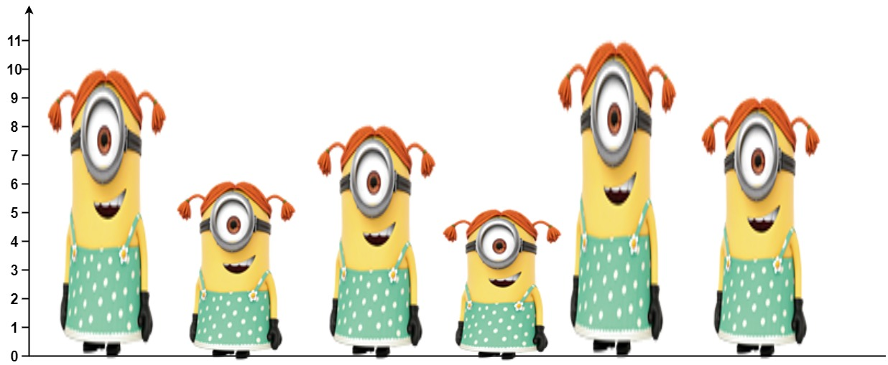

输入：heights = [10,6,8,5,11,9]
输出：[3,1,2,1,1,0]
解释：
第 0 个人能看到编号为 1 ，2 和 4 的人。
第 1 个人能看到编号为 2 的人。
第 2 个人能看到编号为 3 和 4 的人。
第 3 个人能看到编号为 4 的人。
第 4 个人能看到编号为 5 的人。
第 5 个人谁也看不到因为他右边没人。
示例 2：

输入：heights = [5,1,2,3,10]
输出：[4,1,1,1,0]

提示：

n == heights.length
1 <= n <= 10^5
1 <= heights[i] <= 10^5
heights 中所有数 互不相同 。

**思路**
分析图例可以发现，第 0 个人可以看到的三个人的身高是严格递增的。通过分析是可以验证这个规律，如果满足`i<j`，此时下标为 j 且靠后的人比下标为 i 且靠前的人矮，那么下标为 j 的人无法被下标 i 之前的人看到。根据这个规律，我们可以想到利用单调栈来解决这个问题。从队伍末尾开始，维护一个单调栈，从栈底到栈顶，身高严格递减。

那么，在维护单调栈的过程中，一个下标为 i 的人能看到的人数，是否就是当前栈里面的人数呢？其实不是，再仔细分析，我们能发现，单调栈里的人，对于当前的人的身高 heights[i]：

那些身高小于 heights[i] 的，都可以被下标为 i 的人看到；
第一个身高大于 heights[i] 的，也可以被下标为 i 的人看到；
其余的人，都不能被看到的。
而这些人数，正好可以在维护单调栈时的出栈过程中计算。单调栈是严格递减的，栈顶每个小于当前人身高的元素，都会被弹出栈，如果此时栈非空，那么栈顶元素表示下标为 i 的人能看到的最后一个人。最后将当前人的身高 heights[i] 入栈。

从队伍末尾开始，对每个人都进行这个操作，同时要维护这个单调栈，最后返回结果。

```C++
class Solution {
public:
    vector<int> canSeePersonsCount(vector<int>& heights) {
        int n = heights.size();
        vector<int> stack;
        vector<int> res(n, 0);

        for (int i = n - 1; i >= 0; i--) {
            int h = heights[i];
            while (!stack.empty() && stack.back() < h) {
                stack.pop_back();
                res[i] += 1;
            }
            if (!stack.empty()) {
                res[i] += 1;
            }
            stack.push_back(h);
        }
        return res;
    }
};
```

### 1/6 [2807. 在链表中插入最大公约数](https://leetcode.cn/problems/insert-greatest-common-divisors-in-linked-list/description/)

给你一个链表的头 head ，每个结点包含一个整数值。

在相邻结点之间，请你插入一个新的结点，结点值为这两个相邻结点值的 最大公约数 。

请你返回插入之后的链表。

两个数的 最大公约数 是可以被两个数字整除的最大正整数。

示例 1：

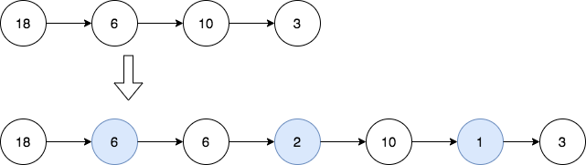

输入：head = [18,6,10,3]
输出：[18,6,6,2,10,1,3]
解释：第一幅图是一开始的链表，第二幅图是插入新结点后的图（蓝色结点为新插入结点）。

- 18 和 6 的最大公约数为 6 ，插入第一和第二个结点之间。
- 6 和 10 的最大公约数为 2 ，插入第二和第三个结点之间。
- 10 和 3 的最大公约数为 1 ，插入第三和第四个结点之间。
所有相邻结点之间都插入完毕，返回链表。

示例 2：


输入：head = [7]
输出：[7]
解释：第一幅图是一开始的链表，第二幅图是插入新结点后的图（蓝色结点为新插入结点）。
没有相邻结点，所以返回初始链表。
提示：

链表中结点数目在 [1, 5000] 之间。
1 <= Node.val <= 1000

**思路**
题目要求在链表的相邻两个节点插入一个新的节点，新节点的值为这两个相邻节点的最大公约数。我们可以直接模拟，每次在原链表的相邻两个节点中插入一个新的节点，新节点的值为相邻两个节点的最大公约数，最后返回新的链表即可。

```C++
/**
 * Definition for singly-linked list.
 * struct ListNode {
 *     int val;
 *     ListNode *next;
 *     ListNode() : val(0), next(nullptr) {}
 *     ListNode(int x) : val(x), next(nullptr) {}
 *     ListNode(int x, ListNode *next) : val(x), next(next) {}
 * };
 */
class Solution {
public:
    ListNode* insertGreatestCommonDivisors(ListNode* head) {
        ListNode * node = head;
        while (node->next) {
            node->next = new ListNode(__gcd(node->val, node->next->val), node->next);
            node = node->next->next;
        }
        return head;
    }
};
```

### 1/7 [383. 赎金信](https://leetcode.cn/problems/ransom-note/description/)

给你两个字符串：ransomNote 和 magazine ，判断 ransomNote 能不能由 magazine 里面的字符构成。

如果可以，返回 true ；否则返回 false 。

magazine 中的每个字符只能在 ransomNote 中使用一次。

示例 1：

输入：ransomNote = "a", magazine = "b"
输出：false
示例 2：

输入：ransomNote = "aa", magazine = "ab"
输出：false
示例 3：

输入：ransomNote = "aa", magazine = "aab"
输出：true

提示：

1 <= ransomNote.length, magazine.length <= 10^5
ransomNote 和 magazine 由小写英文字母组成

**思路**
题目要求使用字符串 magazine 中的字符来构建新的字符串 ransomNote，且ransomNote 中的每个字符只能使用一次，只需要满足字符串 magazine 中的每个英文字母 (’a’-’z’) 的统计次数都大于等于 ransomNote 中相同字母的统计次数即可。

```C++
class Solution {
public:
    bool canConstruct(string ransomNote, string magazine) {
        if (ransomNote.size() > magazine.size()) {
            return false;
        }
        vector<int> cnt(26);
        for (auto & c : magazine) {
            cnt[c - 'a']++;
        }
        for (auto & c : ransomNote) {
            cnt[c - 'a']--;
            if (cnt[c - 'a'] < 0) {
                return false;
            }
        }
        return true;
    }
};
```

### 1/8 [447. 回旋镖的数量](https://leetcode.cn/problems/number-of-boomerangs/description/)

给定平面上 n 对 互不相同 的点 points ，其中 points[i] = [xi, yi] 。回旋镖 是由点 (i, j, k) 表示的元组 ，其中 i 和 j 之间的距离和 i 和 k 之间的欧式距离相等（需要考虑元组的顺序）。

返回平面上所有回旋镖的数量。

示例 1：

输入：points = `[[0,0],[1,0],[2,0]]`
输出：2
解释：两个回旋镖为 `[[1,0],[0,0],[2,0]]` 和 `[[1,0],[2,0],[0,0]]`
示例 2：

输入：`points = [[1,1],[2,2],[3,3]]`
输出：2
示例 3：

输入：`points = [[1,1]]`
输出：0

提示：

n == points.length
1 <= n <= 500
points[i].length == 2
-10^4 <= xi, yi <= 10^4
所有点都 互不相同

**思路**
题目所描述的回旋镖可以视作一个 V 型的折线。我们可以枚举每个 points[i]，将其当作 V 型的拐点。设 points 中有 m 个点到 points[i] 的距离均相等，我们需要从这 m 点中选出 2 个点当作回旋镖的 2 个端点，由于题目要求考虑元组的顺序，因此方案数即为在 m 个元素中选出 2 个不同元素的排列数，即：

$$A_m^2 = m\cdot(m-1)$$

据此，我们可以遍历 points，计算并统计所有点到 points[i] 的距离，将每个距离的出现次数记录在哈希表中，然后遍历哈希表，并用上述公式计算并累加回旋镖的个数。

在代码实现时，我们可以直接保存距离的平方，避免复杂的开方运算。

```C++
class Solution {
public:
    int numberOfBoomerangs(vector<vector<int>> &points) {
        int ans = 0;
        for (auto &p : points) {
            unordered_map<int, int> cnt;
            for (auto &q : points) {
                int dis = (p[0] - q[0]) * (p[0] - q[0]) + (p[1] - q[1]) * (p[1] - q[1]);
                ++cnt[dis];
            }
            for (auto &[_, m] : cnt) {
                ans += m * (m - 1);
            }
        }
        return ans;
    }
};
```

### 1/9 [2707. 字符串中的额外字符](https://leetcode.cn/problems/extra-characters-in-a-string/description/)

给你一个下标从 0 开始的字符串 s 和一个单词字典 dictionary 。你需要将 s 分割成若干个 互不重叠 的子字符串，每个子字符串都在 dictionary 中出现过。s 中可能会有一些 额外的字符 不在任何子字符串中。

请你采取最优策略分割 s ，使剩下的字符 最少 。

示例 1：

输入：s = "leetscode", dictionary = ["leet","code","leetcode"]
输出：1
解释：将 s 分成两个子字符串：下标从 0 到 3 的 "leet" 和下标从 5 到 8 的 "code" 。只有 1 个字符没有使用（下标为 4），所以我们返回 1 。
示例 2：

输入：s = "sayhelloworld", dictionary = ["hello","world"]
输出：3
解释：将 s 分成两个子字符串：下标从 3 到 7 的 "hello" 和下标从 8 到 12 的 "world" 。下标为 0 ，1 和 2 的字符没有使用，所以我们返回 3 。

提示：

1 <= s.length <= 50
1 <= dictionary.length <= 50
1 <= dictionary[i].length <= 50
dictionary[i] 和 s 只包含小写英文字母。
dictionary 中的单词互不相同。

**思路**
我们可以用一个哈希表 ss 记录字段中的所有单词，方便我们快速判断一个字符串是否在字典中。

接下来，我们定义 f[i] 表示字符串 s 的前 i 个字符的最小额外字符数，初始时 f[0]=0。

当 i≥1 时，第 i 个字符 s[i−1] 可以作为一个额外字符，此时 f[i]=f[i−1]+1，如果在 j∈[0,i−1] 中存在一个下标 j，使得 s[j..i) 在哈希表 ss 中，那么我们可以将 s[j..i) 作为一个单词，此时 f[i]=f[j]。

综上，我们可以得到状态转移方程：
$$f[i] = \min \{ f[i - 1] + 1, \min_{j \in [0, i - 1]} f[j] \}$$
其中 i≥1，而 j∈[0,i−1] 且 s[j..i) 在哈希表 ss 中。

最终答案为 f[n]。

```C++
class Solution {
public:
    int minExtraChar(string s, vector<string>& dictionary) {
        unordered_set<string> ss(dictionary.begin(), dictionary.end());
        int n = s.size();
        int f[n + 1];
        f[0] = 0;
        for (int i = 1; i <= n; ++i) {
            f[i] = f[i - 1] + 1;
            for (int j = 0; j < i; ++j) {
                if (ss.count(s.substr(j, i - j))) {
                    f[i] = min(f[i], f[j]);
                }
            }
        }
        return f[n];
    }
};
```

### 1/10 [2696. 删除子串后的字符串最小长度](https://leetcode.cn/problems/minimum-string-length-after-removing-substrings/)

给你一个仅由 大写 英文字符组成的字符串 s 。

你可以对此字符串执行一些操作，在每一步操作中，你可以从 s 中删除 任一个 "AB" 或 "CD" 子字符串。

通过执行操作，删除所有 "AB" 和 "CD" 子串，返回可获得的最终字符串的 最小 可能长度。

注意，删除子串后，重新连接出的字符串可能会产生新的 "AB" 或 "CD" 子串。

示例 1：

输入：s = "ABFCACDB"
输出：2
解释：你可以执行下述操作：

- 从 "ABFCACDB" 中删除子串 "AB"，得到 s = "FCACDB" 。
- 从 "FCACDB" 中删除子串 "CD"，得到 s = "FCAB" 。
- 从 "FCAB" 中删除子串 "AB"，得到 s = "FC" 。
最终字符串的长度为 2 。
可以证明 2 是可获得的最小长度。
示例 2：

输入：s = "ACBBD"
输出：5
解释：无法执行操作，字符串长度不变。

提示：

1 <= s.length <= 100
s 仅由大写英文字母组成

**思路**
因为题目要求需要删除重新拼接的字符串产生的 AB和 CD，因此我们可以使用栈。当栈顶两个元素分别为 AB或 CD 时，我们通过将它们弹出栈来模拟删除的过程。这样以来，后续的判断过程就是建立在已经删除元素的栈之上了。遍历完之后，返回栈的长度。

```C++
class Solution {
public:
    int minLength(string s) {
        vector<int> st;
        for (char c : s) {
            st.push_back(c);
            int m = st.size();
            if (m >= 2 &&
                (st[m - 2] == 'A' && st[m - 1] == 'B' ||
                st[m - 2] == 'C' && st[m - 1] == 'D')) {
                st.pop_back();
                st.pop_back();
            }
        }
        return st.size();
    }
};
```

### 1/11 [2645. 构造有效字符串的最少插入数](https://leetcode.cn/problems/minimum-additions-to-make-valid-string/submissions/494854594/)

给你一个字符串 word ，你可以向其中任何位置插入 "a"、"b" 或 "c" 任意次，返回使 word 有效 需要插入的最少字母数。

如果字符串可以由 "abc" 串联多次得到，则认为该字符串 有效 。

示例 1：

输入：word = "b"
输出：2
解释：在 "b" 之前插入 "a" ，在 "b" 之后插入 "c" 可以得到有效字符串 "abc" 。
示例 2：

输入：word = "aaa"
输出：6
解释：在每个 "a" 之后依次插入 "b" 和 "c" 可以得到有效字符串 "abcabcabc" 。
示例 3：

输入：word = "abc"
输出：0
解释：word 已经是有效字符串，不需要进行修改。

提示：

1 <= word.length <= 50
word 仅由字母 "a"、"b" 和 "c" 组成。

**思路**
定义状态 d[i] 为将前 i 个字符（为了方便编码，下标从 1 开始）拼凑成若干个 abc 所需要的最小插入数。那么初始状态 d[0]=0，最终要求解 d[n]，其中 n 为 word 的长度。

转移过程有以下几种情况：

word[i] 单独存在于一组 abc 中，d[i]=d[i−1]+2。
如果 word[i]>word[i−1]，那么 word[i] 可以和 word[i−1] 在同一组 abc 中，d[i]=d[i−1]−1。
d[i] 取以上情况的最小值。在本题中，每个字符总是尽可能的与前面的字符去组合，因此情况 2 优于情况 1（从动态转移方程中也可以发现此规律），按照顺序依次更新 d[i] 即可，并不需要取最小值。

```C++
class Solution {
public:
    int addMinimum(string word) {
        int n = word.size();
        vector<int> d(n + 1);
        for (int i = 1; i <= n; i++) {
            d[i] = d[i - 1] + 2;
            if (i > 1 && word[i - 1] > word[i - 2]) {
                d[i] = d[i - 1] - 1;
            }
        }
        return d[n];
    }
};
```

### 1/12 [2085. 统计出现过一次的公共字符串](https://leetcode.cn/problems/count-common-words-with-one-occurrence/description/)

给你两个字符串数组 words1 和 words2 ，请你返回在两个字符串数组中 都恰好出现一次 的字符串的数目。

示例 1：

输入：words1 = ["leetcode","is","amazing","as","is"], words2 = ["amazing","leetcode","is"]
输出：2
解释：

- "leetcode" 在两个数组中都恰好出现一次，计入答案。
- "amazing" 在两个数组中都恰好出现一次，计入答案。
- "is" 在两个数组中都出现过，但在 words1 中出现了 2 次，不计入答案。
- "as" 在 words1 中出现了一次，但是在 words2 中没有出现过，不计入答案。
所以，有 2 个字符串在两个数组中都恰好出现了一次。
示例 2：

输入：words1 = ["b","bb","bbb"], words2 = ["a","aa","aaa"]
输出：0
解释：没有字符串在两个数组中都恰好出现一次。
示例 3：

输入：words1 = ["a","ab"], words2 = ["a","a","a","ab"]
输出：1
解释：唯一在两个数组中都出现一次的字符串是 "ab" 。

提示：

1 <= words1.length, words2.length <= 1000
1 <= words1[i].length, words2[j].length <= 30
words1[i] 和 words2[j] 都只包含小写英文字母。

**思路**
我们用两个哈希表分别统计 word1 与 word2 中字符串的出现次数。

随后，我们遍历第一个哈希表中的字符串，检查它在 word1 与 word2 中的出现次数是否均为 1。与此同时，我们统计出现过一次的公共字符串个数，如果某个字符串在两个数组中均只出现一次，那么我们将个数加 1。最终，我们返回该个数作为答案。

```C++
class Solution {
public:
    int countWords(vector<string>& words1, vector<string>& words2) {
        // 统计字符串出现频率
        unordered_map<string, int> freq1, freq2;
        for (const string& w: words1) {
            ++freq1[w];
        }
        for (const string& w: words2) {
            ++freq2[w];
        }

        // 遍历 words1 出现的字符并判断是否满足要求
        int res = 0;
        for (const auto& [w, cnt1] : freq1) {
            if (cnt1 == 1 && freq2[w] == 1) {
                ++res;
            }
        }
        return res;
    }
};
```

### 1/13 [2182. 构造限制重复的字符串](https://leetcode.cn/problems/construct-string-with-repeat-limit/description/)

给你一个字符串 s 和一个整数 repeatLimit ，用 s 中的字符构造一个新字符串 repeatLimitedString ，使任何字母 连续 出现的次数都不超过 repeatLimit 次。你不必使用 s 中的全部字符。

返回 字典序最大的 repeatLimitedString 。

如果在字符串 a 和 b 不同的第一个位置，字符串 a 中的字母在字母表中出现时间比字符串 b 对应的字母晚，则认为字符串 a 比字符串 b 字典序更大 。如果字符串中前 min(a.length, b.length) 个字符都相同，那么较长的字符串字典序更大。

示例 1：

输入：s = "cczazcc", repeatLimit = 3
输出："zzcccac"
解释：使用 s 中的所有字符来构造 repeatLimitedString "zzcccac"。
字母 'a' 连续出现至多 1 次。
字母 'c' 连续出现至多 3 次。
字母 'z' 连续出现至多 2 次。
因此，没有字母连续出现超过 repeatLimit 次，字符串是一个有效的 repeatLimitedString 。
该字符串是字典序最大的 repeatLimitedString ，所以返回 "zzcccac" 。
注意，尽管 "zzcccca" 字典序更大，但字母 'c' 连续出现超过 3 次，所以它不是一个有效的 repeatLimitedString 。
示例 2：

输入：s = "aababab", repeatLimit = 2
输出："bbabaa"
解释：
使用 s 中的一些字符来构造 repeatLimitedString "bbabaa"。
字母 'a' 连续出现至多 2 次。
字母 'b' 连续出现至多 2 次。
因此，没有字母连续出现超过 repeatLimit 次，字符串是一个有效的 repeatLimitedString 。
该字符串是字典序最大的 repeatLimitedString ，所以返回 "bbabaa" 。
注意，尽管 "bbabaaa" 字典序更大，但字母 'a' 连续出现超过 2 次，所以它不是一个有效的 repeatLimitedString 。

提示：

1 <= repeatLimit <= s.length <= 10^5
s 由小写英文字母组成

**思路**
提示 1

我们可以按照如下的方式构造字符串，这样构造出的字符串对应的字典序一定是最大的：

每次选择当前剩余的字典序最大的字符加到字符串末尾；如果字符串末尾的字符已经连续出现了 repeatLimit 次，则将字典序次大的字符加到字符串末尾，随后继续选择当前剩余的字典序最大的字符加到字符串末尾，直至使用完字符或没有新的字符可以合法加入。

解释

根据反证法，我们只需要证明任意比上述方法构造出的字符串 ret 的字典序更大的字符串都是不合法的即可。

根据字典序的定义，上述证明可以分为两部分：

从高位至低位逐位尝试使用字典序更大的字符替代，并逐个判断；

尝试在 ret 后添加新的字符，并逐个判断。

对于第一部分，任何使用更大的字符替代后的字符串要么使用了 s 中不存在的字符，要么某一字符连续出现的次数大于 repeatLimit 次，而这两种都是不合法的；对于第二部分，任何尝试添加新字符的字符串也一定是第一部分的两种情况之一，因而也是不合法的。

综上所述，按照上文方法构造的字符串的字典序一定是最大的。

思路与算法

我们可以尝试按照提示 1 的方式构造字典序最大的合法字符串 ret。具体方法如下：

首先，我们遍历 s，并用一个长度为 N=26 的数组 count 统计 s 中各个字符的出现次数，其中 count[k] 代表小写字母表第 k 个字符的出现次数。

与此同时，我们用下标 i 指向当前未使用的字典序最大的字符，用下标 j 来指向当前未使用的字典序次大的字符（满足 count[j]>0 以及 j<i），用 m 记录当前已经填入的末尾字符的连续次数。

初始时 i=N−1，j=N−2，m=0，接下来，我们模拟构造字符串的过程直到 i≥0 且 j≥0 不成立，有以下情况：

如果 count[i]=0，那么说明当前的字符已经填完，我们将 i 指向下一个字符，即 i=i−1，同时重置 m=0，继续构造字符串的过程。

如果 count[i]>0 且 m<repeatLimit，那么说明当前的字符可以合法填入，我们将该字符填入结果字符串 ret 末尾，令 count[i]=count[i]−1，m=m+1，继续构造字符串的过程。

如果前两种情况不满足，且 j≥i 或 count[j]=0，我们将 j 指向下一个字符，即 j=j−1，直到 j<i 且 count[j]>0 成立；然后我们将第 j 个字符填入结果字符串 ret 的末尾，令 count[j]=count[j]−1，同时重置 m=0，继续构造字符串的过程。

构造结束后，ret 即为符合要求的字典序最大的字符串，我们返回该字符串作为答案。

```C++
const int N = 26;
class Solution {
public:
    string repeatLimitedString(string s, int repeatLimit) {
        vector<int> count(N);
        for (char c : s) {
            count[c - 'a']++;
        }
        string ret;
        int m = 0;
        for (int i = N - 1, j = N - 2; i >= 0 && j >= 0;) {
            if (count[i] == 0) { // 当前字符已经填完，填入后面的字符，重置 m
                m = 0;
                i--;
            } else if (m < repeatLimit) { // 当前字符未超过限制
                count[i]--;
                ret.push_back('a' + i);
                m++;
            } else if (j >= i || count[j] == 0) { // 当前字符已经超过限制，查找可填入的其他字符
                j--;
            } else { // 当前字符已经超过限制，填入其他字符，并且重置 m
                count[j]--;
                ret.push_back('a' + j);
                m = 0;
            }
        }
        return ret;
    }
};
```

### 1/14 [83. 删除排序链表中的重复元素](https://leetcode.cn/problems/remove-duplicates-from-sorted-list/description/)

给定一个已排序的链表的头 head ， 删除所有重复的元素，使每个元素只出现一次 。返回 已排序的链表 。

示例 1：

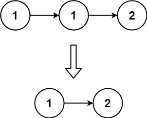

输入：head = [1,1,2]
输出：[1,2]

示例 2：

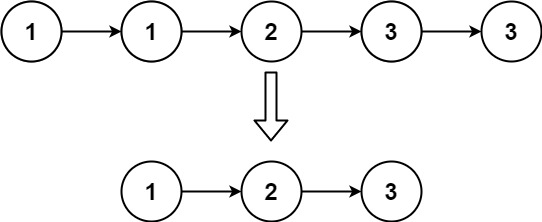

输入：head = [1,1,2,3,3]
输出：[1,2,3]

提示：

链表中节点数目在范围 [0, 300] 内
-100 <= Node.val <= 100
题目数据保证链表已经按升序 排列

**思路**
我们用一个指针 cur 来遍历链表。如果当前 cur 与 cur.next 对应的元素相同，我们就将 cur 的 next 指针指向 cur 的下下个节点。否则，说明链表中 cur 对应的元素是不重复的，因此可以将 cur 指针移动到下一个节点。

遍历结束后，返回链表的头节点即可。

```C++
/**
 * Definition for singly-linked list.
 * struct ListNode {
 *     int val;
 *     ListNode *next;
 *     ListNode() : val(0), next(nullptr) {}
 *     ListNode(int x) : val(x), next(nullptr) {}
 *     ListNode(int x, ListNode *next) : val(x), next(next) {}
 * };
 */
class Solution {
public:
    ListNode* deleteDuplicates(ListNode* head) {
        ListNode* cur = head;
        while (cur != nullptr && cur->next != nullptr) {
            if (cur->val == cur->next->val) {
                cur->next = cur->next->next;
            } else {
                cur = cur->next;
            }
        }
        return head;
    }
};
```

### 1/15 [82. 删除排序链表中的重复元素 II](https://leetcode.cn/problems/remove-duplicates-from-sorted-list-ii/description/)

给定一个已排序的链表的头 head ， 删除原始链表中所有重复数字的节点，只留下不同的数字 。返回 已排序的链表 。

示例 1：

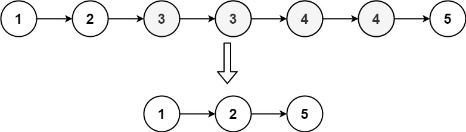

输入：head = [1,2,3,3,4,4,5]
输出：[1,2,5]

示例 2：

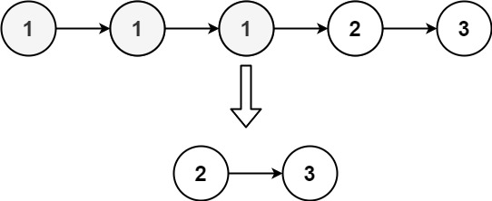

输入：head = [1,1,1,2,3]
输出：[2,3]

提示：

链表中节点数目在范围 [0, 300] 内
-100 <= Node.val <= 100
题目数据保证链表已经按升序 排列

**思路**
我们先创建一个虚拟头节点 dummy，令 dummy.next=head，然后创建指针 pre 指向 dummy，指针 cur 指向 head，开始遍历链表。

当 cur 指向的节点值与 cur.next 指向的节点值相同时，我们就让 cur 不断向后移动，直到 cur 指向的节点值与 cur.next 指向的节点值不相同时，停止移动。此时，我们判断 pre.next 是否等于 cur，如果相等，说明 pre 与 cur 之间没有重复节点，我们就让 pre 移动到 cur 的位置；否则，说明 pre 与 cur 之间有重复节点，我们就让 pre.next 指向 cur.next。然后让 cur 继续向后移动。继续上述操作，直到 cur 为空，遍历结束。

最后，返回 dummy.next 即可。

```C++
/**
 * Definition for singly-linked list.
 * struct ListNode {
 *     int val;
 *     ListNode *next;
 *     ListNode() : val(0), next(nullptr) {}
 *     ListNode(int x) : val(x), next(nullptr) {}
 *     ListNode(int x, ListNode *next) : val(x), next(next) {}
 * };
 */
class Solution {
public:
    ListNode* deleteDuplicates(ListNode* head) {
        ListNode* dummy = new ListNode(0, head);
        ListNode* pre = dummy;
        ListNode* cur = head;
        while (cur) {
            while (cur->next && cur->next->val == cur->val) {
                cur = cur->next;
            }
            if (pre->next == cur) {
                pre = cur;
            } else {
                pre->next = cur->next;
            }
            cur = cur->next;
        }
        return dummy->next;
    }
};
```

### 1/16 [2719. 统计整数数目](https://leetcode.cn/problems/count-of-integers/description/)

给你两个数字字符串 num1 和 num2 ，以及两个整数 max_sum 和 min_sum 。如果一个整数 x 满足以下条件，我们称它是一个好整数：

num1 <= x <= num2
min_sum <= digit_sum(x) <= max_sum.
请你返回好整数的数目。答案可能很大，请返回答案对 109 + 7 取余后的结果。

注意，digit_sum(x) 表示 x 各位数字之和。

示例 1：

输入：num1 = "1", num2 = "12", min_num = 1, max_num = 8
输出：11
解释：总共有 11 个整数的数位和在 1 到 8 之间，分别是 1,2,3,4,5,6,7,8,10,11 和 12 。所以我们返回 11 。
示例 2：

输入：num1 = "1", num2 = "5", min_num = 1, max_num = 5
输出：5
解释：数位和在 1 到 5 之间的 5 个整数分别为 1,2,3,4 和 5 。所以我们返回 5 。

提示：

1 <= num1 <= num2 <= 10^22
1 <= min_sum <= max_sum <= 400

**思路**
仿照 isLimit，再添加一个参数 limitLow，表示是否受到下界 num1的约束。为了让代码更清晰，原来的参数名 isLimit 改名为 limitHigh。此外，d 的最大值 up 改名为 hi，即 high 的前两个字母。

为了方便计算，在 num1前面添加前导零，使其长度和 num2相等。

limitLow 的用法类似 limitHigh，如果为 limitLow=true，那么 d 只能从 num1[i] 开始枚举，否则可以从 0 开始，这个值记作 lo，即 low 的前两个字母。如果 limitLow=true 并且 d=lo，那么往下递归时，传入的 limitLow 仍然为 true，否则为 false。

```C++
class Solution {
public:
    int count(string num1, string num2, int min_sum, int max_sum) {
        int n = num2.length();
        num1 = string(n - num1.length(), '0') + num1; // 补前导零，和 num2 对齐

        vector<vector<int>> memo(n, vector<int>(min(9 * n, max_sum) + 1, -1));
        function<int(int, int, bool, bool)> dfs = [&](int i, int sum, bool limit_low, bool limit_high) -> int {
            if (sum > max_sum) { // 非法
                return 0;
            }
            if (i == n) {
                return sum >= min_sum;
            }
            if (!limit_low && !limit_high && memo[i][sum] != -1) {
                return memo[i][sum];
            }

            int lo = limit_low ? num1[i] - '0' : 0;
            int hi = limit_high ? num2[i] - '0' : 9;

            int res = 0;
            for (int d = lo; d <= hi; d++) { // 枚举当前数位填 d
                res = (res + dfs(i + 1, sum + d, limit_low && d == lo, limit_high && d == hi)) % 1'000'000'007;
            }

            if (!limit_low && !limit_high) {
                memo[i][sum] = res;
            }
            return res;
        };

        return dfs(0, 0, true, true);
    }
};
```

### 1/17 [2744. 最大字符串配对数目](https://leetcode.cn/problems/find-maximum-number-of-string-pairs/description/)

给你一个下标从 0 开始的数组 words ，数组中包含 互不相同 的字符串。

如果字符串 words[i] 与字符串 words[j] 满足以下条件，我们称它们可以匹配：

字符串 words[i] 等于 words[j] 的反转字符串。
0 <= i < j < words.length
请你返回数组 words 中的 最大 匹配数目。

注意，每个字符串最多匹配一次。

示例 1：

输入：words = ["cd","ac","dc","ca","zz"]
输出：2
解释：在此示例中，我们可以通过以下方式匹配 2 对字符串：

- 我们将第 0 个字符串与第 2 个字符串匹配，因为 word[0] 的反转字符串是 "dc" 并且等于 words[2]。
- 我们将第 1 个字符串与第 3 个字符串匹配，因为 word[1] 的反转字符串是 "ca" 并且等于 words[3]。
可以证明最多匹配数目是 2 。
示例 2：

输入：words = ["ab","ba","cc"]
输出：1
解释：在此示例中，我们可以通过以下方式匹配 1 对字符串：

- 我们将第 0 个字符串与第 1 个字符串匹配，因为 words[1] 的反转字符串 "ab" 与 words[0] 相等。
可以证明最多匹配数目是 1 。
示例 3：

输入：words = ["aa","ab"]
输出：0
解释：这个例子中，无法匹配任何字符串。

提示：

1 <= words.length <= 50
words[i].length == 2
words 包含的字符串互不相同。
words[i] 只包含小写英文字母。

**思路**
遍历 words，对于 s=words[i]：

如果在 s 之前，已经遇到 s 反转后的字符串，那么就找到了一个匹配。由于题目保证 words 中的字符串互不相同，这个匹配是唯一的。
如果前面没有遇到，那么把 s 加入哈希表（数组）seen，方便在后续遍历中，快速判断是否有能匹配的字符串。

```C++
class Solution {
public:
    int maximumNumberOfStringPairs(vector<string>& words) {
        int ans = 0;
        bool seen[26][26]{};
        for (auto &s : words) {
            int x = s[0] - 'a';
            int y = s[1] - 'a';
            if (seen[y][x]) {
                ans++; // s 和 seen 中的 y+x 匹配
            } else {
                seen[x][y] = true;
            }
        }
        return ans;
    }
};
```

### 1/18 [2171. 拿出最少数目的魔法豆](https://leetcode.cn/problems/removing-minimum-number-of-magic-beans/description/)

给定一个 正整数 数组 beans ，其中每个整数表示一个袋子里装的魔法豆的数目。

请你从每个袋子中 拿出 一些豆子（也可以 不拿出），使得剩下的 非空 袋子中（即 至少还有一颗 魔法豆的袋子）魔法豆的数目 相等。一旦把魔法豆从袋子中取出，你不能再将它放到任何袋子中。

请返回你需要拿出魔法豆的 最少数目。

示例 1：

输入：beans = [4,1,6,5]
输出：4
解释：

- 我们从有 1 个魔法豆的袋子中拿出 1 颗魔法豆。
  剩下袋子中魔法豆的数目为：[4,0,6,5]
- 然后我们从有 6 个魔法豆的袋子中拿出 2 个魔法豆。
  剩下袋子中魔法豆的数目为：[4,0,4,5]
- 然后我们从有 5 个魔法豆的袋子中拿出 1 个魔法豆。
  剩下袋子中魔法豆的数目为：[4,0,4,4]
总共拿出了 1 + 2 + 1 = 4 个魔法豆，剩下非空袋子中魔法豆的数目相等。
没有比取出 4 个魔法豆更少的方案。

示例 2：

输入：beans = [2,10,3,2]
输出：7
解释：

- 我们从有 2 个魔法豆的其中一个袋子中拿出 2 个魔法豆。
  剩下袋子中魔法豆的数目为：[0,10,3,2]
- 然后我们从另一个有 2 个魔法豆的袋子中拿出 2 个魔法豆。
  剩下袋子中魔法豆的数目为：[0,10,3,0]
- 然后我们从有 3 个魔法豆的袋子中拿出 3 个魔法豆。
  剩下袋子中魔法豆的数目为：[0,10,0,0]
总共拿出了 2 + 2 + 3 = 7 个魔法豆，剩下非空袋子中魔法豆的数目相等。
没有比取出 7 个魔法豆更少的方案。

提示：

1 <= beans.length <= 10^5
1 <= beans[i] <= 10^5

**思路**
我们可以将 beans 从小到大排序后，枚举最终非空袋子中魔法豆的数目 v，将小于 v 的魔法豆全部清空，大于 v 的魔法豆减少至 v，这样所有非空袋子中的魔法豆就都相等了。

由于拿出魔法豆 + 剩余魔法豆 = 初始魔法豆之和，我们可以考虑最多能剩下多少个魔法豆，从而计算出最少能拿出多少个魔法豆。
可以保留蓝色矩形区域内的魔法豆。设 beans 的长度为 n，以 n−i 为矩形底边长，v=beans[i]为矩形高，则矩形面积为(n−i)⋅v(n-i)
用 ∑beans[i] 减去矩形面积的最大值，即为拿出魔法豆的最小值。

```C++
class Solution {
public:
    long long minimumRemoval(vector<int> &beans) {
        ranges::sort(beans);
        long long sum = 0, mx = 0;
        int n = beans.size();
        for (int i = 0; i < n; i++) {
            sum += beans[i];
            mx = max(mx, (long long) (n - i) * beans[i]);
        }
        return sum - mx;
    }
};
```

### 1/19 [2809. 使数组和小于等于 x 的最少时间](https://leetcode.cn/problems/minimum-time-to-make-array-sum-at-most-x/description)

给你两个长度相等下标从 0 开始的整数数组 nums1 和 nums2 。每一秒，对于所有下标 0 <= i < nums1.length ，nums1[i] 的值都增加 nums2[i] 。操作 完成后 ，你可以进行如下操作：

选择任一满足 0 <= i < nums1.length 的下标 i ，并使 nums1[i] = 0 。
同时给你一个整数 x 。

请你返回使 nums1 中所有元素之和 小于等于 x 所需要的 最少 时间，如果无法实现，那么返回 -1 。

示例 1：

输入：nums1 = [1,2,3], nums2 = [1,2,3], x = 4
输出：3
解释：
第 1 秒，我们对 i = 0 进行操作，得到 nums1 = [0,2+2,3+3] = [0,4,6] 。
第 2 秒，我们对 i = 1 进行操作，得到 nums1 = [0+1,0,6+3] = [1,0,9] 。
第 3 秒，我们对 i = 2 进行操作，得到 nums1 = [1+1,0+2,0] = [2,2,0] 。
现在 nums1 的和为 4 。不存在更少次数的操作，所以我们返回 3 。
示例 2：

输入：nums1 = [1,2,3], nums2 = [3,3,3], x = 4
输出：-1
解释：不管如何操作，nums1 的和总是会超过 x 。

提示：

1 <= nums1.length <= 10^3
1 <= nums1[i] <= 10^3
0 <= nums2[i] <= 10^3
nums1.length == nums2.length
0 <= x <= 10^6

**思路**
首先，我们可以发现，每一次操作使得 nums1[i]=0，对于每一个 nums1[i] 我们最多需要进行一次这样的操作。如果我们需要设置两次，我们可以简单地移除前一次设置。

观察重置为零的数，会按照 nums2 的速度增长，所以对于所有操作的数，我们应该优先操作增长速度慢的数。
如果我们选择多个索引 $\textit{nums}_2[i_1] \le \textit{nums}_2[i_2] \le \ldots \le \textit{nums}_2[i_k]$ 的顺序进行设置是最优的。

让我们按照 nums2 的大小对所有数值对进行排序（非递减顺序）。用 `dp[j][i]` 表示如果对前 j 个元素进行 i 次操作，可以减少的最大总值，初始值为零。对于第 j 个元素，我们可以选择对其进行操作或者不操作，由此可以得到状态转移方程：

$\textit{dp}[j][i] = \max(\textit{dp}[j - 1][i], \textit{dp}[j - 1][i - 1] + \textit{nums}_2[j - 1] \times i + \textit{nums}_1[j - 1])$

其中有 $1 \le i \le j \le n$。

最后我们返回最小的 $\textit{sum}(\textit{nums}_1) + \textit{sum}(\textit{nums}_2) \times t - \textit{dp}[n][t] \le x$，如果不存在返回 −1。

```C++
class Solution {
public:
    int minimumTime(vector<int>& nums1, vector<int>& nums2, int x) {
        int n = nums1.size();
        vector<vector<int>> dp(n + 1, vector<int>(n + 1, 0));
        vector<pair<int, int>> nums(n);
        for (int i = 0; i < n; i++) {
            nums[i] = {nums2[i], nums1[i]};
        }
        sort(nums.begin(), nums.end());

        for (int j = 1; j <= n; j++) {
            int b = nums[j - 1].first, a = nums[j - 1].second;
            for (int i = j; i > 0; i--) {
                dp[j][i] = max(dp[j - 1][i], dp[j - 1][i - 1] + i * b + a);
            }
        }

        int s1 = accumulate(nums1.begin(), nums1.end(), 0);
        int s2 = accumulate(nums2.begin(), nums2.end(), 0);
        for (int i = 0; i <= n; i++) {
            if (s2 * i + s1 - dp[n][i] <= x) {
                return i;
            }
        }
        return -1;
    }
};
```

### 1/20 [2788. 按分隔符拆分字符串](https://leetcode.cn/problems/split-strings-by-separator/description/)

给你一个字符串数组 words 和一个字符 separator ，请你按 separator 拆分 words 中的每个字符串。

返回一个由拆分后的新字符串组成的字符串数组，不包括空字符串 。

注意

separator 用于决定拆分发生的位置，但它不包含在结果字符串中。
拆分可能形成两个以上的字符串。
结果字符串必须保持初始相同的先后顺序。

示例 1：

输入：words = ["one.two.three","four.five","six"], separator = "."
输出：["one","two","three","four","five","six"]
解释：在本示例中，我们进行下述拆分：

"one.two.three" 拆分为 "one", "two", "three"
"four.five" 拆分为 "four", "five"
"six" 拆分为 "six"

因此，结果数组为 ["one","two","three","four","five","six"] 。
示例 2：

输入：words = ["$easy$","$problem$"], separator = "$"
输出：["easy","problem"]
解释：在本示例中，我们进行下述拆分：

"$easy$" 拆分为 "easy"（不包括空字符串）
"$problem$" 拆分为 "problem"（不包括空字符串）

因此，结果数组为 ["easy","problem"] 。
示例 3：

输入：words = ["|||"], separator = "|"
输出：[]
解释：在本示例中，"|||" 的拆分结果将只包含一些空字符串，所以我们返回一个空数组 [] 。

提示：

1 <= words.length <= 100
1 <= words[i].length <= 20
words[i] 中的字符要么是小写英文字母，要么就是字符串 `".,|$#@"` 中的字符（不包括引号）
separator 是字符串 `".,|$#@"` 中的某个字符（不包括引号）

**思路**
我们首先创建结果数组 res，然后我们将字符串数组 words 中每一个字符串按照 separator 进行拆分，并将每一个拆分出来的非空字符串加入答案数组 res 即可。

```C++
class Solution {
public:
    vector<string> splitWordsBySeparator(vector<string>& words, char separator) {
        vector<string> res;
        for (string &word : words) {
            stringstream ss(word);
            string sub;
            while (getline(ss, sub, separator)) {
                if (!sub.empty()) {
                    res.push_back(sub);
                }
            }
        }
        return res;
    }
};
```

### 1/21 [410. 分割数组的最大值](https://leetcode.cn/problems/split-array-largest-sum/description)

给定一个非负整数数组 nums 和一个整数 k ，你需要将这个数组分成 k 个非空的连续子数组。

设计一个算法使得这 k 个子数组各自和的最大值最小。

示例 1：

输入：nums = [7,2,5,10,8], k = 2
输出：18
解释：
一共有四种方法将 nums 分割为 2 个子数组。
其中最好的方式是将其分为 [7,2,5] 和 [10,8] 。
因为此时这两个子数组各自的和的最大值为18，在所有情况中最小。
示例 2：

输入：nums = [1,2,3,4,5], k = 2
输出：9
示例 3：

输入：nums = [1,4,4], k = 3
输出：4

提示：

1 <= nums.length <= 1000
0 <= nums[i] <= 10……6
1 <= k <= min(50, nums.length)

**思路**
「使……最大值尽可能小」是二分搜索题目常见的问法。

本题中，我们注意到：当我们选定一个值 x，我们可以线性地验证是否存在一种分割方案，满足其最大分割子数组和不超过 x。策略如下：

贪心地模拟分割的过程，从前到后遍历数组，用 sum 表示当前分割子数组的和，cnt 表示已经分割出的子数组的数量（包括当前子数组），那么每当 sum 加上当前值超过了 x，我们就把当前取的值作为新的一段分割子数组的开头，并将 cnt 加 1。遍历结束后验证是否 cnt 不超过 m。

这样我们可以用二分查找来解决。二分的上界为数组 nums 中所有元素的和，下界为数组 nums 中所有元素的最大值。通过二分查找，我们可以得到最小的最大分割子数组和，这样就可以得到最终的答案了。

```C++
class Solution {
public:
    bool check(vector<int>& nums, int x, int m) {
        long long sum = 0;
        int cnt = 1;
        for (int i = 0; i < nums.size(); i++) {
            if (sum + nums[i] > x) {
                cnt++;
                sum = nums[i];
            } else {
                sum += nums[i];
            }
        }
        return cnt <= m;
    }

    int splitArray(vector<int>& nums, int m) {
        long long left = 0, right = 0;
        for (int i = 0; i < nums.size(); i++) {
            right += nums[i];
            if (left < nums[i]) {
                left = nums[i];
            }
        }
        while (left < right) {
            long long mid = (left + right) >> 1;
            if (check(nums, mid, m)) {
                right = mid;
            } else {
                left = mid + 1;
            }
        }
        return left;
    }
};
```

### 1/22 [670. 最大交换](https://leetcode.cn/problems/maximum-swap/description/)

给定一个非负整数，你至多可以交换一次数字中的任意两位。返回你能得到的最大值。

示例 1 :

输入: 2736
输出: 7236
解释: 交换数字2和数字7。
示例 2 :

输入: 9973
输出: 9973
解释: 不需要交换。
注意:

给定数字的范围是 [0, 10^8]

**思路**
我们先将数字转为字符串 s，然后从右往左遍历字符串 s，用数组或哈希表 d 记录每个数字右侧的最大数字的位置（可以是字符本身的位置）。

接着从左到右遍历 d，如果 `s[i]<s[d[i]]`，则进行交换，并退出遍历的过程。

最后将字符串 s 转为数字，即为答案。

```C++
class Solution {
public:
    int maximumSwap(int num) {
        string s = to_string(num);
        int n = s.size();
        vector<int> d(n);
        iota(d.begin(), d.end(), 0);
        for (int i = n - 2; ~i; --i) {
            if (s[i] <= s[d[i + 1]]) {
                d[i] = d[i + 1];
            }
        }
        for (int i = 0; i < n; ++i) {
            int j = d[i];
            if (s[i] < s[j]) {
                swap(s[i], s[j]);
                break;
            }
        }
        return stoi(s);
    }
};
```

### 1/23 [2765. 最长交替子数组](https://leetcode.cn/problems/longest-alternating-subarray/description/?envType=daily-question&envId=2024-01-23)

给你一个下标从 0 开始的整数数组 nums 。如果 nums 中长度为 m 的子数组 s 满足以下条件，我们称它是一个 交替子数组 ：

m 大于 1 。
s1 = s0 + 1 。
下标从 0 开始的子数组 s 与数组 [s0, s1, s0, s1,...,s(m-1) % 2] 一样。也就是说，s1 - s0 = 1 ，s2 - s1 = -1 ，s3 - s2 = 1 ，s4 - s3 = -1 ，以此类推，直到 s[m - 1] - s[m - 2] = (-1)m 。
请你返回 nums 中所有 交替 子数组中，最长的长度，如果不存在交替子数组，请你返回 -1 。

子数组是一个数组中一段连续 非空 的元素序列。

示例 1：

输入：nums = [2,3,4,3,4]
输出：4
解释：交替子数组有 [3,4] ，[3,4,3] 和 [3,4,3,4] 。最长的子数组为 [3,4,3,4] ，长度为4 。
示例 2：

输入：nums = [4,5,6]
输出：2
解释：[4,5] 和 [5,6] 是仅有的两个交替子数组。它们长度都为 2 。

提示：

2 <= nums.length <= 100
1 <= nums[i] <= 10^4

**思路**
适用场景：按照题目要求，数组会被分割成若干组，且每一组的判断/处理逻辑是一样的。

核心思想：

外层循环负责遍历组之前的准备工作（记录开始位置），和遍历组之后的统计工作（更新答案最大值）。
内层循环负责遍历组，找出这一组最远在哪结束。
这个写法的好处是，各个逻辑块分工明确，也不需要特判最后一组。以我的经验，这个写法是所有写法中最不容易出 bug 的，推荐大家记住。

对于本题来说，在内层循环时，假设这一组的第一个数是 333，那么这一组的数字必须形如 3,4,3,4,⋯3，也就是

$$\textit{nums}[i] = \textit{nums}[i-2]$$

另外，对于 [3,4,3,4,5,4,5] 这样的数组，第一组交替子数组为 [3,4,3,4]，第二组交替子数组为 [4,5,4,5]，这两组有一个数是重叠的，所以下面代码在外层循环末尾要把 i 减一。

```C++
class Solution {
public:
    int alternatingSubarray(vector<int> &nums) {
        int ans = -1;
        int i = 0, n = nums.size();
        while (i < n - 1) {
            if (nums[i + 1] - nums[i] != 1) {
                i++; // 直接跳过
                continue;
            }
            int i0 = i; // 记录这一组的开始位置
            i += 2; // i 和 i+1 已经满足要求，从 i+2 开始判断
            while (i < n && nums[i] == nums[i - 2]) {
                i++;
            }
            // 从 i0 到 i-1 是满足题目要求的（并且无法再延长的）子数组
            ans = max(ans, i - i0);
            i--;
        }
        return ans;
    }
};
```

### 1/24 [2865. 美丽塔 I](https://leetcode.cn/problems/beautiful-towers-i/description/)

给你一个长度为 n 下标从 0 开始的整数数组 maxHeights 。

你的任务是在坐标轴上建 n 座塔。第 i 座塔的下标为 i ，高度为 heights[i] 。

如果以下条件满足，我们称这些塔是 美丽 的：

1 <= heights[i] <= maxHeights[i]
heights 是一个 山脉 数组。
如果存在下标 i 满足以下条件，那么我们称数组 heights 是一个 山脉 数组：

对于所有 0 < j <= i ，都有 heights[j - 1] <= heights[j]
对于所有 i <= k < n - 1 ，都有 heights[k + 1] <= heights[k]
请你返回满足 美丽塔 要求的方案中，高度和的最大值 。

示例 1：

输入：maxHeights = [5,3,4,1,1]
输出：13
解释：和最大的美丽塔方案为 heights = [5,3,3,1,1] ，这是一个美丽塔方案，因为：

- 1 <= heights[i] <= maxHeights[i]  
- heights 是个山脉数组，峰值在 i = 0 处。
13 是所有美丽塔方案中的最大高度和。
示例 2：

输入：maxHeights = [6,5,3,9,2,7]
输出：22
解释： 和最大的美丽塔方案为 heights = [3,3,3,9,2,2] ，这是一个美丽塔方案，因为：

- 1 <= heights[i] <= maxHeights[i]
- heights 是个山脉数组，峰值在 i = 3 处。
22 是所有美丽塔方案中的最大高度和。
示例 3：

输入：maxHeights = [3,2,5,5,2,3]
输出：18
解释：和最大的美丽塔方案为 heights = [2,2,5,5,2,2] ，这是一个美丽塔方案，因为：

- 1 <= heights[i] <= maxHeights[i]
- heights 是个山脉数组，最大值在 i = 2 处。
注意，在这个方案中，i = 3 也是一个峰值。
18 是所有美丽塔方案中的最大高度和。

提示：

1 <= n == maxHeights <= 10^3
1 <= maxHeights[i] <= 10^9

**思路**
方法一的做法足以通过本题，但是时间复杂度较高。我们可以使用“动态规划 + 单调栈”来优化枚举的过程。

我们定义 f[i] 表示前 i+1 座塔中，以最后一座塔作为最高塔的美丽塔方案的高度和。我们可以得到如下的状态转移方程：

$$f[i]= \begin{cases} f[i-1]+heights[i],&\text{if } heights[i]\geq heights[i-1]\\ heights[i]\times(i-j)+f[j],&\text{if } heights[i]<heights[i-1] \end{cases}$$

其中 j 是最后一座塔左边第一个高度小于等于 heights[i] 的塔的下标。我们可以使用单调栈来维护这个下标。

我们可以使用类似的方法求出 g[i]，表示从右往左，以第 i 座塔作为最高塔的美丽塔方案的高度和。最终答案即为 f[i]+g[i]−heights[i] 的最大值。

```C++
class Solution {
public:
    long long maximumSumOfHeights(vector<int>& maxHeights) {
        int n = maxHeights.size();
        stack<int> stk;
        vector<int> left(n, -1);
        vector<int> right(n, n);
        for (int i = 0; i < n; ++i) {
            int x = maxHeights[i];
            while (!stk.empty() && maxHeights[stk.top()] > x) {
                stk.pop();
            }
            if (!stk.empty()) {
                left[i] = stk.top();
            }
            stk.push(i);
        }
        stk = stack<int>();
        for (int i = n - 1; ~i; --i) {
            int x = maxHeights[i];
            while (!stk.empty() && maxHeights[stk.top()] >= x) {
                stk.pop();
            }
            if (!stk.empty()) {
                right[i] = stk.top();
            }
            stk.push(i);
        }
        long long f[n], g[n];
        for (int i = 0; i < n; ++i) {
            int x = maxHeights[i];
            if (i && x >= maxHeights[i - 1]) {
                f[i] = f[i - 1] + x;
            } else {
                int j = left[i];
                f[i] = 1LL * x * (i - j) + (j != -1 ? f[j] : 0);
            }
        }
        for (int i = n - 1; ~i; --i) {
            int x = maxHeights[i];
            if (i < n - 1 && x >= maxHeights[i + 1]) {
                g[i] = g[i + 1] + x;
            } else {
                int j = right[i];
                g[i] = 1LL * x * (j - i) + (j != n ? g[j] : 0);
            }
        }
        long long ans = 0;
        for (int i = 0; i < n; ++i) {
            ans = max(ans, f[i] + g[i] - maxHeights[i]);
        }
        return ans;
    }
};
```

### 1/25 [2859. 计算 K 置位下标对应元素的和](https://leetcode.cn/problems/sum-of-values-at-indices-with-k-set-bits/description/)

给你一个下标从 0 开始的整数数组 nums 和一个整数 k 。

请你用整数形式返回 nums 中的特定元素之 和 ，这些特定元素满足：其对应下标的二进制表示中恰存在 k 个置位。

整数的二进制表示中的 1 就是这个整数的 置位 。

例如，21 的二进制表示为 10101 ，其中有 3 个置位。

示例 1：

输入：nums = [5,10,1,5,2], k = 1
输出：13
解释：下标的二进制表示是：
0 = 000 2
1 = 001 2
2 = 010 2
3 = 011 2
4 = 100 2

下标 1、2 和 4 在其二进制表示中都存在 k = 1 个置位。
因此，答案为 nums[1] + nums[2] + nums[4] = 13 。
示例 2：

输入：nums = [4,3,2,1], k = 2
输出：1
解释：下标的二进制表示是：
0 = 00 2
1 = 01 2
2 = 10 2
3 = 11 2
只有下标 3 的二进制表示中存在 k = 2 个置位。
因此，答案为 nums[3] = 1 。

提示：

1 <= nums.length <= 1000
1 <= nums[i] <= 10^5
0 <= k <= 10

**思路**
对于给定长度为 n 的数组 nums，我们在 [0,n) 的范围内枚举每一个下标 i。如果 i 有 k 个置位，就将 nums[i] 加入答案。

为了计算 i 的置位个数，我们可以使用十进制转二进制的方法，每次通过 i mod 2 得到最低的二进制位，在通过 ⌊i/2⌋ 去掉最低的二进制位（其中 ⌊⋅⌋ 表示向下取整），不断进行该操作直到 i=0 为止

```C++
class Solution {
public:
    int sumIndicesWithKSetBits(vector<int>& nums, int k) {
        auto bitCount = [](int x) {
            int cnt = 0;
            while (x) {
                cnt += (x % 2);
                x /= 2;
            }
            return cnt;
        };

        int ans = 0;
        for (int i = 0; i < nums.size(); ++i) {
            if (bitCount(i) == k) {
                ans += nums[i];
            }
        }
        return ans;
    }
};
```

### 1/26 [2846. 边权重均等查询](https://leetcode.cn/problems/minimum-edge-weight-equilibrium-queries-in-a-tree/description/?envType=daily-question&envId=2024-01-26)

现有一棵由 n 个节点组成的无向树，节点按从 0 到 n - 1 编号。给你一个整数 n 和一个长度为 n - 1 的二维整数数组 edges ，其中 edges[i] = [ui, vi, wi] 表示树中存在一条位于节点 ui 和节点 vi 之间、权重为 wi 的边。

另给你一个长度为 m 的二维整数数组 queries ，其中 queries[i] = [ai, bi] 。对于每条查询，请你找出使从 ai 到 bi 路径上每条边的权重相等所需的 最小操作次数 。在一次操作中，你可以选择树上的任意一条边，并将其权重更改为任意值。

注意：

查询之间 相互独立 的，这意味着每条新的查询时，树都会回到 初始状态 。
从 ai 到 bi的路径是一个由 不同 节点组成的序列，从节点 ai 开始，到节点 bi 结束，且序列中相邻的两个节点在树中共享一条边。
返回一个长度为 m 的数组 answer ，其中 answer[i] 是第 i 条查询的答案。

示例 1：

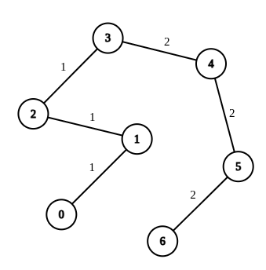

输入：`n = 7, edges = [[0,1,1],[1,2,1],[2,3,1],[3,4,2],[4,5,2],[5,6,2]], queries = [[0,3],[3,6],[2,6],[0,6]]`
输出：[0,0,1,3]
解释：第 1 条查询，从节点 0 到节点 3 的路径中的所有边的权重都是 1 。因此，答案为 0 。
第 2 条查询，从节点 3 到节点 6 的路径中的所有边的权重都是 2 。因此，答案为 0 。
第 3 条查询，将边 [2,3] 的权重变更为 2 。在这次操作之后，从节点 2 到节点 6 的路径中的所有边的权重都是 2 。因此，答案为 1 。
第 4 条查询，将边 [0,1]、[1,2]、[2,3] 的权重变更为 2 。在这次操作之后，从节点 0 到节点 6 的路径中的所有边的权重都是 2 。因此，答案为 3 。
对于每条查询 queries[i] ，可以证明 answer[i] 是使从 ai 到 bi 的路径中的所有边的权重相等的最小操作次数。

示例 2：

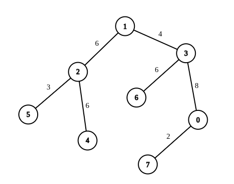

输入：`n = 8, edges = [[1,2,6],[1,3,4],[2,4,6],[2,5,3],[3,6,6],[3,0,8],[7,0,2]], queries = [[4,6],[0,4],[6,5],[7,4]]`
输出：[1,2,2,3]
解释：第 1 条查询，将边 [1,3] 的权重变更为 6 。在这次操作之后，从节点 4 到节点 6 的路径中的所有边的权重都是 6 。因此，答案为 1 。
第 2 条查询，将边 [0,3]、[3,1] 的权重变更为 6 。在这次操作之后，从节点 0 到节点 4 的路径中的所有边的权重都是 6 。因此，答案为 2 。
第 3 条查询，将边 [1,3]、[5,2] 的权重变更为 6 。在这次操作之后，从节点 6 到节点 5 的路径中的所有边的权重都是 6 。因此，答案为 2 。
第 4 条查询，将边 [0,7]、[0,3]、[1,3] 的权重变更为 6 。在这次操作之后，从节点 7 到节点 4 的路径中的所有边的权重都是 6 。因此，答案为 3 。
对于每条查询 queries[i] ，可以证明 answer[i] 是使从 ai 到 bi 的路径中的所有边的权重相等的最小操作次数。

提示：

1 <= n <= 10^4
edges.length == n - 1
edges[i].length == 3
0 <= ui, vi < n
1 <= wi <= 26
生成的输入满足 edges 表示一棵有效的树
1 <= queries.length == m <= 2 * 10^4
queries[i].length == 2
0 <= ai, bi < n

**思路**
以节点 0 为根节点，使用数组 count[i] 记录节点 i 到根节点 0 的路径上边权重的数量，即 `count[i][j]` 表示节点 i 到根节点 0 的路径上权重为 j 的边数量。对于查询 queries[i]=[ai,bi]，记节点 $\textit{lca}_i$ 为节点 $a_i$ 与 $b_i$ 的最近公共祖先，那么从节点 $a_i$ 到节点 $b_i$ 的路径上，权重为 j 的边数量 $t_j$ 的计算如下：
$$t_j = \textit{count}[a_i][j] + \textit{count}[b_i][j] - 2 \times \textit{count}[\textit{lca}_i][j]$$

为了让节点 $a_i$ 到节点 $b_i$ 路径上每条边的权重都相等，贪心地将路径上所有的边都更改为边数量最多的权重即可，即从节点$a_i$ 到节点 $b_i$ 路径上每条边的权重都相等所需的最小操作次数 $\textit{res}_i$ 的计算如下：
$$\textit{res}_i = \sum_{j=1}^{W}t_j - \max_{1 \le j \le W}$$
其中 W=26 表示权重的最大值。

```C++
const int W = 26;

class Solution {
public:
    int find(vector<int> &uf, int i) {
        if (uf[i] == i) {
            return i;
        }
        uf[i] = find(uf, uf[i]);
        return uf[i];
    }

    vector<int> minOperationsQueries(int n, vector<vector<int>>& edges, vector<vector<int>>& queries) {
        int m = queries.size();
        vector<unordered_map<int, int>> neighbors(n);
        for (auto &edge : edges) {
            neighbors[edge[0]][edge[1]] = edge[2];
            neighbors[edge[1]][edge[0]] = edge[2];
        }
        vector<vector<pair<int, int>>> queryArr(n);
        for (int i = 0; i < m; i++) {
            queryArr[queries[i][0]].push_back({queries[i][1], i});
            queryArr[queries[i][1]].push_back({queries[i][0], i});
        }

        vector<vector<int>> count(n, vector<int>(W + 1));
        vector<int> visited(n), uf(n), lca(m);
        function<void(int, int)> tarjan = [&](int node, int parent) {
            if (parent != -1) {
                count[node] = count[parent];
                count[node][neighbors[node][parent]]++;
            }
            uf[node] = node;
            for (auto [child, _] : neighbors[node]) {
                if (child == parent) {
                    continue;
                }
                tarjan(child, node);
                uf[child] = node;
            }
            for (auto [node1, index] : queryArr[node]) {
                if (node != node1 && !visited[node1]) {
                    continue;
                }
                lca[index] = find(uf, node1);
            }
            visited[node] = 1;
        };
        tarjan(0, -1);
        vector<int> res(m);
        for (int i = 0; i < m; i++) {
            int totalCount = 0, maxCount = 0;
            for (int j = 1; j <= W; j++) {
                int t = count[queries[i][0]][j] + count[queries[i][1]][j] - 2 * count[lca[i]][j];
                maxCount = max(maxCount, t);
                totalCount += t;
            }
            res[i] = totalCount - maxCount;
        }
        return res;
    }
};
```

### 1/27 [2861. 最大合金数](https://leetcode.cn/problems/maximum-number-of-alloys/description/)

假设你是一家合金制造公司的老板，你的公司使用多种金属来制造合金。现在共有 n 种不同类型的金属可以使用，并且你可以使用 k 台机器来制造合金。每台机器都需要特定数量的每种金属来创建合金。

对于第 i 台机器而言，创建合金需要 `composition[i][j]` 份 j 类型金属。最初，你拥有 stock[i] 份 i 类型金属，而每购入一份 i 类型金属需要花费 cost[i] 的金钱。

给你整数 n、k、budget，下标从 1 开始的二维数组 composition，两个下标从 1 开始的数组 stock 和 cost，请你在预算不超过 budget 金钱的前提下，最大化 公司制造合金的数量。

所有合金都需要由同一台机器制造。

返回公司可以制造的最大合金数。

示例 1：

输入：`n = 3, k = 2, budget = 15, composition = [[1,1,1],[1,1,10]], stock = [0,0,0], cost = [1,2,3]`
输出：2
解释：最优的方法是使用第 1 台机器来制造合金。
要想制造 2 份合金，我们需要购买：

- 2 份第 1 类金属。
- 2 份第 2 类金属。
- 2 份第 3 类金属。

总共需要 `2 * 1 + 2 * 2 + 2 * 3 = 12` 的金钱，小于等于预算 15 。
注意，我们最开始时候没有任何一类金属，所以必须买齐所有需要的金属。
可以证明在示例条件下最多可以制造 2 份合金。
示例 2：

输入：`n = 3, k = 2, budget = 15, composition = [[1,1,1],[1,1,10]], stock = [0,0,100], cost = [1,2,3]`
输出：5
解释：最优的方法是使用第 2 台机器来制造合金。
要想制造 5 份合金，我们需要购买：

- 5 份第 1 类金属。
- 5 份第 2 类金属。
- 0 份第 3 类金属。

总共需要 `5 * 1 + 5 * 2 + 0 * 3 = 15` 的金钱，小于等于预算 15 。
可以证明在示例条件下最多可以制造 5 份合金。
示例 3：

输入：`n = 2, k = 3, budget = 10, composition = [[2,1],[1,2],[1,1]], stock = [1,1], cost = [5,5]`
输出：2
解释：最优的方法是使用第 3 台机器来制造合金。
要想制造 2 份合金，我们需要购买：

- 1 份第 1 类金属。
- 1 份第 2 类金属。

总共需要 `1 * 5 + 1 * 5 = 10` 的金钱，小于等于预算 10 。
可以证明在示例条件下最多可以制造 2 份合金。

提示：

`1 <= n, k <= 100`
`0 <= budget <= 10^8`
`composition.length == k`
`composition[i].length == n`
`1 <= composition[i][j] <= 100`
`stock.length == cost.length == n`
`0 <= stock[i] <= 10^8`
`1 <= cost[i] <= 100`

**思路**
我们注意到，所有合金都需要由同一台机器制造，因此我们可以枚举使用哪一台机器来制造合金。

对于每一台机器，我们可以使用二分查找的方法找出最大的整数 x，使得我们可以使用这台机器制造 x 个合金。找出所有 x 中的最大值即为答案。

```C++
class Solution {
public:
    int maxNumberOfAlloys(int n, int k, int budget, vector<vector<int>>& composition, vector<int>& stock, vector<int>& cost) {
        auto isValid = [&](long long target) {
            for (int i = 0; i < k; i++) {
                long long remain = budget;
                auto currMachine = composition[i];
                for (int j = 0; j < n && remain >= 0; j++) {
                    long long need = max(0LL, target * currMachine[j] - stock[j]);
                    remain -= need * cost[j];
                }
                if (remain >= 0) {
                    return true;
                }
            }
            return false;
        };
        long long l = 0, r = budget + stock[0];
        while (l < r) {
            long long mid = (l + r + 1) >> 1;
            if (isValid(mid)) {
                l = mid;
            } else {
                r = mid - 1;
            }
        }
        return l;
    }
};
```

### 1/28 [365. 水壶问题](https://leetcode.cn/problems/water-and-jug-problem/description/?envType=daily-question&envId=2024-01-28)

有两个水壶，容量分别为 jug1Capacity 和 jug2Capacity 升。水的供应是无限的。确定是否有可能使用这两个壶准确得到 targetCapacity 升。

如果可以得到 targetCapacity 升水，最后请用以上水壶中的一或两个来盛放取得的 targetCapacity 升水。

你可以：

装满任意一个水壶
清空任意一个水壶
从一个水壶向另外一个水壶倒水，直到装满或者倒空

示例 1:

输入: jug1Capacity = 3, jug2Capacity = 5, targetCapacity = 4
输出: true
解释：来自著名的 "Die Hard"
示例 2:

输入: jug1Capacity = 2, jug2Capacity = 6, targetCapacity = 5
输出: false
示例 3:

输入: jug1Capacity = 1, jug2Capacity = 2, targetCapacity = 3
输出: true

提示:

1 <= jug1Capacity, jug2Capacity, targetCapacity <= 10^6

**思路**
首先对题目进行建模。观察题目可知，在任意一个时刻，此问题的状态可以由两个数字决定：X 壶中的水量，以及 Y 壶中的水量。

在任意一个时刻，我们可以且仅可以采取以下几种操作：

把 X 壶的水灌进 Y 壶，直至灌满或倒空；
把 Y 壶的水灌进 X 壶，直至灌满或倒空；
把 X 壶灌满；
把 Y 壶灌满；
把 X 壶倒空；
把 Y 壶倒空。
因此，本题可以使用深度优先搜索来解决。搜索中的每一步以 remain_x, remain_y 作为状态，即表示 X 壶和 Y 壶中的水量。在每一步搜索时，我们会依次尝试所有的操作，递归地搜索下去。这可能会导致我们陷入无止境的递归，因此我们还需要使用一个哈希结合（HashSet）存储所有已经搜索过的 remain_x, remain_y 状态，保证每个状态至多只被搜索一次。

在实际的代码编写中，由于深度优先搜索导致的递归远远超过了 Python 的默认递归层数（可以使用 sys 库更改递归层数，但不推荐这么做），因此下面的代码使用栈来模拟递归，避免了真正使用递归而导致的问题。

```C++
using PII = pair<int, int>;

class Solution {
public:
    bool canMeasureWater(int x, int y, int z) {
        stack<PII> stk;
        stk.emplace(0, 0);
        auto hash_function = [](const PII& o) {return hash<int>()(o.first) ^ hash<int>()(o.second);};
        unordered_set<PII, decltype(hash_function)> seen(0, hash_function);
        while (!stk.empty()) {
            if (seen.count(stk.top())) {
                stk.pop();
                continue;
            }
            seen.emplace(stk.top());
            
            auto [remain_x, remain_y] = stk.top();
            stk.pop();
            if (remain_x == z || remain_y == z || remain_x + remain_y == z) {
                return true;
            }
            // 把 X 壶灌满。
            stk.emplace(x, remain_y);
            // 把 Y 壶灌满。
            stk.emplace(remain_x, y);
            // 把 X 壶倒空。
            stk.emplace(0, remain_y);
            // 把 Y 壶倒空。
            stk.emplace(remain_x, 0);
            // 把 X 壶的水灌进 Y 壶，直至灌满或倒空。
            stk.emplace(remain_x - min(remain_x, y - remain_y), remain_y + min(remain_x, y - remain_y));
            // 把 Y 壶的水灌进 X 壶，直至灌满或倒空。
            stk.emplace(remain_x + min(remain_y, x - remain_x), remain_y - min(remain_y, x - remain_x));
        }
        return false;
    }
};
```

### 1/29 [514. 自由之路](https://leetcode.cn/problems/freedom-trail/description/?envType=daily-question&envId=2024-01-29)

电子游戏“辐射4”中，任务 “通向自由” 要求玩家到达名为 “Freedom Trail Ring” 的金属表盘，并使用表盘拼写特定关键词才能开门。

给定一个字符串 ring ，表示刻在外环上的编码；给定另一个字符串 key ，表示需要拼写的关键词。您需要算出能够拼写关键词中所有字符的最少步数。

最初，ring 的第一个字符与 12:00 方向对齐。您需要顺时针或逆时针旋转 ring 以使 key 的一个字符在 12:00 方向对齐，然后按下中心按钮，以此逐个拼写完 key 中的所有字符。

旋转 ring 拼出 key 字符 key[i] 的阶段中：

您可以将 ring 顺时针或逆时针旋转 一个位置 ，计为1步。旋转的最终目的是将字符串 ring 的一个字符与 12:00 方向对齐，并且这个字符必须等于字符 key[i] 。
如果字符 key[i] 已经对齐到12:00方向，您需要按下中心按钮进行拼写，这也将算作 1 步。按完之后，您可以开始拼写 key 的下一个字符（下一阶段）, 直至完成所有拼写。

示例 1：

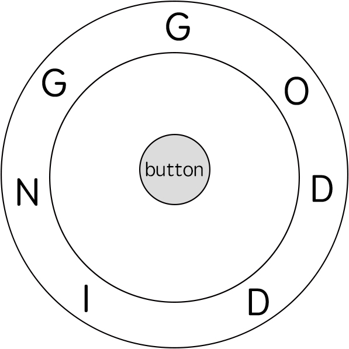

输入: ring = "godding", key = "gd"
输出: 4
解释:

对于 key 的第一个字符 'g'，已经在正确的位置, 我们只需要1步来拼写这个字符。
对于 key 的第二个字符 'd'，我们需要逆时针旋转 ring "godding" 2步使它变成 "ddinggo"。
当然, 我们还需要1步进行拼写。
因此最终的输出是 4。

示例 2:

输入: ring = "godding", key = "godding"
输出: 13

提示：

1 <= ring.length, key.length <= 100
ring 和 key 只包含小写英文字母
保证 字符串 key 一定可以由字符串  ring 旋转拼出

**思路**
定义 `dp[i][j]` 表示从前往后拼写出 key 的第 i 个字符， ring 的第 j 个字符与 12:00 方向对齐的最少步数（下标均从 0 开始）。

显然，只有当字符串 ring 的第 j 个字符需要和 key 的第 i 个字符相同时才能拼写出 key 的第 i 个字符，因此对于 key 的第 i 个字符，需要考虑计算的 ring 的第 j 个字符只有 key[i] 在 ring 中出现的下标集合。我们对每个字符维护一个位置数组 pos[i]，表示字符 i 在 ring 中出现的位置集合，用来加速计算转移的过程。

对于状态 `dp[i][j]`，需要枚举上一次与 12:00 方向对齐的位置 kkk，因此可以列出如下的转移方程：

$$\textit{dp}[i][j]=\min_{k \in pos[key[i-1]]}\{dp[i-1][k]+\min\{\text{abs}(j-k),n-\text{abs}(j-k)\}+1\}$$

其中 $\min\{\text{abs}(j-k),n-\text{abs}(j-k)\}+1$ 表示在当前第 k 个字符与 12:00 方向对齐时第 j 个字符旋转到 12:00 方向并按下拼写的最少步数。

最后答案即为 $$\min_{i=0}^{n-1}\{\textit{dp}[m-1][i]\}$$

这样的做法需要开辟 O(mn) 的空间来存放 dp 值。考虑到每次转移状态 `dp[i][]` 只会从 dp[i−1] 转移过来，因此我们可以利用滚动数组优化第一维的空间复杂度，有能力的读者可以尝试实现。下面只给出最朴素的 O(mn)空间复杂度的实现。

```C++
class Solution {
public:
    int findRotateSteps(string ring, string key) {
        int n = ring.size(), m = key.size();
        vector<int> pos[26];
        for (int i = 0; i < n; ++i) {
            pos[ring[i] - 'a'].push_back(i);
        }
        vector<vector<int>> dp(m, vector<int>(n, 0x3f3f3f3f));
        for (auto& i: pos[key[0] - 'a']) {
            dp[0][i] = min(i, n - i) + 1;
        }
        for (int i = 1; i < m; ++i) {
            for (auto& j: pos[key[i] - 'a']) {
                for (auto& k: pos[key[i - 1] - 'a']) {
                    dp[i][j] = min(dp[i][j], dp[i - 1][k] + min(abs(j - k), n - abs(j - k)) + 1);
                }
            }
        }
        return *min_element(dp[m - 1].begin(), dp[m - 1].end());
    }
};
```

### 1/30 [2808. 使循环数组所有元素相等的最少秒数](https://leetcode.cn/problems/minimum-seconds-to-equalize-a-circular-array/)

给你一个下标从 0 开始长度为 n 的数组 nums 。

每一秒，你可以对数组执行以下操作：

对于范围在 [0, n - 1] 内的每一个下标 i ，将 nums[i] 替换成 nums[i] ，nums[(i - 1 + n) % n] 或者 nums[(i + 1) % n] 三者之一。
注意，所有元素会被同时替换。

请你返回将数组 nums 中所有元素变成相等元素所需要的 最少 秒数。

示例 1：

输入：nums = [1,2,1,2]
输出：1
解释：我们可以在 1 秒内将数组变成相等元素：

- 第 1 秒，将每个位置的元素分别变为 [nums[3],nums[1],nums[3],nums[3]] 。变化后，nums = [2,2,2,2] 。
1 秒是将数组变成相等元素所需要的最少秒数。
示例 2：

输入：nums = [2,1,3,3,2]
输出：2
解释：我们可以在 2 秒内将数组变成相等元素：

- 第 1 秒，将每个位置的元素分别变为 [nums[0],nums[2],nums[2],nums[2],nums[3]] 。变化后，nums = [2,3,3,3,3] 。
- 第 2 秒，将每个位置的元素分别变为 [nums[1],nums[1],nums[2],nums[3],nums[4]] 。变化后，nums = [3,3,3,3,3] 。
2 秒是将数组变成相等元素所需要的最少秒数。
示例 3：

输入：nums = [5,5,5,5]
输出：0
解释：不需要执行任何操作，因为一开始数组中的元素已经全部相等。

提示：

1 <= n == nums.length <= 10^5
1 <= nums[i] <= 10^9

**思路**
我们首先用哈希表，统计 nums 中相同的数所出现的位置，mp[x] 表示 x 所出现的位置。

然后我们研究，使得数组全部变为 x 所需要的时间，这个时间取决于 nums 中，相邻 x 的最大距离。我们依次枚举所有相邻（包括头尾）x 的索引值，找到最大的距离。最大距离除以二并向下取整，就是使得数组全部变为 x 所需要的时间。

最后我们对所有 nums 中 的数，都找到所需的时间，返回其中的最小值即可。

```C++
class Solution {
public:
    int minimumSeconds(vector<int>& nums) {
        unordered_map<int, vector<int>> mp;
        int n = nums.size(), res = n;
        for (int i = 0; i < n; ++i) {
            mp[nums[i]].push_back(i);
        }
        for (auto& pos : mp) {
            int mx = pos.second[0] + n - pos.second.back();
            for (int i = 1; i < pos.second.size(); ++i) {
                mx = max(mx, pos.second[i] - pos.second[i - 1]);
            }
            res = min(res, mx / 2);
        }
        return res;
    }
};
```

### 1/31 [2670. 找出不同元素数目差数组](https://leetcode.cn/problems/find-the-distinct-difference-array/description/?envType=daily-question&envId=2024-01-31)

给你一个下标从 0 开始的数组 nums ，数组长度为 n 。

nums 的 不同元素数目差 数组可以用一个长度为 n 的数组 diff 表示，其中 diff[i] 等于前缀 nums[0, ..., i] 中不同元素的数目 减去 后缀 nums[i + 1, ..., n - 1] 中不同元素的数目。

返回 nums 的 不同元素数目差 数组。

注意 nums[i, ..., j] 表示 nums 的一个从下标 i 开始到下标 j 结束的子数组（包含下标 i 和 j 对应元素）。特别需要说明的是，如果 i > j ，则 nums[i, ..., j] 表示一个空子数组。

示例 1：

输入：nums = [1,2,3,4,5]
输出：[-3,-1,1,3,5]
解释：
对于 i = 0，前缀中有 1 个不同的元素，而在后缀中有 4 个不同的元素。因此，diff[0] = 1 - 4 = -3 。
对于 i = 1，前缀中有 2 个不同的元素，而在后缀中有 3 个不同的元素。因此，diff[1] = 2 - 3 = -1 。
对于 i = 2，前缀中有 3 个不同的元素，而在后缀中有 2 个不同的元素。因此，diff[2] = 3 - 2 = 1 。
对于 i = 3，前缀中有 4 个不同的元素，而在后缀中有 1 个不同的元素。因此，diff[3] = 4 - 1 = 3 。
对于 i = 4，前缀中有 5 个不同的元素，而在后缀中有 0 个不同的元素。因此，diff[4] = 5 - 0 = 5 。
示例 2：

输入：nums = [3,2,3,4,2]
输出：[-2,-1,0,2,3]
解释：
对于 i = 0，前缀中有 1 个不同的元素，而在后缀中有 3 个不同的元素。因此，diff[0] = 1 - 3 = -2 。
对于 i = 1，前缀中有 2 个不同的元素，而在后缀中有 3 个不同的元素。因此，diff[1] = 2 - 3 = -1 。
对于 i = 2，前缀中有 2 个不同的元素，而在后缀中有 2 个不同的元素。因此，diff[2] = 2 - 2 = 0 。
对于 i = 3，前缀中有 3 个不同的元素，而在后缀中有 1 个不同的元素。因此，diff[3] = 3 - 1 = 2 。
对于 i = 4，前缀中有 3 个不同的元素，而在后缀中有 0 个不同的元素。因此，diff[4] = 3 - 0 = 3 。

提示：

1 <= n == nums.length <= 50
1 <= nums[i] <= 50

**思路**
我们可以预处理出一个后缀数组 suf，其中 suf[i] 表示后缀 nums[i , ... , n−1] 中不同元素的数目，在预处理过程中，我们使用一个哈希表 s 来维护后缀中出现过的元素，这样我们就可以在 O(1) 的时间内查询后缀中不同元素的数目。

预处理完后缀数组 suf 后，我们清空哈希表 s，然后再次遍历数组 nums，用哈希表 s 来维护前缀中出现过的元素，那么位置 i 的答案就是 s 中不同元素的数目减去 suf[i+1]，即 ∣s∣−suf[i+1]。

```C++
class Solution {
public:
    vector<int> distinctDifferenceArray(vector<int>& nums) {
        int n = nums.size();
        vector<int> suf(n + 1);
        unordered_set<int> s;
        for (int i = n - 1; i >= 0; --i) {
            s.insert(nums[i]);
            suf[i] = s.size();
        }
        s.clear();
        vector<int> ans(n);
        for (int i = 0; i < n; ++i) {
            s.insert(nums[i]);
            ans[i] = s.size() - suf[i + 1];
        }
        return ans;
    }
};
```
