# HUAWEI

## [1. Excel单元格数值统计](https://sars2025.blog.csdn.net/article/details/139324794)

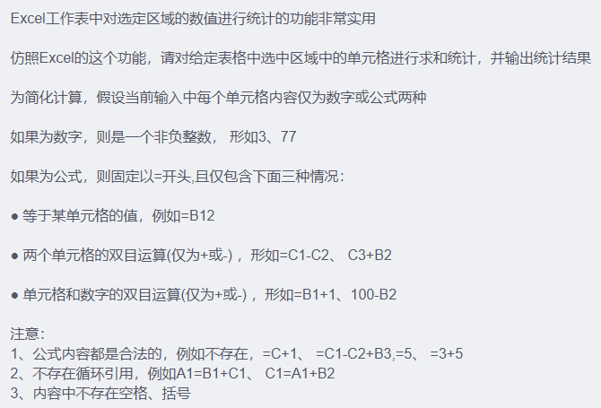
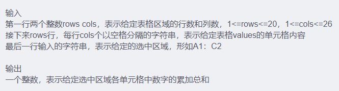
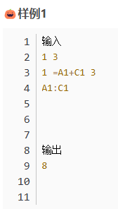
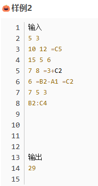
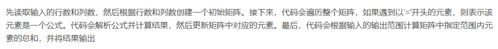

```Python
def main():
    # 处理输入
    rows, cols = map(int, input().split())  # 获取行数和列数
    matrix = [input().split() for _ in range(rows)]  # 创建初始矩阵

    # 解析公式并计算
    for i in range(rows):
        for j in range(cols):
            if matrix[i][j][0] == '=':  # 判断是否为公式
                expression = matrix[i][j][1:]  # 提取公式部分
                if '+' in expression:  # 判断是否为加法公式
                    op1, op2 = expression.split('+')  # 拆分操作数
                    num1 = int(matrix[int(op1[1:]) - 1][ord(op1[0]) - 65]) if op1[0] >= 'A' else int(op1)
                    num2 = int(matrix[int(op2[1:]) - 1][ord(op2[0]) - 65]) if op2[0] >= 'A' else int(op2)
                    matrix[i][j] = str(num1 + num2)  # 计算结果并更新矩阵元素
                elif '-' in expression:  # 判断是否为减法公式
                    op1, op2 = expression.split('-')  # 拆分操作数
                    num1 = int(matrix[int(op1[1:]) - 1][ord(op1[0]) - 65]) if op1[0] >= 'A' else int(op1)
                    num2 = int(matrix[int(op2[1:]) - 1][ord(op2[0]) - 65]) if op2[0] >= 'A' else int(op2)
                    matrix[i][j] = str(num1 - num2)  # 计算结果并更新矩阵元素
                else:
                    cell = matrix[int(expression[1:]) - 1][ord(expression[0]) - 65]  # 获取单元格的值
                    matrix[i][j] = cell  # 更新矩阵元素为单元格的值

    # 输出统计结果
    output = input().split(":")  # 获取输出范围
    ny1, nx1 = int(output[0][1:]) - 1, ord(output[0][0]) - 65  # 计算输出范围起始位置的行列索引
    ny2, nx2 = int(output[1][1:]) - 1, ord(output[1][0]) - 65  # 计算输出范围结束位置的行列索引
    total_sum = sum(int(matrix[i][j]) for i in range(ny1, ny2 + 1) for j in range(nx1, nx2 + 1))  # 计算输出范围内元素的总和
    print(total_sum)  # 输出结果

if __name__ == "__main__":
    main()
```

## [2. 最优资源分配问题（背包问题）](https://sars2025.blog.csdn.net/article/details/143785205)

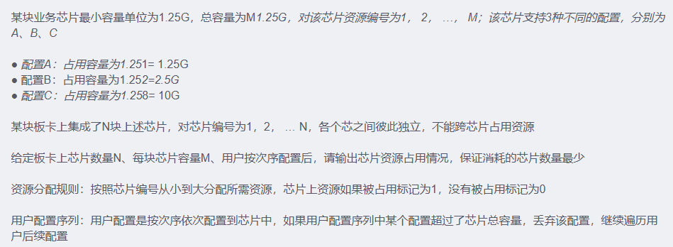
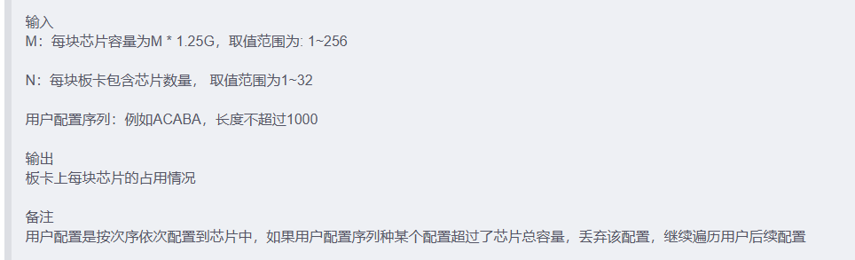
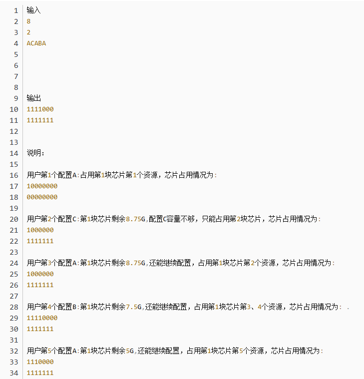
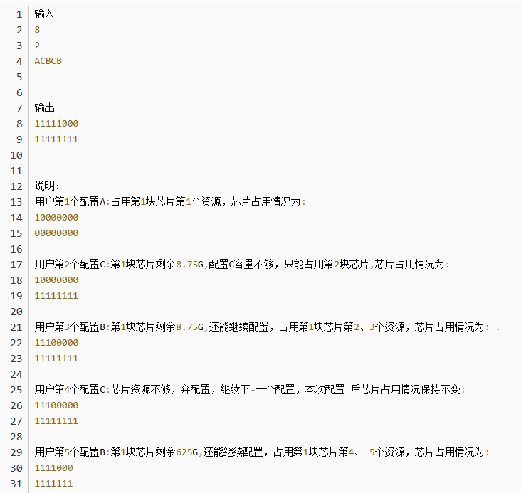
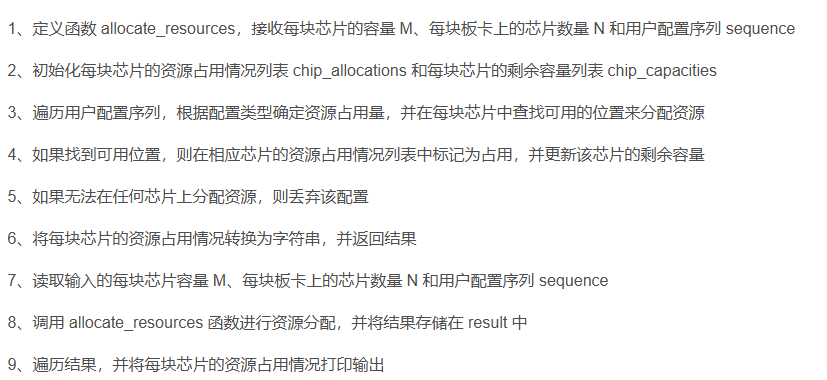

```Python
def allocate_resources(M, N, sequence):
    # 初始化每块芯片的资源占用情况列表
    chip_allocations = [['0'] * M for _ in range(N)]

    # 初始化每块芯片的剩余容量列表
    chip_capacities = [M] * N

    # 遍历用户配置序列
    for config in sequence:
        # 根据配置的类型确定资源占用量
        if config == 'A':
            allocation = 1
        elif config == 'B':
            allocation = 2
        elif config == 'C':
            allocation = 8

        # 在每块芯片中查找可用的位置来分配资源
        allocated = False
        for chip_index in range(N):
            # 如果当前芯片的剩余容量足够，则分配资源
            if chip_capacities[chip_index] >= allocation:
                start_index = M - chip_capacities[chip_index]
                for i in range(start_index, start_index + allocation):
                    chip_allocations[chip_index][i] = '1'
                chip_capacities[chip_index] -= allocation
                allocated = True
                break

        # 如果无法在任何芯片上分配资源，则丢弃该配置
        if not allocated:
            continue

    # 将每块芯片的资源占用情况转换为字符串
    chip_allocations = [''.join(chip) for chip in chip_allocations]

    return chip_allocations


# 读取输入
M = int(input())  # 每块芯片容量
N = int(input())  # 每块板卡上芯片数量
sequence = input()  # 用户配置序列

# 调用函数进行资源分配
result = allocate_resources(M, N, sequence)

# 输出结果
for allocation in result:
    print(allocation)
```

## [3. 预订酒店](https://blog.csdn.net/m0_47384542/article/details/134059321)

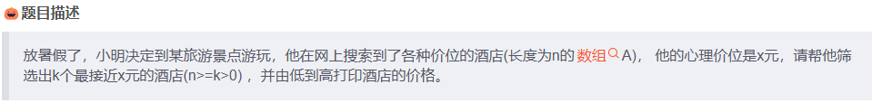
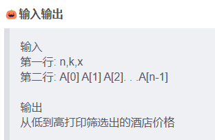
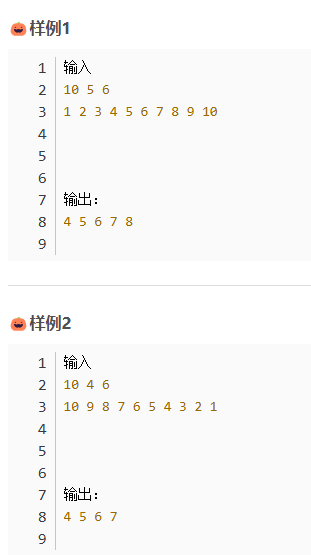
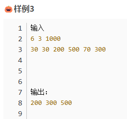
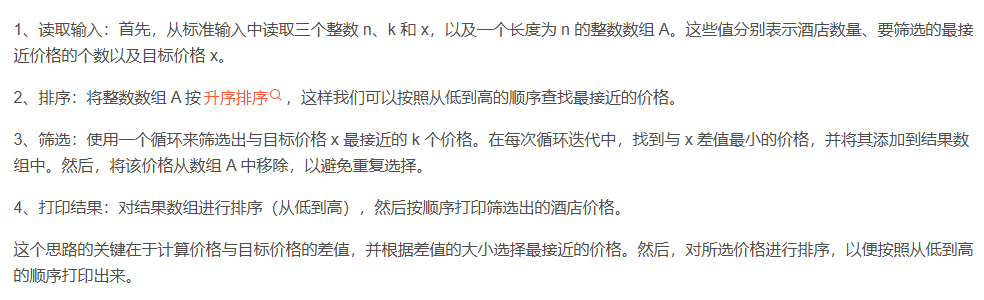

```Python
def filter_hotels(n, k, x, prices):
    prices.sort()
    res = []
    for _ in range(k):
        min_index = 0
        min_diff = abs(prices[0] - x)

        for j in range(1, n):
            diff = abs(prices[j] - x)
            if diff < min_diff:
                min_diff = diff
                min_index = j
        res.append(prices[min_index])
        prices.pop(min_index)
        n -= 1
    
    for price in sorted(res):
        print(price, end = " ")

n, k, x = map(int, input().spilt())
prices = list(map(int, input().split()))
filter_hotels(n, k, x, prices)
```

## [4. 最长连续子序列](https://sars2025.blog.csdn.net/article/details/141534679)

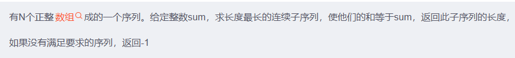
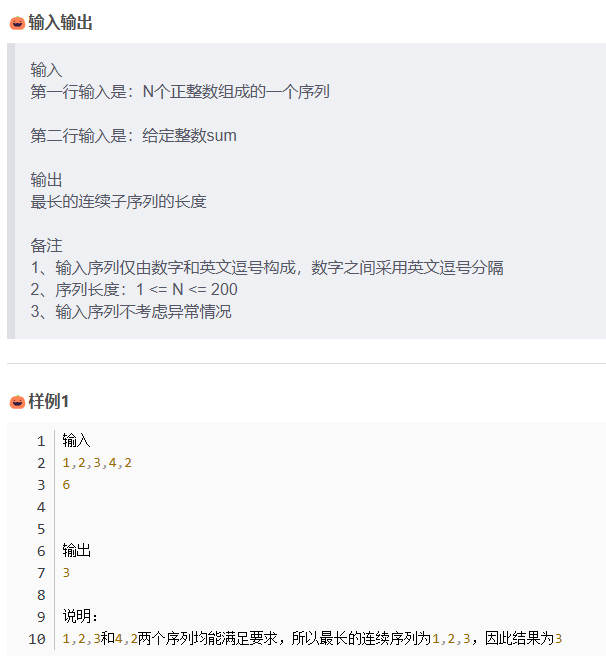
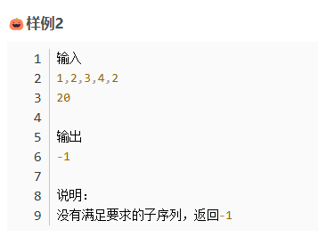
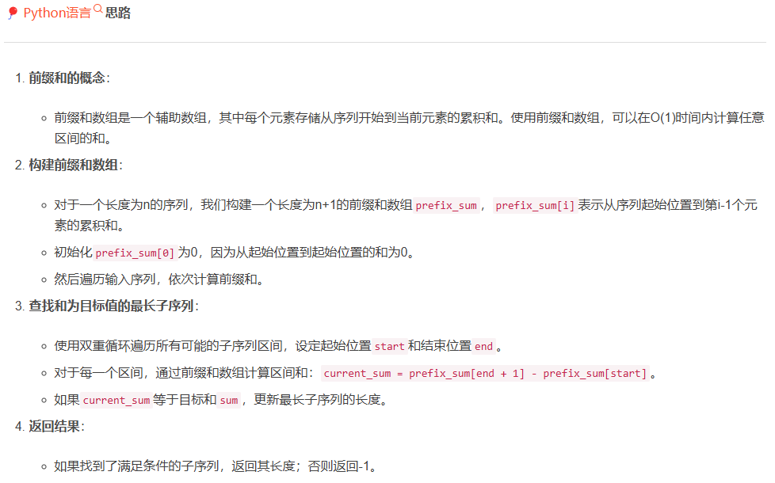

```Python
def find_longest_subsequence(sequence, target_sum):
    nums = list(map(int, sequence.split(",")))
    n = len(nums)

    pre = [0] * (n + 1)
    for i in range(n):
        pre[i + 1] = pre[i] + nums[i]

    max_len = -1

    for start in range(n):
        for end in range(start, n):
            cur = pre[end + 1] - pre[start]
            if cur == target_sum:
                max_len = max(max_len, end - start + 1)
    
    return max_len

if __name__ == "__main__":
    sequence = input().strip()
    target_sum = int(input().strip())
    print(find_longest_subsequence(sequence, target_sum))
```

## [5. 最左侧冗余覆盖子串](https://sars2025.blog.csdn.net/article/details/141555835)

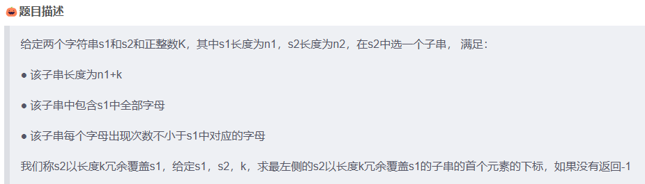
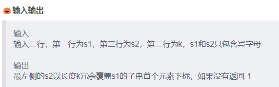
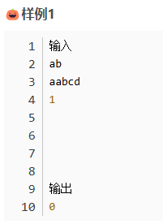
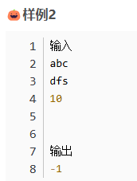
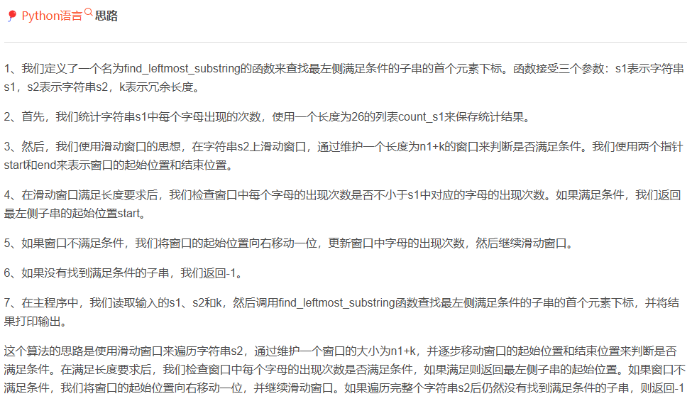

```Python
def find_leftmost_substring(s, t, k):
    n1, n2 = len(s), len(t)
    count = [0] * 26
    for char in s:
        count[ord(char) - ord("a")] += 1
    window = [0] * 26

    start, end = 0, 0

    while end < n2:
        window[ord(t[end]) - ord("a")] += 1

        if end - start + 1 >= n1 + k:
            if all(window[i] >= count[i] for i in range(26)):
                return start
            
            window[ord(t[start]) - ord("a")] -= 1
            start += 1
        
        end += 1
    return -1

s = input()
t = input()
k = int(input())
print(find_leftmost_substring(s, t, k))
```

## [6. 分糖果](https://blog.csdn.net/m0_47384542/article/details/134033006)

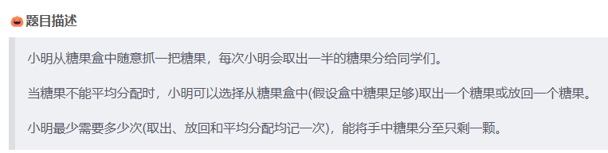
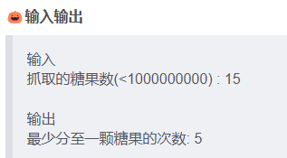
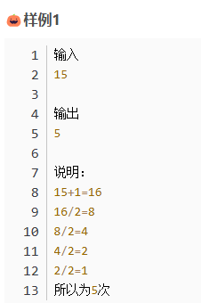
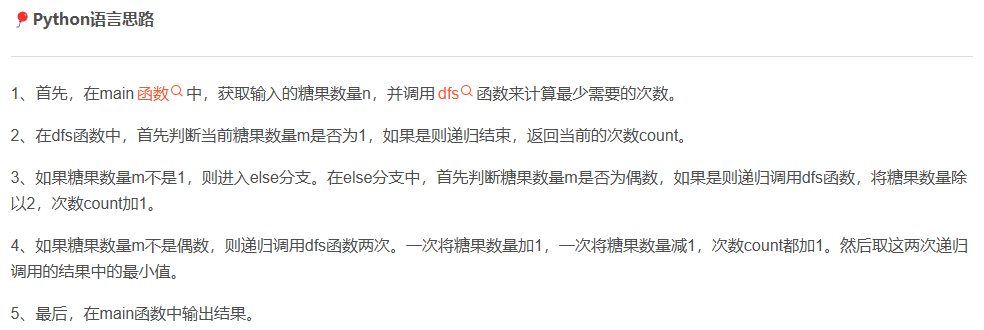

```Python
def main():
    n = int(input())
    print(dfs(n, 0))

def dfs(m, count):
    if m == 1:
        return count
    else:
        if m % 2 == 0:
            return dfs(m // 2, count + 1)
        else:
            return dfs(m + 1, count + 1), dfs(m - 1, count + 1)

if __name__ == "__main__":
    main()
```

## [7. 字符串拼接、构成指定长度字符串的个数](https://sars2025.blog.csdn.net/article/details/139500963)

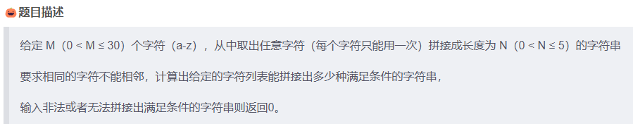
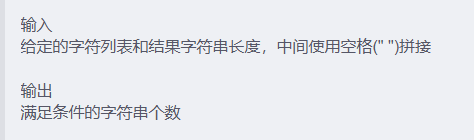
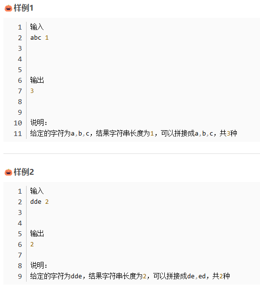
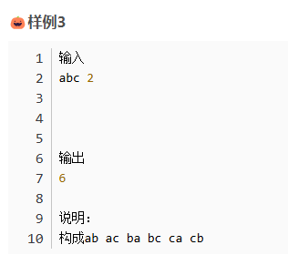
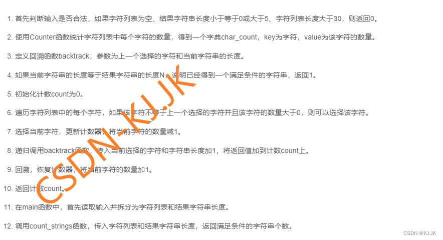

```Python
from collections import Counter

def count_strings(chars, N):
    """
    计算给定字符列表能拼接出的满足条件的字符串个数

    参数:
    chars -- 字符列表
    N -- 结果字符串的长度

    返回值:
    满足条件的字符串个数
    """
    if not chars or N <= 0 or N > 5 or len(chars) > 30:
        return 0

    # 统计每个字符的数量
    char_count = Counter(chars)

    # 使用回溯法计算可能的字符串个数
    def backtrack(last_char, length):
        if length == N:
            return 1
        count = 0
        for char, available in char_count.items():
            if char != last_char and available > 0:
                # 选择当前字符，更新计数器
                char_count[char] -= 1
                count += backtrack(char, length + 1)
                # 回溯，恢复计数器
                char_count[char] += 1
        return count

    # 从一个空字符开始回溯
    return backtrack('', 0)

# 解析输入，并调用函数计算结果
def main():
    input_str = input()
    parts = input_str.split()
    if len(parts) != 2:
        return 0

    chars, N_str = parts
    N = int(N_str)
    return count_strings(list(chars), N)


print(main())
```

## [8. 猜字谜](https://sars2025.blog.csdn.net/article/details/141495856)

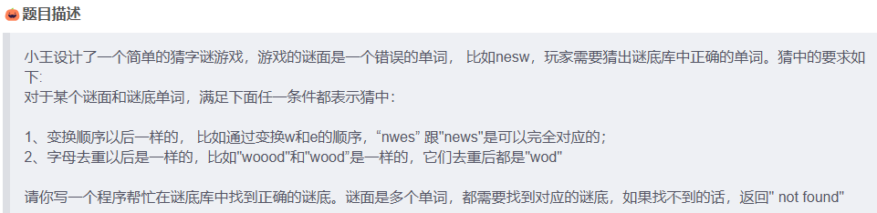
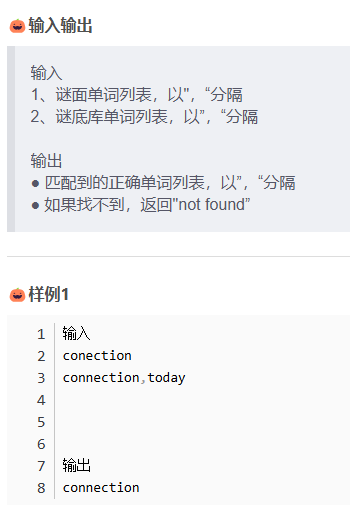
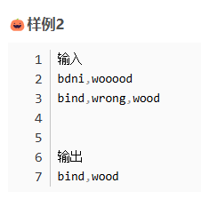
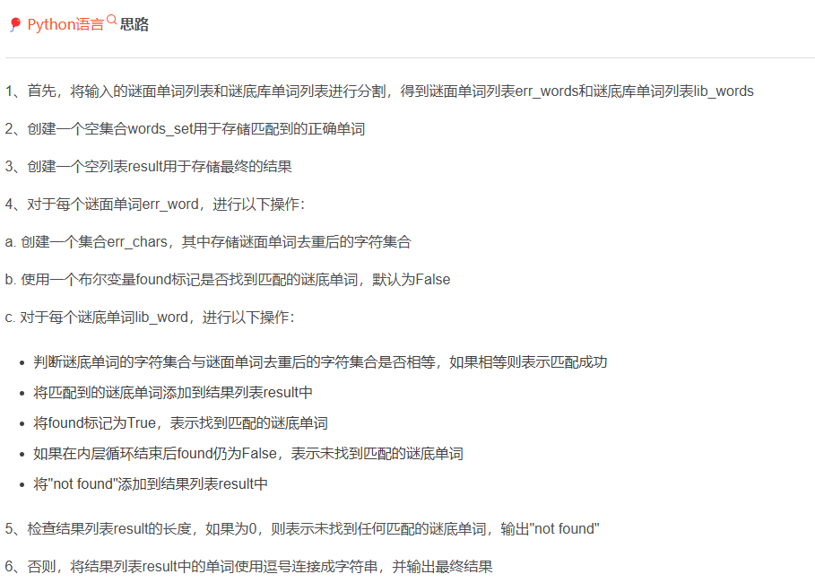

```Python
def find_correct_words():
    # 输入谜面单词列表和谜底库单词列表
    err_words = input().split(",")
    lib_words = input().split(",")

    words_set = set(lib_words)  # 用于存储匹配到的正确单词的集合
    result = []

    for err_word in err_words:
        err_chars = set(err_word)  # 谜面单词去重后的字符集合
        found = False  # 标记是否找到匹配的谜底单词

        for lib_word in lib_words:
            # 判断谜底单词的字符集合与谜面单词去重后的字符集合是否相等
            if len(set(lib_word)) == len(err_chars) and set(lib_word) == err_chars:
                result.append(lib_word)  # 将匹配到的谜底单词添加到结果列表中
                found = True  # 标记为找到匹配的谜底单词
                break

        if not found:
            result.append("not found")  # 如果未找到匹配的谜底单词，则添加 "not found" 到结果列表中

    return result


result = find_correct_words()

if len(result) == 0:
    print("not found")
else:
    print(",".join(result))  # 使用逗号连接结果列表，并打印最终结果
```

## [9.去除多余空格](https://sars2025.blog.csdn.net/article/details/134058292)

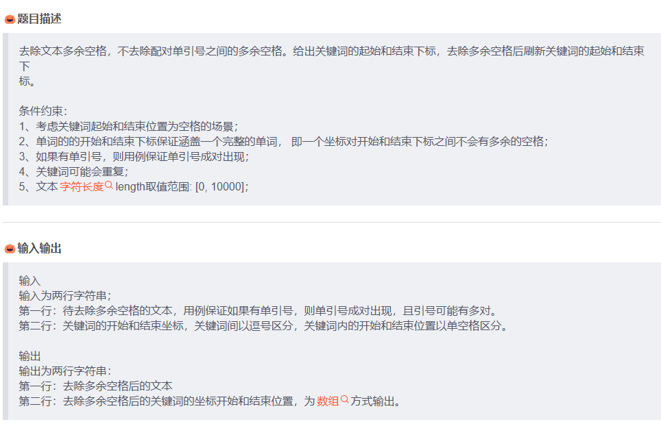
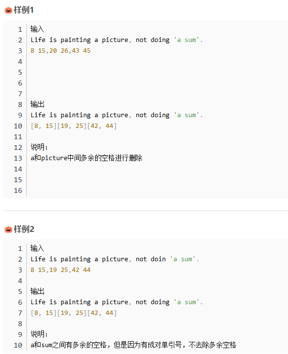

```python
s = input("待去除多余空格的文本: ").strip()  # 输入待处理的字符串
kw_idx_str = input("关键词的开始和结束坐标: ")  # 输入关键词的起始和结束下标

spaceset = set()  # 用于记录多余空格位置的集合
pre = None
flag = False

# 遍历字符串，标记多余空格的位置
for i in range(len(s)):
    if s[i] == "'":  # 如果遇到单引号，则切换标记状态
        flag = not flag
        continue

    if s[i] == " " and not flag:  # 如果遇到空格且不在单引号内，则检查前一个字符是否也是空格，若是则添加到集合中
        if pre == " ":
            spaceset.add(i)
    pre = s[i]

kw_idx_list = [int(ch) for ch in kw_idx_str.replace(",", " ").split()]  # 将关键词下标字符串转换为列表
for i, idx in enumerate(kw_idx_list):  # 遍历关键词下标列表
    diff = 0
    for space_idx in spaceset:  # 统计关键词之前的多余空格数量
        if space_idx < idx:
            diff += 1
    kw_idx_list[i] = idx - diff  # 更新关键词下标

slist = list(s)
for i in range(len(slist)):  # 删除多余空格
    if i in spaceset:
        slist[i] = ""
print("".join(slist))  # 输出去除多余空格后的字符串

for i in range(0, len(kw_idx_list) - 1, 2):  # 输出更新后的关键词下标
    print("[" + str(kw_idx_list[i]) + "," + str(kw_idx_list[i + 1]) + "]", end="")
```
